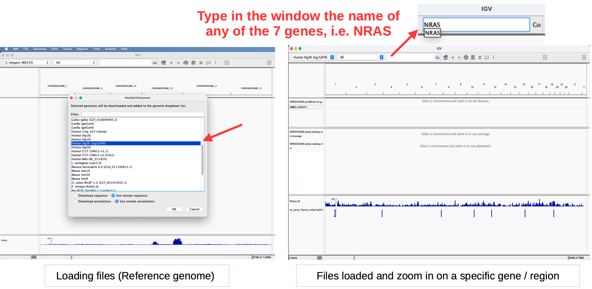
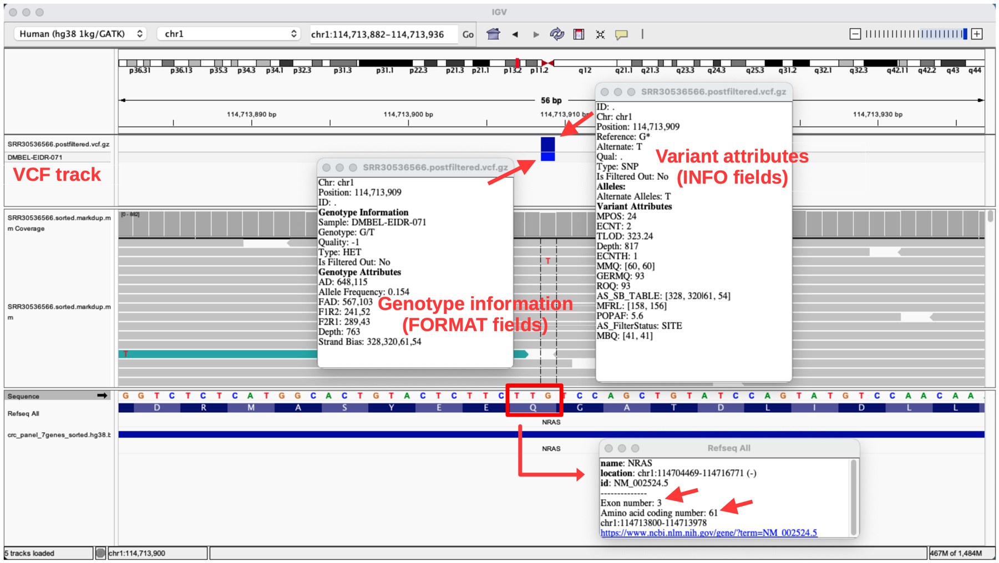
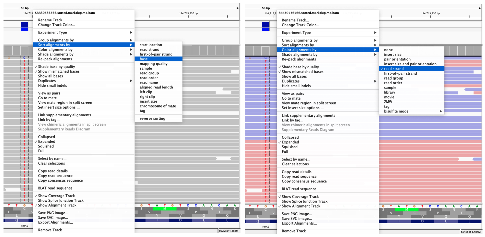
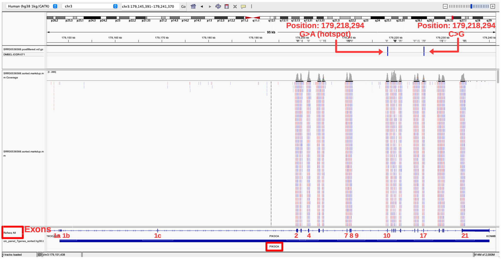
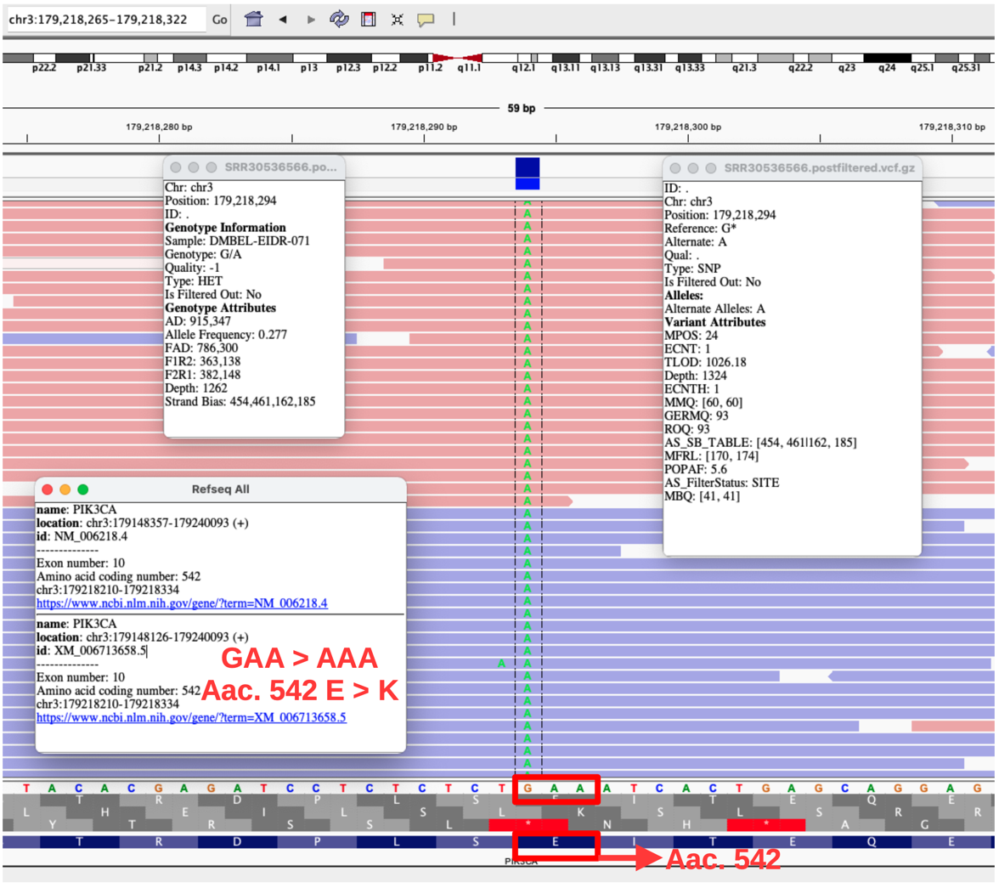
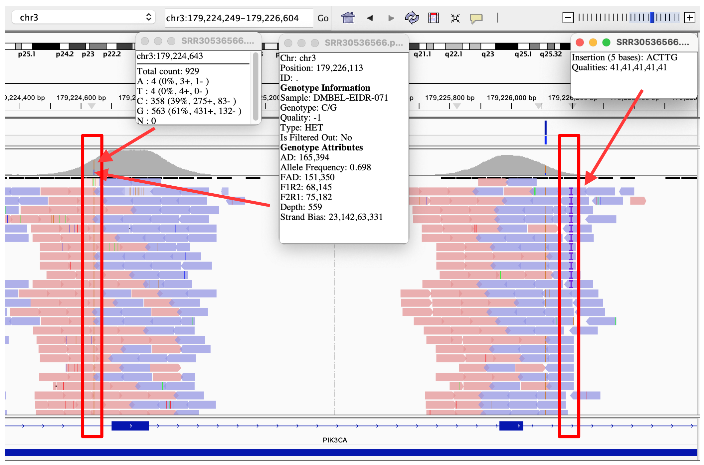
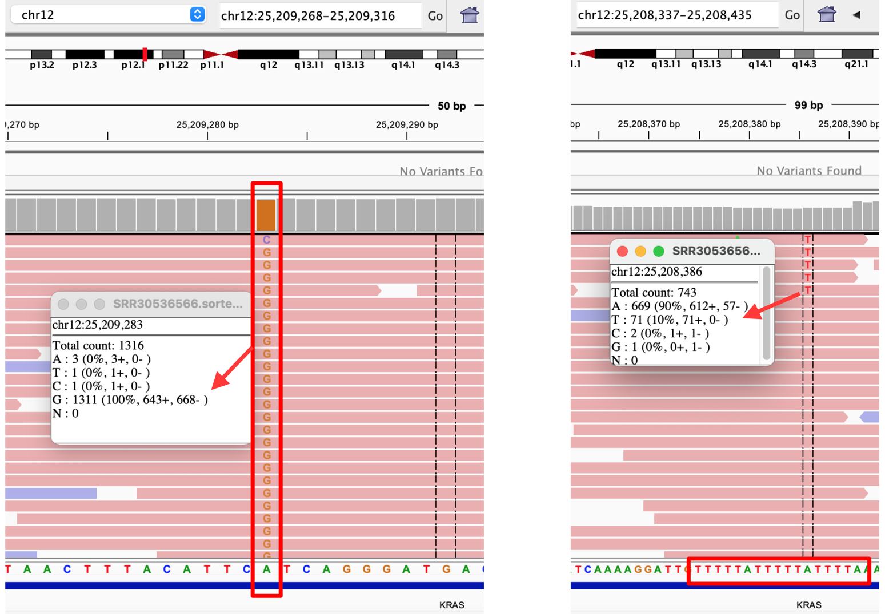
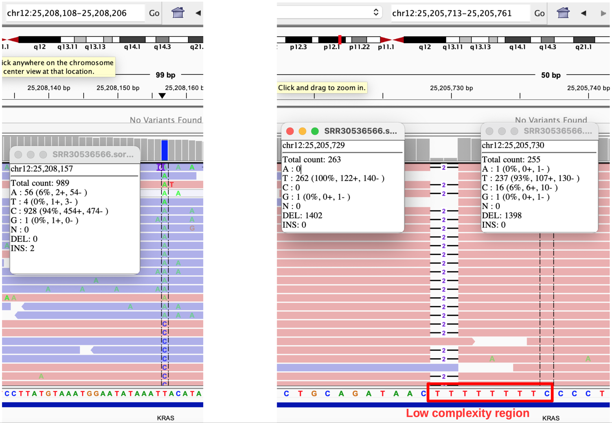
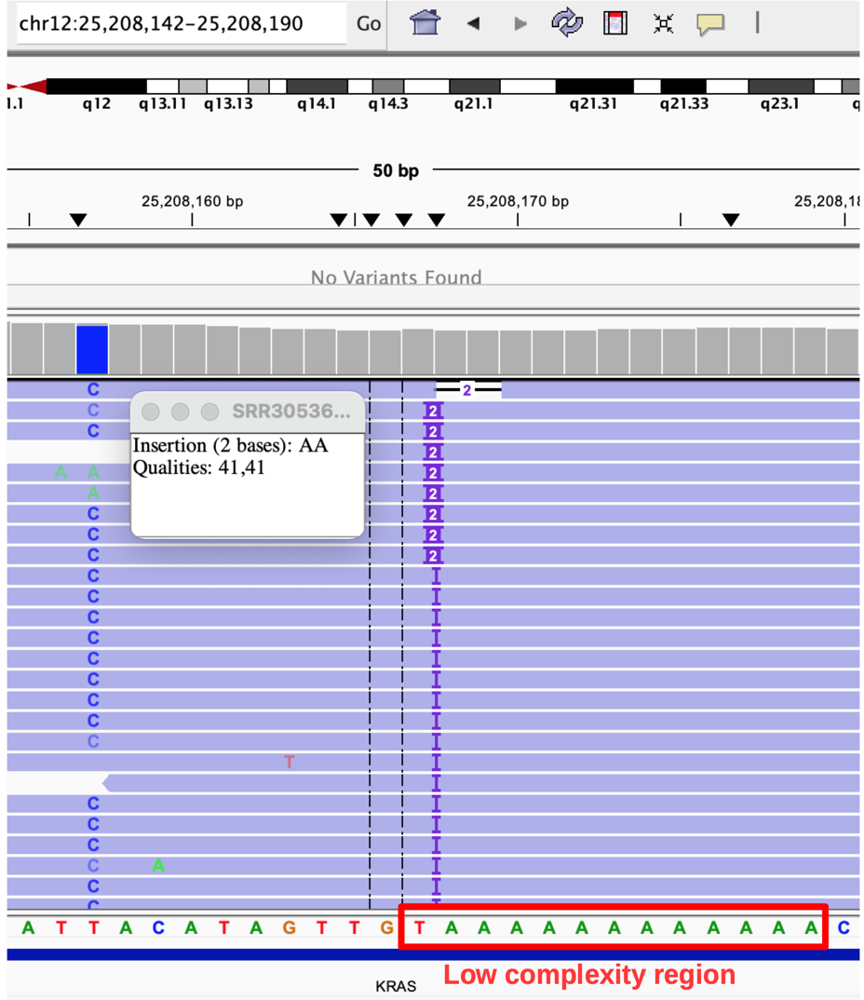

⚠️ **WORK IN PROGRESS**

#  Part III – Variant Visualization

## Table of Contents

- [Introduction](#introduction)
- [Integrative Genomics Viewer (IGV)](#integrative-genomics-viewer-igv)
- [IGV: Installation](#igv-installation)
- [Opening and Loading files into IGV](#opening-and-loading-files-into-igv)
- [Assessing the validity of called variants: NRAS](#assessing-the-validity-of-called-variants)
- [Assessing the validity of called variants: PIK3CA](#2-pik3ca)
- [Identifying SNV Artifacts in IGV: A Practical Guide](#identifying-snv-artifacts-in-igv-a-practical-guide)
- [Pop-up information](#pop-up-information-read-level-fields)
- [Visualizing apparent SNVs and artifacts](#visualizing-apparent-SNVs-and-artifacts)


## Introduction

The last part of this basic tutorial on DNA-NGS analysis of a small FASTQ dataset consists of visualizing the reads mapped to the reference genome and confirming the called variants shown in [Part II – Somatic analysis](README_somatic_analysis_Part2-3.md) using the dataset `SRR30536566`. A software widely used for this purpose is called Integrative Genomics Viewer or **IGV**.

The IGV version used for this tutorial is: **2.19.7**

In this section then, I will show you:

- what IGV is

- how to install it

- how to load the data

- and how IGV helps assess whether variants are real or artifacts

> **Note**: This tutorial will not cover complex genomic alterations such as copy number variations (CNVs), translocations, or other types of structural variants (SVs).

**Documentation**

- Main website: <https://igv.org/> → Check "**Citing IGV**". 
  - Recommended reference: <http://cancerres.aacrjournals.org/content/77/21/e31.long>
- IGV installation: <https://igv.org/doc/desktop/>: 
- **Best practices for variant calling in clinical sequencing**. DOI: <https://doi.org/10.1186/s13073-020-00791-w>
- **Integrative genomics viewer**. Nature Biotechnology. Robinson, et al. 2011: <https://www.nature.com/articles/nbt.1754>
- **Dr. Sarah Dean, PhD** - <https://www.youtube.com/watch?v=VyNpu3ubAGY>: Excellent tutorial!


## Integrative Genomics Viewer (IGV)

IGV is an open-source tool for visualization of NGS data, allowing the observation of mapped reads to the reference genome from NGS datasets and the understanding of different types of variant calls from genomes more intuitively. In this sense, it's possible to explore different type of mutations, including single nucleotide variants (SNVs) and small insertions/deletions (indels), SVs, but also RNA interference screens, gene expression, methylation and genomic annotations ([Robinson, et al. 2011](https://www.nature.com/articles/nbt.1754)). 

>**Key message**: The aim of this tutorial is not really to teach how to use IGV but rather provide a step-by-step way to visualize the SNVs found in the somatic DNA-NGS analysis from Part II. If you want to learn how to use IGV in detail, please check the **documentation**.


### IGV: Installation

Go to <https://igv.org/doc/desktop/#DownloadPage/> 

1. Click on the type of computer you have to download IGV. For those working with Mac, pay attention to the chip architecture your computer has (Apple or Intel Chip). Because IGV works with Java, I would recommend to download the package of IGV that **includes** Java.

2. Once downloaded, unpack it. Then move the icon to Applications (for those having Mac).

3. Open IGV - double click

### Type of files

Ideally, in order to have a comprehensive view of the analyzed DNA-NGS dataset, there should be loaded 5 different types of files. The files used for the visualization are those derived from the analysis of dataset `SRR30536566`, which was done in  👉 [Part II – Somatic analysis](README_somatic_analysis_Part2-3.md). **Table 1** shows a full list of files necessary for IGV visualization.

**Table 1A**: Files to upload into IGV.

| Format File | File from `SRR30536566` | Purpose in IGV | Why It's Needed |
|-------------|-------------------------|----------------|-----------------|
| **Reference FASTA** (hosted or custom FASTA) | `Homo_sapiens_assembly38.fasta` | Provides the **reference genome sequence** against which the reads were aligned | IGV must use the same reference genome build and contig naming convention used for alignment. In practice, using the hosted hg38 1kg/GATK genome is sufficient and recommended for this tutorial. |
| **BAM** | `SRR30536566.sorted.markdup.md.bam` | Shows **aligned sequencing reads** mapped to the reference genome with coverage depth and read details | Core visualization file - shows actual read alignments, base quality scores, chromosome coordinates and how reads support variant calls. BAM + Index together are the minimum files for IGV visualization. |
| **BAM Index** | `SRR30536566.sorted.markdup.md.bam.bai` | **Index** for the BAM file allowing fast navigation/access to any genomic position | Without this index, IGV would be extremely slow or unable to load large BAM files. |
| **VCF** (compressed) | `SRR30536566.postfiltered.vcf.gz` | Displays **variant calls** as colored bars showing variant positions, alleles, and quality metrics | Allows visual confirmation of variant calls against aligned reads. |
| **VCF Index** | `SRR30536566.postfiltered.vcf.gz.tbi` | **Index** for the VCF file enabling quick navigation to variant positions | Essential for random access in compressed VCF files. |
| **GTF** (compressed) | `gencode.v38.annotation.gtf.gz` | Shows **gene annotations** - gene boundaries (start/stop genomic positions), codons & exons, gene strand (pos/neg), transcripts as separate tracks.<br> Some **.gtf** files provide information about the name and location of the specific primers used for targeted amplicon generation | Provides biological context (is variant in a gene? in an exon? which transcript?) |
| **BED**<br>(browser extensible data) | `crc_panel_7genes_sorted.hg38.bed` | Highlights **targeted sequencing regions** as a colored track | Shows which genomic regions were actually sequenced in your panel.<br>Also shows start/stop regions of targeted genes. Usually, this file is provided by the producer of the gene panel to show the gene regions targeted by the primers they created. |


**Table 1B**: Germline Database File (**Optional**) to upload into IGV.

| Format File | File from Resources | Purpose in IGV | Important Notes |
|-------------|---------------------|----------------|-----------------|
| **VCF** (germline database) | `af-only-gnomad.hg38.vcf.gz`<br>(from `/somatic_resources/`) | Shows **population allele frequencies** at known germline variant positions | **⚠️ WARNING**: This shows common germline variants in the general population, NOT a patient-matched normal. It helps identify variants that are likely germline (common in population) vs. potentially somatic (rare). |

>**Note**: VCF, GTF and BED files are **supporting files**, that means, they will help to understand better the visualization.

### Using Population Databases as Reference

Since no matched normal sample is available for `SRR30536566`, you can use population databases as a reference:

1. **gnomAD VCF** (`af-only-gnomad.hg38.vcf.gz`):
   - Shows **population allele frequencies** at millions of positions
   - **Purpose**: Identify variants that are common in the general population (likely germline)
   - **Limitation**: Cannot prove a variant is somatic, only suggests it might be germline if common

2. **What to look for**:
   - If your variant overlaps a gnomAD position with high allele frequency (>1%), it's likely a germline variant
   - If no gnomAD entry exists or frequency is very low (<0.1%), it *could* be somatic
   - **Important**: Rare germline variants exist, so absence from gnomAD doesn't guarantee somatic status

3. **Clinical context**:
   - In clinical practice, **this is insufficient** - you need patient-matched normal

4. For research/tutorial purposes, it provides useful context

### Opening and Loading files into IGV

When opening IGV for the first time, the window will be almost completely blank as shown in **Figure 1 (left panel)**

1. Click on **IGV** icon
2. Load "**hg38**" human reference genome
   - Go to: **Genomes** > **Download Hosted Genome** → Pop-up window called **Hosted Genomes**
   - Type "Human" or "hg38"
   - Select: **Human (hg38 1kg/GATK)**
3. Load **BAM**, **BED** and **VCF** files
   - Go to: **File** > **Load from File...**

All the files uploaded to IGV will appear at the left side of IGV window and each of them represents different **track**.

4. Type the name of one of the seven genes of dataset `SRR30536566`. For example "**NRAS**".

**Reminder**: There are seven genes from **Targeted sequencing panels**. See 👉 [Part II – Somatic analysis – Variant calling with Mutect2](README_somatic_analysis_Part2-3.md#variant-calling-with-mutect2--04_mutect2sh)

```bash
Final CRC 7-gene BED file contents:
Chr Gene_Start  Gene_End  Gene_Name
chr1	114704468	114716771	NRAS
chr10	87863624	87971930	PTEN
chr12	25205245	25250936	KRAS
chr15	66386836	66491544	MAP2K1
chr19	49635291	49640143	RRAS
chr3	179148113	179240093	PIK3CA
chr7	140719326	140924929	BRAF
```

The IGV will look more or less like in **Figure 1 (right)**, showing 4 tracks: VCF (subdivided in two), BAM (subdivided in two), Reference "hg38", (sorted) BED


**Figure 1**: First glance at IGV (left panel) and after loading BAM and supporting files. Each file has its own track in IGV.




> **Note**: The **GTF** and the **gnomAD** (`af-only-gnomad.hg38.vcf.gz`) files were not loaded into IGV because each of them requires more than 8 GB of available RAM.
  
>**Key message**: Ideally, **IGV must use the same reference genome that was used for alignment**. Although IGV supports loading custom FASTA reference genomes, hosted genomes (such as hg38 1kg/GATK) are strongly preferred because they bundle the reference sequence together with gene annotations and cytobands, and avoid additional preprocessing steps (e.g. FASTA indexing, dictionary creation, and optional igvtools genome creation).


### Assessing the validity of called variants

### 1. NRAS

From step number 4:

5. Click on "Go" and IGV will display **NRAS**. In **Figure 2**, it's possible to see that **NRAS**:

   - is located on **chr1**

   - has 7 exons represented as blue thick lines (thin lines are introns) according to the **hg38**

   - has a read coverage for mainly exons that extends a bit to the beginning and end of introns

   - has a SNV located in the **exon 3** as the **VCF** panel indicates a single base (two blue color bars)

   - is full covered by the **BED** file

   - is downstream the **CSDE1** gene

**Figure 2**: **NRAS** gene structure overview at glance.


To visualize in more detail the SNV:

6. Zoom in by increasing the sliding bar (top right) to **+** and focus the SNV at the center of the window using the center line, exactly at the **VCF** bar on exon 3.

7. Click on the two blue bars from the **VCF** track.

Two windows will pop up:

A. **Genotype Information**: Sample-level, from FORMAT column of **VCF**.

   Header
   
   ```bash
   Sample: DMBEL-EIDR-071
   Genotype: G/T
   Type: HET
   ```
   ✔ Heterozygous NRAS Q61 mutation
   
   ✔ Matches expectation
   
   **AD**: `648,115`
   Allele Depth
   
   - 648 reads supporting reference (G)
   - 115 reads supporting alternate (T)
   
   **Allele Frequency: 0.154** → Calculated as: `115 / (648 + 115) ≈ 0.154`
   
   **Depth**: 763 → Total reads at this position (good coverage).
   
   **Strand Bias**: `328,320,61,54` ✔ Alt allele well balanced → trustworthy variant
   
   ```bash
   Ref Forward: 328
   Ref Reverse: 320
   Alt Forward: 61
   Alt Reverse: 54
   ```
   
   **Quality**: `-1` → It doesn't mean "low quality". `Quality: -1` is not a quality score — it is a signal that genotype quality is undefined for somatic callers like Mutect2. 
   The genotype-level “Quality” field shown as `-1` reflects that Mutect2 does not assign a conventional genotype quality (GQ) score because somatic variants are not diploid genotypes in the classical sense. For somatic variants, confidence is instead encoded in site-level metrics such as TLOD and filtering annotations (in other words: TLOD, Read depth, VAF, Strand bias, Base & mapping quality, Filter status).
  
   

B. **Variant attributes**: Site-level (INFO fields)

   Header

   ```bash
   Reference: G*
   Alternate: T
   Type: SNP
   ```

   **TLOD**: `323.24`  ✔ extremely strong
   Tumor Log Odds → **This is the most important somatic quality metric**
   It measures confidence that variant ≠ sequencing noise
     - 10 is decent
     - 100 is excellent
   
   **AS_SB_TABLE**: `[328, 320|61, 54]`  ✔ No strand bias. A strong imbalance (e.g. alternate reads appearing predominantly on one strand) would suggest a sequencing or alignment artifact.
   Same strand-bias numbers as above:
   
   ```bash
   Ref: 328 F / 320 R
   Alt: 61 F / 54 R
   ```

   **MMQ**: `[60, 60]` ✔ Maximum MQ → excellent mapping quality
   Median Mapping Quality
     - Ref reads: 60
     - Alt reads: 60

  **MBQ**: `[41, 41]` ✔ Both alleles with high base quality
  Median Base Quality
  
  **GERMQ**: `93`
  Germline quality score
    - High value means **unlikely germline**
    - Supports somatic interpretation
    
  **POPAF**: `5.6` Estimated population allele frequency (% × 10⁻⁴ scale depending on caller)
  Low value → not common in population
  
  **AS_FilterStatus**: SITE
  Variant passed all site-level filters.

8. Click on the amino acid **Q** on track "**Sequence**" at the same position of the SNV

One window will pop up showing the following information:

```markdown
name: NRAS
location: chr1:114704469-114716771 (-)
id: NM_002524.5
--------------
Exon number: 3
Amino acid coding number: 61
chr1:114713800-114713978
https://www.ncbi.nlm.nih.gov/gene/?term=NM_002524.5
```

**Figure 3** shows the pop-up windows with the information about variant attribute, genotype and mutated amino acid of NRAS's SNV.



### IGV-based NRAS Q61K variant interpretation
>Visual inspection in IGV (reference genome: hg38 1kg/GATK) confirmed a heterozygous somatic single-nucleotide variant in the **NRAS** gene (NM_002524.5), located in **exon 3** at genomic position **chr1:114,713,909 (G>T)**. This variant affects codon 61, resulting in an amino-acid substitution from **glutamine (Q)** to **lysine (K)** (**p.Gln61Lys, Q61K**).
>The variant is supported by high read depth (~760×), a variant allele frequency (VAF) of ~15%, balanced forward and reverse strand representation, high mapping and base qualities, and a strong somatic log-odds score (**TLOD = 323**), with no evidence of strand bias or sequencing artifact. These features are consistent with a **high-confidence somatic NRAS Q61K mutation**.


**Visit** 👉 [Part II – Somatic analysis – Final clinical report table](README_somatic_analysis_Part2-3.md#final-clinical-report-table) and **compare** the information about NRAS (G>T | Gln61Lys) variant with image and info provided by IGV.


### Improving visualization of SNV

1. Place the center line on the variant bars position 
2. Right click in the middle of the center line
3. Select **Sort alignments by** → **base**

This will allow the reordering of aligned reads, facilitating the visualization of the SNV. See **Figure 4 (left)** where the base "**T**" (SNV) is in red.
The aligned reads not showing any base are actually those having bases matching to the reference genome at that position, which is "**G**".

4. Right click on any aligned read
5. Select **Color alignments by** → **read strand**

This will color the aligned reads based on strand. See **Figure 4 (right)** where the SNV "**T**" is practically distributed equally on both aligned read strands, showing no evident strand bias.


**Figure 4** Left panel shows reordered aligned reads based on **base**. Right panel shows read alignments in colors based on strand: forward (pink) and reverse (blue) aligned reads.

 


### 2. PIK3CA

- **Figure 5**: Overview of PIK3CA, showing exon numbers ("Refseq All" track) and SNV bars (VCF track)



>**Key message**: 
>
>  1. PIK3CA has multiple transcripts with alternative first exons (1a, 1b, 1c). Because exon numbering is transcript-specific, the same coding exon may be referred to as exon 9 or exon 10 in different publications.
>
>  Reference: <https://doi.org/10.1242/jcs.013029>
>
>  2. There are two SNV: one is located in **exon 10**, which in some literature is shown as exon 9, and another one in exon 17. 
>
>  Reference: <https://pmc.ncbi.nlm.nih.gov/articles/PMC3777497/>
>
> **Reminder**: From a clinical stand point, the SNV located in exon 10 is related to cancer and considered a **HOTSPOT**. This SNV is a real somatic mutation of "Gain-of-Function", increasing the PI3K/AKT/mTOR signaling pathway, and inducing an uncontrolled cell proliferation, which finally is clinically associated with poor prognosis.
>
>  Reference: <https://pmc.ncbi.nlm.nih.gov/articles/PMC3164550/>

- **Figure 6**: Information about variant attribute, genotype and mutated amino acid (Aac.)of PIK3CA's SNV.



### IGV-based PIK3CA E542K variant interpretation
>Visual inspection in IGV (reference genome: hg38 1kg/GATK) confirmed a heterozygous somatic single-nucleotide variant in the **PIK3CA** gene (NM_006218.4), located in **exon 10** at genomic position **chr3:179,218,294 (G>A)**. This variant affects codon 542, resulting in an amino-acid substitution from **glutamic acid (E)** to **lysine (K)** (**p.Glu542Lys, E542K**).
>The variant is supported by very high sequencing depth (>1,200×), with 347 reads supporting the alternate allele and a VAF of ~28%, consistent with a somatic event. Read support is well balanced across forward and reverse strands, with high mapping quality (MMQ = 60) and high base quality (MBQ = 41) for both reference and alternate alleles.
>Somatic confidence is extremely strong (**TLOD = 1026.18**), with no evidence of strand bias or sequencing artifacts, and the variant passed all site-level filters (AS_FilterStatus = SITE). These features are consistent with a **high-confidence somatic PIK3CA E542K hotspot mutation**.

**Visit** 👉 [Part II – Somatic analysis – Final clinical report table](README_somatic_analysis_Part2-3.md#final-clinical-report-table) and **compare** the information about NRAS (G>A | Glu542Lys) variant with image and info provided by IGV.


## Identifying SNV Artifacts in IGV: A Practical Guide

### Why Artifact Detection Matters in IGV
Even after sophisticated bioinformatics filtering, some false positive variants can survive. IGV visualization allows you to catch these artifacts by examining the raw read evidence. This skill is particularly crucial in **tumor-only analyses** where you lack a matched normal for comparison.

### Common SNV Artifacts and Their IGV Signatures

### 1. Strand Bias Artifacts

**What it is**: Variant reads come predominantly from one sequencing strand (forward or reverse).

**How to spot in IGV**:

  - **Visually**: Right-click on BAM track → `Color alignments by` → `read strand`

  - **Check**: If all/most variant reads are pink (forward) or blue (reverse)

  - **Quantitative**: In variant pop-up, check strand bias numbers:

      - **Severe bias**: Alt Forward: 50, Alt Reverse: 2

      - **Acceptable**: Alt Forward: 28, Alt Reverse: 25

**Common causes**:

  - **FFPE damage**: Cytosine deamination in formalin-fixed samples causes **C→T changes on one DNA strand and the complementary G→A changes on the opposite strand**. In IGV, this often appears as variants supported almost exclusively by reads from a single strand.

  - **Oxidative damage**: Guanine oxidation (e.g. 8-oxo-G lesions) leads to G→T transversions, frequently showing strand-specific enrichment depending on library preparation and read orientation.

  - **PCR bias**: During library preparation, PCR may preferentially amplify fragments from one strand, resulting in variant reads being over-represented on only the forward or reverse strand.

Example from your data:
The NRAS variant shows `Alt Forward: 61, Alt Reverse: 54` → **balanced** (not artifact).

>**Key warning sign in IGV**:
Variants supported predominantly or exclusively by reads from one strand (e.g. 95% forward, 5% reverse) should be considered suspicious, even if depth and base quality are high.

### 2. Read-End Artifacts

**What it is**: Variants appearing only at the very beginning or end of reads.

**How to spot in IGV**:

  - Zoom to base-level view

  - Check if variant bases cluster at:

      - **First 5 bases** of reads (5' end)

      - **Last 5 bases** of reads (3' end)

  - Right-click BAM → `View as pairs` to see read ends clearly

**Why problematic**:

  - Sequencing errors are more common at read ends

  - Adapter contamination can cause false variants

  - Mapping uncertainty increases near read boundaries

**IGV tip**: Use `Sort alignments by` → `start location` to group read ends together.


### 3. Low Base Quality (Q-score) Artifacts

**What it is**: Variant bases have consistently low quality scores.

**How to spot in IGV**:

  - **Enable quality shading:**: Right-click BAM → `Shade base by quality`

  - Bases will be shaded: **dark gray** = high quality, **light gray** = low quality

  - Check MBQ in variant pop-up: `MBQ: [41, 20]` → ALT base quality=20 is concerning

**Alternative method**:

  - Click on individual variant-supporting reads

  - In the pop-up, look for Base = [letter] @ QV [number]

  - Example: Base = T @ QV 37 = excellent quality (37)

**Quality score interpretation**:

  - **Q≥30**: Excellent (1 error per 1000 bases)

  - **Q20-30**: Acceptable (1 error per 100 bases)

  - **Q<20**: Poor (≥1% error rate)
  
### 4. Mapping Quality Artifacts

**What it is**: Reads supporting variant map poorly to the genome.

**How to spot in IGV**:

  - **Sort by mapping quality**: Right-click BAM → `Sort alignments by` → `mapping quality`

  - Reads will group: **top** = high MQ (60), **bottom** = low MQ (0-30)
  
  - Check if variant-supporting reads cluster at bottom (low MQ)

**Understanding MAPQ vs MQ in IGV**

MAPQ (Mapping Quality) reflects the confidence that this read is correctly aligned to its genomic location.

- Shown in IGV as: `Mapping = Primary @ MAPQ 60`

- Typical interpretation:

  - MAPQ ≥50 → excellent, uniquely mapped

  - MAPQ 20–40 → moderate confidence

  - MAPQ <20 → unreliable alignment

MQ (Mate Mapping Quality) represents the mapping quality of the mate read in a paired-end fragment.

- In IGV, `MQ = 60` means **the other read in the pair** is also confidently and uniquely mapped.

Why this matters:

- High MAPQ + high MQ → both reads in the pair are well aligned

- Low MQ can indicate:

  - Mate mapped to repetitive regions

  - Structural variation

  - Mis-pairing or alignment ambiguity

**Key takeaway**:

MAPQ evaluates ***this read***; MQ evaluates ***its mate***. High values for both strengthen confidence in variant support.


### 5. Homopolymer/Polymerase Slippage Artifacts

**What it is**: False variants in regions of identical bases (e.g., AAAAAA).

**How to spot in IGV**:

  - **Show sequence context**: Right-click BAM → Check `Show all bases`

  - Look for **runs of identical bases** (≥5 same bases)

  - Check if variant disrupts a homopolymer run

    Example: In `TTTTTT` region, a T→C might be sequencing error
    
  - Zoom out to see 50-100bp around the variant


### 6. PCR Duplicate Artifacts

**What it is**: Identical reads from PCR amplification create false variant clusters.

**How to spot in IGV**:

   - **Show duplicates**: Right-click BAM → `Duplicates` → Check `Show duplicates`
   - Check if variant is supported only by duplicates

**For amplicon data** (like yours):

   - All reads are technical duplicates by design!

   - Focus on whether variant appears in **multiple independent amplicons**

   - Look for different **UMI sequences** (if UMIs were used)

### 7. Reference Base Errors

**What it is**: Reference genome has wrong base at that position.

**How to spot in IGV**:

  - Load multiple samples from different individuals

  - If all show same "variant" against reference, it's likely a reference error

  - Check dbSNP/gnomAD: if allele frequency is ~100%, it's reference error

The NRAS Q61K is known cancer mutation, not reference error.

### When to Trust vs. Reject a Variant in IGV

**Trust the Variant if**:

   ✅ Balanced strand support (40/60 to 60/40 ratio)

   ✅ High base quality (Q≥30 for alt bases)

   ✅ High mapping quality (MAPQ≥50 for alt reads)

   ✅ Not at read extremes (position 20-80 in read)

   ✅ Multiple independent reads support it

  ✅ Biological context makes sense (hotspot, expected consequence)

**Reject as Artifact if**:

   ❌ Extreme strand bias (>80% on one strand)

   ❌ Low alt base quality (Q<20)

   ❌ Poor alt mapping quality (MAPQ<20)

   ❌ Variant at first/last 5bp of reads

   ❌ Only in PCR duplicates

  ❌ In homopolymer or simple repeat region

  ❌ Clustered with other variants in 50bp region
  

### Documenting Your IGV Findings

When reviewing variants in IGV, document:

### **IGV Assessment for [Variant Name]**

**Visual Inspection:**
- [ ] Strand balance: [F/R ratio]
- [ ] Read distribution: [Even/Clustered]
- [ ] Position in reads: [Middle/Ends]
- [ ] Coverage: [Depth] with [X] alt reads

**Quality Metrics:**
- MBQ (Ref/Alt): [X]/[X]
- MMQ (Ref/Alt): [X]/[X]
- Strand Bias Table: [F/R | F/R]
- Read Position (MPOS): [X]

**Context:**
- Region: [Coding/Non-coding]
- Known hotspot: [Yes/No]
- Homopolymer nearby: [Yes/No]
- Database frequency: [X]% in gnomAD

**Conclusion:**
- [ ] High confidence somatic
- [ ] Possible artifact (explain: [reason])
- [ ] Needs orthogonal validation


---
---

## Pop-up information: Read-level fields

| Field               | Meaning                                   | Interpretation                          |
| ------------------- | ----------------------------------------- | --------------------------------------- |
| **Read name**       | Unique identifier for the sequencing read | Helps track duplicates or PCR artifacts |
| **Sample**          | Sample identifier                         | Useful when multiple samples are loaded |
| **Library**         | Library prep type (e.g. AMPLICON)         | Important for interpreting duplicates   |
| **Read group (RG)** | Sequencing batch/unit                     | Used for recalibration and QC           |
| **Read length**     | Length of the sequenced read              | Short reads are more error-prone        |
| **Mapping**         | Alignment status and MAPQ                 | Shows confidence of alignment           |
| **Reference span**  | Genomic coordinates covered by read       | Defines read coverage                   |
| **Base = X @ QV Y** | Observed base and base quality            | QV ≥30 is reliable                      |

### Flags

It's an integer encoding multiple read properties

**Flags (SAM FLAG field)**

The **Flags** value encodes multiple yes/no properties about the read, such as:

- Is the read paired?

- Is it properly paired?

- Is it mapped to the forward or reverse strand?

- Is it the first or second read in the pair?

- Is it marked as a PCR duplicate?

For example:

- `Flags = 163` → properly paired, second in pair, reverse strand

- `Flags = 147` → properly paired, second in pair, reverse strand

- `Flags = 1187` → duplicate read (PCR duplicate)

Practical IGV use:

- Reads marked as duplicates should not be trusted as independent evidence

- Flags help explain why some reads are greyed out or ignored by variant callers


### CIGAR

The CIGAR string describes how a read aligns to the reference:

- `M` = aligned base (match or mismatch)

- `S` = soft clipping (base present in read but not aligned)

- `I` = insertion relative to reference

- `D` = deletion relative to reference

Examples:

`74M` → 74 bases aligned

`2S87M` → first 2 bases soft-clipped, remaining 87 aligned

Why it matters:

- Soft clipping near variant sites may indicate:

   - Alignment uncertainty

   - Structural variation

   - Artifacts at read ends


### Insert size

Insert size represents the **distance between paired reads**, including the unsequenced fragment between them.

- Positive value: expected orientation

- Negative value: opposite orientation (depends on strand)

Examples:

- `Insert size = 258` → normal fragment length

- `Insert size = -377`→ valid but reversed orientation

Red flags:

Extremely large or inconsistent insert sizes may indicate:

- Misalignment

- Structural variants

- Chimeric reads


### PG — Program Group

The PG tag records which bioinformatics tool last modified the read.

Example:

- `PG = MarkDuplicates`

This means:

- The read was processed by Picard MarkDuplicates

- PCR duplicates may be flagged

Why this matters:

- Variant callers may downweight or ignore duplicate reads

- IGV can optionally hide duplicates to assess independent evidence


### Hidden tags (MD, RG, etc.)

Hidden tags: IGV hides some SAM tags by default to reduce clutter.

Common hidden tags:

- MD: Encodes mismatches relative to reference

- RG: Read group metadata

These tags are used internally by:

- Variant callers

- Base quality recalibration

- Alignment validation

You usually don’t need them for visual inspection, but they contribute to quality metrics shown elsewhere in IGV.


### F1R2 and F2R1 — visual representation

**F1R2 / F2R1** describe which read in a paired-end fragment supports the variant and on which strand.

### F1R2 Pattern:

- REFERENCE FORWARD (+): 5' - A T G C C T G A T T G G A C G T - 3'

- REFERENCE REVERSE  (-): 3' - T A C G G A C T A A C C T G C A - 5'

🔴 **F1**: 5' - **A T G C C T G A** - 3' _(Forward strand)_  
🔵 **R2**: 5' - **A C G T C C A A** - 3' _(Reverse strand)_

### F2R1 Pattern

- REFERENCE REVERSE  (-): 5' - A C G T C C A A T C A G G C A T - 3'

- REFERENCE FORWARD (+): 3' - T A C G G A C T A A C C T G C A - 5'

🔵 **R1**: 5' - **A C G T C C A A** - 3' _(Reverse strand)_  
🔴 **F2**: 5' - **A T G C C T G A** - 3' _(Forward strand)_


### Temporal Order Summary Table

| Time | Step | What Happens | Resulting Read | Orientation |
|------|------|--------------|----------------|-------------|
| **T0** | Library Prep | DNA fragments ligated to adapters | - | - |
| **T1** | Cluster Amplification | Bridge amplification on flow cell | - | - |
| **T2** | **Read 1 Synthesis** | Sequencing by synthesis (SBS) | **First read of pair** | Determines F1 or R1 |
| **T3** | Bridge Replication | Synthesize complementary strand | - | - |
| **T4** | **Read 2 Synthesis** | SBS on opposite strand | **Second read of pair** | Determines R2 or F2 |

### Quick Reference Guide - Orientation Symbols in IGV

| Symbol | Meaning | Synthesized When | Color of read in IGV |
|--------|---------|------------------|--------------|
| **F1** | Read 1 on + strand | First synthesis cycle | 🔴 Red/Pink |
| **R2** | Read 2 on - strand | Second synthesis cycle | 🔵 Blue/Teal |
| **R1** | Read 1 on - strand | First synthesis cycle | 🔵 Blue/Teal |
| **F2** | Read 2 on + strand | Second synthesis cycle | 🔴 Red/Pink |


### Interpretation matrix of strands

```text
           F1R2   F2R1   CONCLUSION
          ┌──────┬──────┬─────────────────────────┐
Good:     │  50  │  50  │ ✅ REAL VARIANT          │
          ├──────┼──────┼─────────────────────────┤
Warning:  │  70  │  30  │ ⚠️ MILD BIAS - CHECK     │
          ├──────┼──────┼─────────────────────────┤
Artifact: │  95  │   5  │ ❌ LIKELY ARTIFACT       │
          ├──────┼──────┼─────────────────────────┤
Artifact: │   5  │  95  │ ❌ LIKELY ARTIFACT       │
          └──────┴──────┴─────────────────────────┘
```

### Quick Reference Table - Strand Bias Patterns

| Pattern | F1R2 | F2R1 | Likely Cause | Action |
|---------|------|------|--------------|--------|
| **Balanced** | ~50% | ~50% | Real somatic variant | ✅ Trust it |
| **F1R2-biased** | >80% | <20% | Oxidation, 5' damage | ❌ Filter out |
| **F2R1-biased** | <20% | >80% | FFPE, 3' damage | ❌ Filter out |
| **All F1R2** | 100% | 0% | Clear artifact | ❌ Definitely filter |
| **All F2R1** | 0% | 100% | Clear artifact | ❌ Definitely filter |

**Why this matters for variant calling**

- Balanced F1R2 and F2R1 support indicates no strand- or read-pair bias

- Variants supported only by one orientation may indicate:

   - PCR artifacts
   - Strand-specific damage
   - Alignment bias


---
---

## Visualizing apparent SNVs and artifacts

Before analyzing these pseudo variants, one key principle to keep in mind:

>**Mutect2 is a somatic caller, not a generic variant detector**.
It is designed to suppress germline variation, alignment artifacts, and low-informative sites — even if they look “real” in IGV.

>Each problem analysis will be provided as a figure with the "coverage/depth pop-up" information.

### **Problem 1 - Figure 7** 



1. Left side: Is this a true clinical SNV in PIK3CA C/G?

   **Coverage Pop-Up information**
```bash
chr3:179,224,643
Total count: 929
A : 4 (0%, 3+, 1- )
T : 4 (0%, 4+, 0- )
C : 358 (39%, 275+, 83- )
G : 563 (61%, 431+, 132- )
N : 0
```
**How to read this?**
| Field                | Meaning                                                             |
| -------------------- | ------------------------------------------------------------------- |
| **Total count: 929** | Total reads covering this base                                      |
| **A / T / C / G**    | Number of reads supporting each base                                |
| **(%, +, -)**        | Variant allele fraction, forward-strand reads, reverse-strand reads |

Observations:

   - G is the major allele: 563 reads (~61%)
   - C is the minor allele: 358 reads (~39%)
   - A and T are negligible noise (4 reads each)

This looks like a clean biallelic site (heterozygous), with: High depth, strong support for both alleles, balanced strand representation for both C and G.

**Why isn't a SNV?** because of the **genomic context**:
- Located between exon 15 and exon 16 of PIK3CA
- Not within coding sequence
- Not at canonical splice sites (±1–2 bp, sometimes ±8 bp depending on filters)
- Even deep intronic variants can be retained if they are in known regulatory or splice-enhancer regions — but this is not the case here.

Most somatic pipelines (including Mutect2 + post-filtering):
❌ Do not retain deep intronic variants
❌ Ignore variants with no predicted functional consequence

This SNP has:
- No predicted effect on protein
- No established disease association
- Not reportable in a clinical context

>**Interpretation**: A high-confidence intronic SNV was observed in PIK3CA between exons 15 and 16 with ~39% alternate allele fraction; however, this variant lies outside coding and splice regions and is predicted to have no functional impact (MODIFIER). It was therefore not considered clinically relevant and was excluded from downstream reporting.

2. Right side: Is this insertion an artifact?

   **Coverage Pop-Up information**
```bash
Insertion (5 bases): ACTTG
Qualities: 41, 41, 41, 41, 41
```

>**Interpretation**: Although the high quality of the inserted bases, the insertion is placed only in the reverse reads without support from forward reads. Also, in the case of being a true insertion, this should be located in an intronic region between the exon 17 and 18 of PIK3CA. This insertion should be an artefact, showing strand bias and probably irrelevant.


### **Problem 2 - Figure 8** 



1. Left side: Is this a true clinical SNV in KRAS A>G?

   **Coverage Pop-Up information**
```bash
Total count: 1316
A : 3
T : 1
C : 1
G : 1311 (100%)
```
Observations:

   - Reference base = A
   - All reads show G
   - No homopolymer context
   - Looks like alt-homozygous (G/G)

>**Two interpretations**:
>
> - **This is probably a germline SNP** because it shows ~100% alternate allele fraction, extremely high sequencing depth, no strand bias, and a clean, consistent signal across reads. Somatic mutations are almost never present at ~100% allele fraction unless in special contexts such as very high tumor purity, loss of heterozygosity (LOH), copy-number alterations, clonal hematopoiesis, or constitutional mosaicism.
>
> In a targeted panel without a matched normal sample, **Mutect2 penalizes variants that behave like germline haplotypes by using population allele-frequency priors (e.g. gnomAD and internal models)** and therefore tends to suppress homozygous-alternate sites, even if they appear visually robust in IGV.
>
> - Since the SNP G/A lies withing the exon 5-6-7 but beyond the stop codon of exon 5, at 3'UTR (non-coding) region, this **mutation is clinically irrelevant**. It's a `3' UTR variant` with an IMPACT: MODIFIER.

2. Right side: Is this a true clinical SNV in KRAS A>T?

**Coverage Pop-Up information**
```bash
Total count: 743
A : 669 (90%, 612+, 57- )
T : 71 (10%, 71+, 0- )
C : 2 (0%, 1+, 1- )
G : 1 (0%, 0+, 1- )
N : 0
```
Observations:

   - Reference base: A (~90%)
   - Reads showing T: ~10%

>**Interpretation**: Unfortunately, there are zero reverse reads supporting "T". Strand bias.


### **Problem 3 - Figure 9** 



1. Left side: Which SNV is a clinical one in KRAS: T>A or T>C?

   **Coverage Pop-Up information**
```bash
Total count: 989
A : 56 (6%, 2+, 54- )
T : 4 (0%, 1+, 3- )
C : 928 (94%, 454+, 474- )
G : 1 (0%, 1+, 0- )
N : 0
DEL: 0
INS: 2
```
Observations:

Strand distribution for A:
   - 2 forward 
   - 54 reverse ⟵ 🚨

>**Interpretation**: Alt allele is heavily biased to one strand: **classic strand-specific artifact** probably because of sequencing/alignment artifact.
>Also, there's a well supported T>C mutation from aligned reads forward and reverse; however, this mutation is located in the 3'UTR (non-coding) region. Clinically irrelevant.

2. Right side: Is this a true deletion?

   **Coverage Pop-Up information**
```bash
Total count: 263
A : 0
T : 262 (100%, 122+, 140- )
C : 0
G : 1 (0%, 0+, 1- )
N : 0
DEL: 1402
INS: 0
```
```bash
Total count: 255
A : 1 (0%, 0+, 1- )
T : 237 (93%, 107+, 130- )
C : 16 (6%, 6+, 10- )
G : 1 (0%, 0+, 1- )
N : 0
DEL: 1398
INS: 0
```

Observations:

   - Reference region: `AACTTTTTTTTCCC` → homopolymer region
   - Forward + reverse support
   
>**Interpretation**:  **Short indels in homopolymer regions are particularly error-prone in short-read sequencing** and should be interpreted with caution unless supported by:
>
>   - Orthogonal validation
>
>   - Long-read data
>
>   - Known hotspot annotation
>
> This indel was not called because of ❌ Low-complexity region; ❌ Indel ambiguity ; ❌ High false-positive rate class    → **Conclusion**: Alignment artifact, correctly filtered.

### **Problem 4 - Figure 10** 

<p align="center">
  
</p>


1. Is this a true insertion of two AA?

  **Coverage Pop-Up information**
```bash
Insertion (2 bases): AA
Qualities: 41, 41
```

>**Interpretation**: Insertion of two As in low-complexity region of As. **Conclusion**: This insertion is not trustworthy.

---

This concludes Part III of the tutorial on visualization of somatic variant by IGV.

**Final Remarks**

In this part of the tutorial, we used Integrative Genomics Viewer (IGV) to visually inspect somatic variant calls derived from a targeted DNA-NGS dataset. By integrating read-level evidence (coverage, allele balance, strand representation, base and mapping quality) with variant-level metrics (TLOD, filter status) and genomic context (coding vs non-coding regions vs low-complexity regions), we demonstrated how IGV serves as a critical quality-control step in somatic variant analysis.

Importantly, this section highlighted that not all visually convincing variants are biologically or clinically relevant, and that somatic callers such as Mutect2 are intentionally conservative — particularly in tumor-only analyses without matched normal samples. IGV visualization allows analysts to understand why variants are retained or filtered, distinguish true somatic mutations from sequencing artifacts or germline variation, and confidently interpret high-impact cancer hotspot mutations.

In **Part IV**, we will focus on automation and reproducibility by running the entire DNA-NGS analysis pipeline using a single Bash script, followed by an introduction to Nextflow for scalable and reproducible workflow execution.


Go back to the beginning of 👉 [Part III – Variant Visualization](#)

Go to the main page 👉 [Part I](README.md)

End of Part III.
