⚠️ **WORK IN PROGRESS**

#  Part II – Somatic analysis (Bash pipelines)

## Table of Contents

- [Introduction](#introduction)
- [Bioinformatics overview: step-by-step somatic NGS-DNA pipeline](#bioinformatics-overview-step-by-step-somatic-ngs-dna-pipeline)
- [Bash shell scripting for NGS-DNA Somatic analysis](#v-bash-shell-scripting-for-ngs-dna-somatic-analysis)
- [Quality control (QC)](#quality-control-qc--01_qcsh)
- [Trimming + QC](#trimming--qc--02_trimsh)
- [Alignment and BAM preprocessing](#alignment-and-bam-preprocessing--03_align__bam_preprocesssh)
    - [Folder structure: From QC – Trimming/Filtering – Alignment + BAM preprocessing](#folder-structure-from-qc---trimmingfiltering---alignment--bam-preprocessing)
- [Variant calling with Mutect2](#variant-calling-with-mutect2--04_mutect2sh)
    - [Essential files for somatic variant calling with GATK Mutect2](#essential-files-for-somatic-variant-calling-with-gatk-mutect2)
    - [Folder structure: Input & Output files of Mutect2 Variant calling](#folder-structure-input--output-files-of-mutect2-variant-calling)
- [Orientation bias model](#orientation-bias-model--05_learn_read_orientation_modelsh)
- [GetPileupSummaries](#getpileupsummaries--06a_get_pileup_summariessh)
- [Contamination estimation](#contamination-estimation--06b_calculate_contaminationsh)
- [Variant filtering](#variant-filtering--07_filter_mutect_callssh)
    - [Inspection of VCF file variants](#5-inspection-of-vcf-file-variants)
- [Post-filter (amplicon-specific)](#post-filter-amplicon-specific--08_postfiltersh)
    - [Folder structure: after running Post-Filter of filtered variants](#folder-structure-after-running-post-filter-of-filtered-variants)
- [Variant annotation](#variant-annotation--vep-online)
    - [Creating SRR30536566 clinical report](#creating-srr30536566_clinical_reporttsv)
    - [Final clinical report table](#final-clinical-report-table)
    - [Folder structure: after VEP-Online variant annotation](#folder-structure-after-vep-online-variant-annotation)
- [Clinical annotation](#clinical-annotation)


## Introduction

Building on [Part I – Preparation & setup](README_setup.md), this tutorial demonstrates how to analyze DNA NGS data on a **local workstation or laptop**.
The workflow is designed to run under **limited computational resources**, and has been tested on macOS (Intel-based MacBook Pro). With minor adaptations, the same approach can be applied to Linux systems.

In **Part I**, steps I–IV were completed. In this part, we focus on **bash scripting** to implement a complete somatic NGS-DNA analysis pipeline.

### Completed steps

I.	Create conda environment

II.	Create a folder structure

III.	Find and download small-sized FASTQ datasets

IV. Download a reference human genome and indexes

V.	Bash shell scripting (**covered in this part**)

---

## Types of NGS - DNA analysis

When investigating genomic alterations, two main categories of NGS-DNA analysis are commonly performed:

### 1. Somatic analysis 

Somatic analysis focuses on mutations acquired by tumor cells. These variants are **not inherited** and are typically absent from normal tissue. 

Typical applications include:

   - Identifying actionable mutations for targeted therapies (e.g. *PIK3CA, ERBB2, ESR1, AKT1* in breast cancer)

   - Monitoring disease progression and minimal residual disease (MRD), often via liquid biopsy and circulating tumor DNA (ctDNA)

   - Clinical trials: Matching the patient to mutation-specific trials

   - Understanding tumor biology: Subtyping the tumor more precisely, identifying driver vs passenger mutations, and detecting resistance mutations
    
---

### 2. Germline analysis
 
Germline analysis aims to detect **inherited variants** present in all cells of the body. These variants may predispose individuals to cancer or other genetic diseases.

Common use cases include:

  - Assessing hereditary cancer risk: early-onset cancer, strong family history, bilateral breast cancer, triple-negative breast cancer < 60 years

  - Clinical decision-making when germline status influences treatment
    
  - Genetic counseling and family screening

**Sample types:** blood or saliva (non-tumor tissue)

---
    

### Somatic vs germline (summary)

- **Somatic NGS analysis:** understanding and treating the tumor  
- **Germline NGS analysis:** assessing inherited cancer risk


In many clinical settings, tumor (somatic) and matched normal (germline) samples are sequenced together. This matched analysis provides the most complete, accurate, and clinically actionable genomic portrait for a cancer patient and it is considered the best practice in modern genomic and precision oncology, **although** cost, sample availability, and access may limit its use.

---

## Bioinformatic workflows/pipelines

NGS-DNA analysis can be automated using several workflow approaches, including:
- Bash scripting
- Nextflow
- Snakemake
- Galaxy
- Others (Cromwell/WDL, Toil, Airflow, Argo Workflows, Make, Ruffus, Bpipe)

>**Note**: Nextflow, Snakemake, Cromwell+WDL, CWL, and Galaxy are all considered workflow managers or workflow management systems. Bash scripting is not considered a workflow manager. It is a shell scripting language. 


**Table 1**: Advantages and disadvantages of selected workflow approaches.

| Tool | Advantages | Disadvantages |
|------|------------|---------------|
| **Bash scripting** | • Maximum transparency and control<br>• No new syntax to learn<br>• Simple to start<br>• Universally available<br>• Ideal for learning and prototyping | • Limited scalability<br>• Manual error handling<br>• No native workflow management |
| **Snakemake** | • Python-based and readable<br>• Explicit file dependencies<br>• Excellent for complex workflows | • Scaling requires configuration<br>• Less cloud-native by default |
| **Nextflow** | • Highly portable (“write once, run anywhere”)<br>• Built-in parallelization and resume<br>• Strong community (nf-core) | • Learning curve (Groovy DSL)<br>• Debugging channels can be challenging |

---

## Bioiformatics tools

**GATK** (Genome Analysis Toolkit) is a comprehensive **software package** developed by the Broad Institute for analyzing high-throughput sequencing data, with a primary **focus on variant discovery** (**SNPs and indels**) in human genetics and medical genomics. 
It provides a step-by-step framework (pipeline) from raw reads → variant calls. To achieve that, GATK has a collection of tools specialized for:

- Data preprocessing (BQSR, MarkDuplicates)

- Variant calling (HaplotypeCaller, Mutect2)

- Variant filtering and refinement (VQSR, CNN)

- Variant manipulation (SelectVariants, CombineVariants)


### Why GATK has more advantages for SNP/Indel analysis

1. **Comprehensive, Validated Best Practices**

    - End-to-end pipeline: GATK provides a complete, battle-tested workflow from raw FASTQ to final VCF

    - Constantly updated: Regular releases incorporating latest research (e.g., CNN filtering)

    - Extensive documentation: The "GATK Best Practices" guides are the de facto standard in clinical genomics

2. **Sophisticated Error Modeling & Correction**

    - Base Quality Score Recalibration (BQSR): Corrects systematic errors in base quality scores

    - Variant Quality Score Recalibration (VQSR): Machine learning approach to filter variants using known resources (HapMap, 1000 Genomes, etc.)

    - Local realignment around indels: Critical for accurate indel calling in repetitive regions

3. **Specialized Calling Algorithms**

    - HaplotypeCaller: Uses local de novo assembly of haplotypes, which is superior for:

         - Calling in difficult regions (low complexity, repeats)

         - Resolving phase (which variants are on same chromosome)

         - Accurate indel calling (by realigning reads to candidate haplotypes)

    - Mutect2: State-of-the-art somatic caller with advanced tumor heterogeneity modeling

4. **Extensive Quality Control & Filtering**

    - Multiple filtering tiers: Hard filters, VQSR, and CNN-based filters

    - Rich annotation: Adds >100 annotations to each variant (QD, FS, MQ, etc.) for informed filtering

    - Joint genotyping: Enables population-level analysis by calling variants across multiple samples simultaneously

5. **Industry Adoption & Validation**

    - Clinical validation: Used in thousands of clinical labs and research studies

    - Benchmarking: Regularly tops precisionFDA challenges and other benchmarks

    - Integration: Works seamlessly with other Broad tools (Cromwell, WDL, Terra)

6. **Active Community & Support**

    - Forum support: Active community with Broad engineers answering questions

    - Training: Regular workshops and detailed online materials

    - Interoperability: Compatible with major public databases (gnomAD, dbSNP, ClinVar)


**GATK dominates clinical and population-scale human genomics because it offers a rigorously validated, end-to-end solution with sophisticated error correction that's essential for reliable variant calling**. Its "Best Practices" represent 10+ years of accumulated knowledge about NGS artifacts and how to mitigate them.

Using GATK (particularly Mutect2 for somatic, HaplotypeCaller for germline) would be considered the gold standard in clinical genomics, providing the accuracy and reliability needed for treatment decisions. However, for non-human projects or quick analyses, simpler tools might be more appropriate.

While GATK excels at SNP and small indel analysis, **structural variant (SV)** analysis requires specialized tools that use different algorithms and signal detection methods.

### Structural Variant (SV) Analysis Tools

| Tool | Description | Primary Use / Strength |
|------|-------------|-------------------------|
| **Manta** | Fast SV and indel caller for mapped sequencing reads | Excellent for germline and somatic SV detection in paired tumor-normal samples |
| **Delly** | Integrated SV caller for paired-end, split-read, and read-pair signals | Good for both germline and somatic SV across multiple SV types (DEL, DUP, INV, BND) |
| **Lumpy** | Probabilistic SV detection using multiple signals (split-read, read-pair) | High sensitivity for breakpoint detection, often used in research |
| **GRIDSS** | Genome Rearrangement Identification Software Suite | Somatic SV calling with high precision, excellent for complex rearrangements |
| **SvABA** | Genome-wide SV and indel caller using local assembly | Optimized for tumor samples, can detect ultra-rare somatic SVs |
| **cn.MOPS** | Copy Number variation detection via Mixture Of PoissonS | CNV detection from NGS data, good for population-level analysis |
| **ERDS** | Estimation by Read Depth with SNV | CNV detection specifically for whole-genome sequencing data |
| **TARDIS** | Targeted Assembly for Rearrangement Detection in Sequencing | Local assembly-based SV calling, good for complex regions |
| **WHAM** | Whole-genome Association Method | Integrates multiple SV signals, good for association studies |
| **Sniffles2** | Fast SV caller for long-read sequencing (PacBio, ONT) | **For long-read data**, the gold standard for SV detection |

### Integrated SV Analysis Platforms
| Tool | Description |
|------|-------------|
| **SURVIVOR** | Toolset for simulating, comparing, and merging SV calls | Post-processing of multiple SV callers to create consensus calls |
| **Truvari** | SV benchmarking and comparison toolkit | Quality assessment and comparison of SV callers |
| **VariantAnnotation** (R/Bioconductor) | R package for variant annotation and interpretation | Annotating and filtering SV calls in R environment |

### When to use these toos instead of GATK:

  - Large deletions/duplications (>50 bp)

  - Chromosomal rearrangements (translocations, inversions)

  - Complex events (tandem duplications, breakend events)

  - Copy number variations (CNVs) across the genome

   - Long-read sequencing data (PacBio, Oxford Nanopore)


### Why GATK offers different tools for somatic and germline variant analysis?

The reason GATK has separate, specialized tools for somatic vs. germline analysis comes down to fundamental biological and technical differences that require different statistical models and filters.

### Core Biological Differences between these tools:

| Aspect | Germline Variants (HaplotypeCaller) | Somatic Variants (Mutect2) |
|--------|-----------------------------------|---------------------------|
| **Origin** | Inherited from parents, present in **every cell** of the body | Acquired during life, present **only in tumor/cancer cells** |
| **Allele Frequency** | ~50% (heterozygous) or ~100% (homozygous) in normal tissue | Can be **very low** (5-20%) due to tumor heterogeneity & purity |
| **"Normal" Sample** | No paired normal needed (but can use) | **REQUIRES matched normal** from same patient to subtract germline background |
| **Goal** | Find **all** inherited variants at appreciable frequency | Find **new, cancer-driving** mutations against patient's germline background |

### Why Different Algorithms Are Needed

**HaplotypeCaller (Germline)**

   - Assumes variants are at high frequency (~50% or 100%). 

   - Optimized for sensitivity to catch all potential Mendelian variants

   - Uses local de novo assembly to build haplotypes, excellent for tricky regions

   - Joint genotyping allows calling across multiple samples to improve accuracy

   - Filters common sequencing artifacts that appear at lower frequencies

**Mutect2 (Somatic)**

   - Designed to find needles in a haystack - very low allele frequency variants

   - Extensive error modeling to distinguish real somatic mutations from:

        - Sequencing errors

        - PCR artifacts

        - Mapping errors

       - Normal cell contamination in tumor sample

   - Panel of Normals (PON) - Uses data from many normal samples to identify and remove systematic artifacts

   - Tumor-specific filters that consider:

       - Tumor purity (what % of sample is actually cancer cells)

       - Ploidy (is the tumor diploid or aneuploid?)

       - Clonality (is the mutation present in all or just some tumor cells?)
        
**Key Technical Divergences**

   - Statistical Models:

        - HaplotypeCaller: Bayesian genotype likelihood model assuming diploidy

        - Mutect2: Somatic likelihood model that doesn't assume diploidy in tumor

   - Error Handling:

       - HaplotypeCaller: Filters out low-frequency noise (assumes real variants are high frequency)

       - Mutect2: Aggressively models and removes noise at ALL frequencies

   - Output Differences:

        - HaplotypeCaller: Outputs genotypes (0/0, 0/1, 1/1)

        - Mutect2: Outputs somatic status (REF, SOMATIC, GERMLINE) and tumor LOD scores

>**Bottom line**: The biological and technical differences between inherited and acquired mutations are so profound that specialized tools with different statistical foundations are necessary. GATK provides both because in clinical cancer genomics, you typically need to perform **both analyses** on the same patient—somatic for treatment targets, germline for inherited risk assessment.


In this **Part II**, bash scripting is used to perform a **somatic NGS-DNA analysis** on the small FASTQ dataset introduced in [Part I – Preparation & setup](README_setup.md) and find SNP and Indels using GATK toolkit.

---

## Bioinformatics overview: step-by-step somatic NGS-DNA pipeline

### Preprocessing

```bash
Raw FASTQ
 ↓
Quality control (FastQC + MultiQC)
 ↓
Trimming (adapters, low-quality bases, poly-A tails)      # FastQC + MultiQC
 ↓
Quality control (FastQC + MultiQC)                        # FastQC + MultiQC
 ↓
Alignment (BWA-MEM with Read Groups) → SAM                # 🔴 GATK requires read groups
 ↓
Conversion SAM → BAM
 ↓
Sort BAM (samtools)                                      # 🔴 REQUIRED before MarkDuplicates. Picard requires coordinate-sorted BAMs.)
 ↓
MarkDuplicates (Picard) or UMI collapsing
 ↓
MD/NM Tags (samtools)                                    # 🔴 REQUIRED before GATK
 ↓
Index BAM (samtools)
```

>**Note**: Base Quality Score Recalibration (BQSR) is often omitted for small targeted panels, UMI-based datasets or targeted amplicon sequencing and is therefore not included in this tutorial.
According to [GATK](https://gatk.broadinstitute.org/hc/en-us/articles/360035890531-Base-Quality-Score-Recalibration-BQSR) "The main case figure where you really might need to skip BQSR is when you have too little data (some small gene panels have that problem), or you're working with a really weird organism that displays insane amounts of variation."

### Somatic variant analysis pipeline 

```bash
Indexed BAM
 ↓
Mutect2 (somatic variant calling)
 ↓
Learn read-orientation bias (LearnReadOrientationModel)
 ↓
Get pileup summaries
 ↓
Calculate contamination
 ↓
FilterMutectCalls (variant filtering)
 ↓
Post-filter
 ↓
Variant Annotation (VEP, ClinVar, COSMIC, SnpEff)
 ↓
Clinical Annotation

```
---

## V. Bash shell scripting for NGS-DNA Somatic analysis

According to [freeCodeCamp](https://www.freecodecamp.org/news/bash-scripting-tutorial-linux-shell-script-and-command-line-for-beginners/), a bash script "is a file containing a sequence of commands that are executed by the bash program line by line. It allows you to perform a series of actions, such as navigating to a specific directory, creating a folder, and launching a process using the command line. By saving these commands in a script, you can repeat the same sequence of steps multiple times and execute them by running the script". If you are new to bash scripting, the following [YouTube](https://www.youtube.com/watch?v=tK9Oc6AEnR4&t=614s) video tutorial, also from **freeCodeCamp**, provides a clear step-by-step introduction.

Each step in the somatic NGS-DNA analysis is implemented as a **separate bash script**. You do not need to write these scripts from scratch; they are provided and can be downloaded and executed directly on your computer.

---
---

## Quality control (QC) 👉 [01_qc.sh](bash_scripts/01_qc.sh)

### FastQC & MultiQC

To learn how to interpret **FastQC** reports, check the official documentation from the [Babraham Bioinformatics](https://www.bioinformatics.babraham.ac.uk/projects/fastqc/)

- **Input FASTQ files**: `~/Genomics_cancer/data/SRR30536566/raw_fastq`
- **QC output path**: `~/Genomics_cancer/data/SRR30536566/qc`
- **QC reports**: 

  - `SRR30536566_1_fastqc.html` (R1)
      
  - `SRR30536566_2_fastqc.html` (R2)
      
  - `multiqc_report.html`
      
**Observations**: 

- A high content of duplicated reads (~60% and ~66% in R1 and R2, respectively) and high GC content.
      
- Overall high base quality across reads.
      
- Slightly reduced quality in the first and last ~5 bp, which will be trimmed (**Figure. 1**).
  
  
**Figure 1.** Per-base sequence quality plots for R1 and R2 show high-quality base calls across most read positions.
  
  
  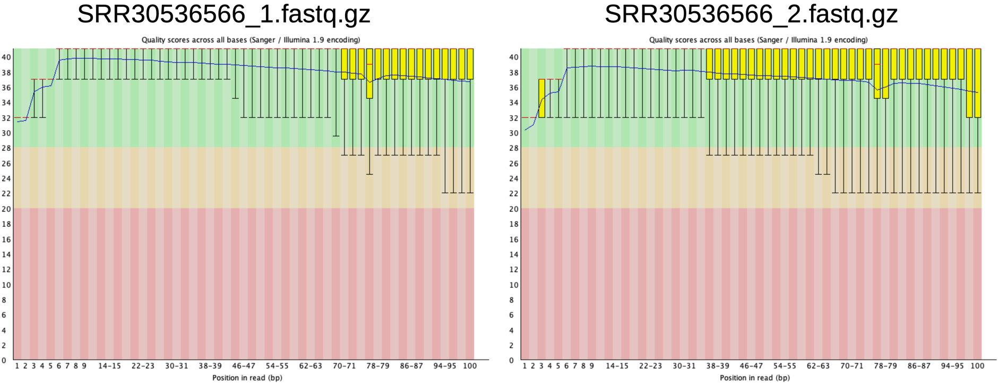
  
  
      
- Regarding the **high content of duplicated reads** (see **Figure. 2**): The NCBI-SRA metadata for the dataset [RUN: SRR30536566](https://www.ncbi.nlm.nih.gov/sra/SRX25960056[accn]) reports: 
  
  - **Strategy**: `AMPLICON`
    
  - **Selection**: `PCR`

This means that the dataset was generated using **targeted amplicon sequencing** of full-length genes including KRAS NRAS BRAF PIK3CA PTEN RRAS and MEK1 including UTR, exons, and introns. These specific genomic regions were PCR-amplified many times to create enough material for sequencing. All reads derived from the same original fragment are **technical duplicates** (PCR duplicates), not biological duplicates. Therefore, a very high duplication rate is inherent to the technique (see **Figure.3**). It does not reflect poor quality; it reflects the method.

**Figure 2.** Sequence duplication levels of reads
  
  
  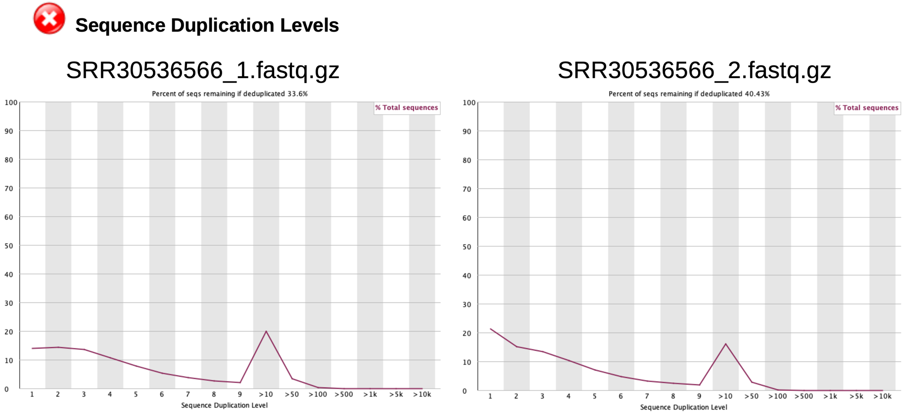
  

**Figure 3.** Proportion of Unique and duplicated reads 
  
  
  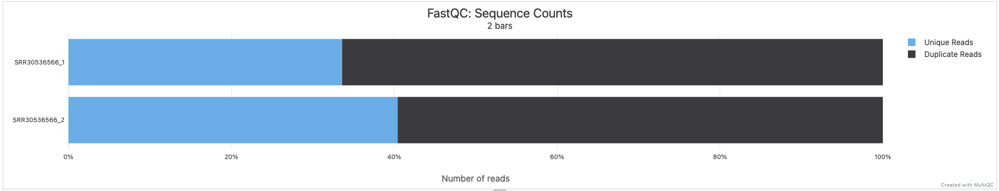


- Regarding the **high GC content** (see **Figure 4**): Usually, a bimodal curve often suggests contamination (e.g., bacteria in a human sample) or a mixed sample that would raise concerns for whole-genome sequencing. However, this is expected for targeted amplicon panels. You are not sequencing the whole human genome (which has a relatively uniform ~41% GC). You are sequencing a panel of specific amplicons. Different genes have different base compositions, resulting in multiple GC peaks. The "camel" shape strongly suggests your targeted panel contains two distinct classes of amplicons:

  1. First Hump (Peak ~35% GC): Likely corresponds to a subset of your amplicons that are GC-poor.
  
  2. Second Hump (Peak ~62% GC): Likely corresponds to a subset of amplicons that are GC-rich (common in many coding regions).
  
The red warning is because FastQC compares your distribution to a unimodal model based on a normal genome. Your amplicon-based distribution violates this model, so it gets flagged. This is **NOT** a problem for your data.

**Figure 4.** Per sequence GC content showing a bimodal shape.
  
  
  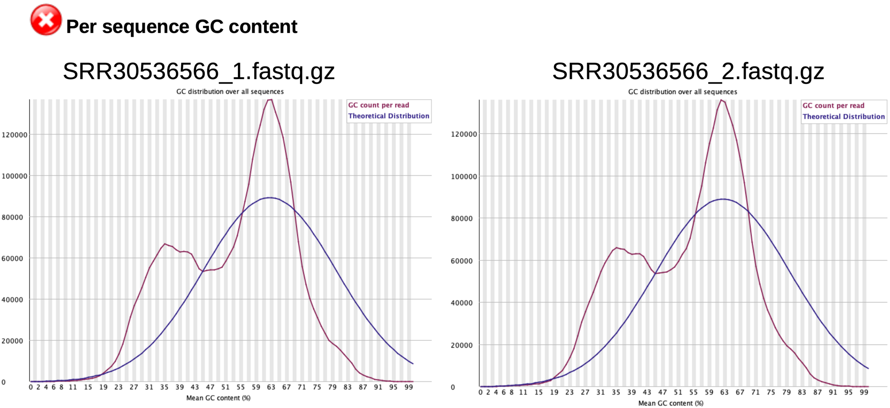

---
---

## Trimming + QC 👉 [02_trim.sh](bash_scripts/02_trim.sh)

### Cutadapt

**Documentation for Cutadapt**:

<https://github.com/marcelm/cutadapt/blob/main/doc/guide.rst> Relevant sections include "***Trimming paired-end reads***" and "***Cutadapt's output***".

- **Trimmed FASTQ files output**: `~/Genomics_cancer/data/SRR30536566/trimmed`
- **Cutadapt log report**: `~/Genomics_cancer/logs/cutadapt_SRR30536566.log`
- **QC reports**: 
  -`SRR30536566_R1.trimmed_fastqc.html`
  -`SRR30536566_R2.trimmed_fastqc.html`
  -`multiqc_report_1.html`

**Trimming strategy**
  - Fixed trimming of the first and last 5 bp based on FastQC. 
  - Quality trimming of low-confidence bases (Phred < 20)
  - Removal of short reads (<30 bp).
  - Trimming of rare terminal poly-A stretches (≥10 A’s)
  
This trimming strategy is conservative and well-suited for targeted amplicon sequencing data, without affecting genuine sequence content.
  
**Cutadapt parameters**

```bash
-u 5 -u -5      → trim 5 bp from 5′ and 3′ of R1
-U 5 -U -5      → trim 5 bp from 5′ and 3′ of R2
-q 20,20        → trim low-quality bases (Phred < 20) from both ends
-m 30           → discard reads shorter than 30 bp
-a A{10}        → trim ≥10 A’s from 3′ end of R1
-A A{10}        → trim ≥10 A’s from 3′ end of R2
```

>**Note**: Fixed trimming (-u, -U) removes a constant number of bases and is therefore not reported separately in the Cutadapt log. Its effect is included in the difference between total processed and total written bases.

**Cutadapt summary interpretation** (`cutadapt_SRR30536566.log`):

After trimming and filtering:

- 97.2% of read pairs were retained

- 86.4% of total bases were preserved

- Quality trimming (`-q 20,20`) affected only 0.9% of bases

- Pairs that were too short (`-m 30`): 2.8%

- Poly-A contamination was minor (<5%)

Why is retained 86.4% of bases?

| Cause                         | Effect                         |
| ----------------------------- | ------------------------------ |
| Fixed trimming (`-u 5 -u -5`) | −10 bp per read                |
| Quality trimming (`-q 20,20`) | −0.9%                          |
| Poly-A trimming (`A{10}`)     | Variable tail removal          |
| Read removal (`-m 30`)        | 2.8% of reads dropped entirely |

✔ Excellent base quality

✔ Expected amplicon duplication

✔ Minor poly-A contamination

✔ Minimal read loss

This indicates **high-quality data** with minimal loss of informative reads.

---
---

## Alignment and BAM preprocessing 👉 [03_align_&_bam_preprocess.sh](bash_scripts/03_align_&_bam_preprocess.sh)

**Documentation**: 

- **BWA**: <https://bio-bwa.sourceforge.net/bwa.shtml>
- **samtools** (v. 1.23): <https://www.htslib.org/doc/samtools.html>
- **Picard**: <https://gatk.broadinstitute.org/hc/en-us/articles/360037052812-MarkDuplicates-Picard>

The alignment steps and processing of BAM file are explained in **Table 2A** and the inputs/outputs files in **Table 2B**.

**Table 2A**: Alignment and BAM Processing Workflow Steps
| Step | Tool | Function / Role |
|------|------|-----------------|
| **1**<br>**Alignment** | `bwa mem` | Aligns paired-end reads to the reference genome.<br>Adds **Read Group (RG)** information required by GATK and downstream tools.<br> Output is an **unsorted SAM** alignment file. |
| **2**<br>**SAM → BAM Conversion** | `samtools view` | Converts human-readable SAM into compressed binary BAM format for efficiency and downstream processing.  |
| **3**<br>**Sort BAM** | `samtools sort` | Sorts alignments by genomic coordinates (chromosome and position).<br>**Required** for duplicate marking, indexing, and variant calling.  |
| **4**<br>**Mark Duplicates** | `picard MarkDuplicates` | Identifies PCR/optical duplicates and **marks them in the BAM (FLAG + tags)** without removing reads.<br>Duplicate sets are tagged (amplicon-aware), enabling variant callers to down-weight or ignore duplicates. |
| **5**<br>**Add MD/NM Tags** | `samtools calmd` | Recalculates and adds **MD** (mismatch positions) and **NM** (Number of mismatches) tags.<br>Improves robustness and compatibility with GATK and somatic variant callers. |
| **6**<br>**Index BAM** | `samtools index` | Creates a BAM index enabling **random genomic access**.<br>Required for variant calling (e.g. Mutect2), visualization (IGV), and QC tools. |

**Table 2B**: Input/Output Files
| Step | Input Files | Output Files |
|------|-------------|--------------|
| **1** | `*_R1.trimmed.fastq.gz`, `*_R2.trimmed.fastq.gz`, `Homo_sapiens_assembly38.fasta` | `SRR30536566.sam` |
| **2** | `SRR30536566.sam` | `SRR30536566.bam` |
| **3** | `SRR30536566.bam` | `SRR30536566.sorted.bam` |
| **4** | `SRR30536566.sorted.bam` | `SRR30536566.sorted.markdup.bam`, `*.markdup.metrics.txt` |
| **5** | `SRR30536566.sorted.markdup.bam`, `Homo_sapiens_assembly38.fasta` | `SRR30536566.sorted.markdup.md.bam` |
| **6** | `SRR30536566.sorted.markdup.md.bam` | `SRR30536566.sorted.markdup.md.bam.bai` |


### Read Groups (RG): The "Birth Certificate" of Each Read

BWA-MEM assigns **Read Group (RG)** information to each read in the SAM/BAM file.
Read groups provide essential metadata that allows downstream tools—especially GATK—to correctly interpret the origin of each read. See **Table 3** for details.

**Table 3**: GATK-relevant read group fields

| Field | Meaning       | Recommendation      | Script                   | Interpretation
| ----- | ------------- | ------------------- |--------------------------|-----------------
| `ID`  | Read group ID | Unique per lane/run | `RG_ID="SRR30536566"`    | Technical identifier
| `SM`  | Sample        | Biological sample   | `RG_SM="DMBEL-EIDR-071"` | Reflects the biological sample
| `LB`  | Library       | Library preparation | `RG_LB="AMPLICON"`       | Reflects library strategy
| `PL`  | Platform      | Sequencing platform | `RG_PL="ILLUMINA"`       | **Mandatory for GATK**
| `PU`  | Platform unit | Flowcell + lane     | `RG_PU="HiSeq4000"`      | Uniquely identifies the sequencing unit


### Picard MarkDuplicates

After trimming and alignment of sample **SRR30536566**, a duplication level of **~54.6% of read pairs** was observed among ~7.7 million mapped reads (Figure 5).
This high duplication rate is **expected** because the data originate from **PCR-amplified amplicon regions** targeting specific genes in colon cancer cells.
Marked duplicates are **not removed**, but flagged so that downstream tools (e.g. Mutect2) can properly account for them.

**Figure 5.** Percentage of reads categorized by duplication states.

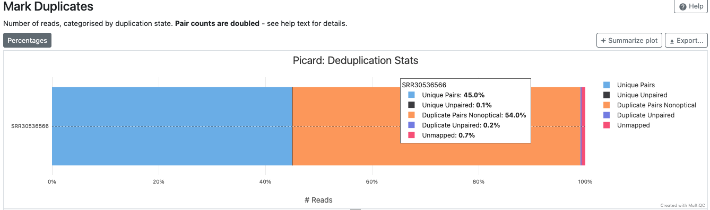

### Samtools – Troubleshooting

When following this tutorial, it is very important to be aware of which version of samtools is installed in the conda environment.
In this course, the environment provides **samtools v0.1.19 (released in 2013)**, which is much older than current samtools versions (≥1.x).

Because of this, some command-line options shown in modern tutorials and online documentation **do NOT exist** in this older version. Using newer options with an old version will lead to errors, even if the command looks perfectly correct.

You can always check the installed version with:

```bash
samtools
```

### 🔹 A common student concern: “Is the old version worse?”

During this tutorial, students often feel that using an old samtools version means lower-quality results.
**This is not true**.

✔️ The core algorithms used by samtools such as:

- coordinate sorting of BAM files

- calculation of MD and NM tags

- interpretation of alignments

are **conceptually identical across versions**.

What has mainly improved in newer versions is:

- memory efficiency

- speed

- multi-threading support

- cleaner command-line syntax

The **biological results and interpretation** (sorted BAM order, MD/NM values, variant evidence) remain the same.


### 🔹 Key version-related differences in samtools versions

1. `samtools sort`

Old version (v0.1.19) does not support `-o`
```bash
THREADS=4
samtools sort -@ "$THREADS" \
  "$ALIGN_DIR/${SAMPLE}.bam" \
  "$ALIGN_DIR/${SAMPLE}.sorted"
```

Current version (≥1.x)
```bash
THREADS=4
samtools sort -@ "$THREADS" \
  -o "$ALIGN_DIR/${SAMPLE}.sorted.bam" \
  "$ALIGN_DIR/${SAMPLE}.bam"
```

Output:
```bash
SRR30536566.sorted.bam
```

2. `samtools calmd`

Old version (v0.1.19) does not support `-@`, `--threads`

```bash
FINAL_BAM="$ALIGN_DIR/${SAMPLE}.sorted.markdup.md.bam"
samtools calmd -b \
  "$ALIGN_DIR/${SAMPLE}.sorted.markdup.bam" \
  "$REF_FASTA" \
  > "$FINAL_BAM"
```

Current version (≥1.x)

```bash
FINAL_BAM="$ALIGN_DIR/${SAMPLE}.sorted.markdup.md.bam"
samtools calmd -@ "$THREADS" -b \
  "$ALIGN_DIR/${SAMPLE}.sorted.markdup.bam" \
  "$REF_FASTA" \
  > "$FINAL_BAM"
```

Output:
```bash
SRR30536566.sorted.markdup.md.bam.bai
```

>**Message about Samtools**:
This pipeline uses an older samtools version (0.1.19), which does not support multithreading (-@).
The MD and NM tags produced here are **biologically identical** to those generated by modern samtools versions; newer versions mainly improve speed and robustness, not the interpretation of variants.


### Folder structure: From QC - Trimming/Filtering - Alignment + BAM preprocessing.

```bash
Genomics_cancer/
├── reference/                 
│   └── GRCh38/
│       ├── fasta/
│       │   ├── Homo_sapiens_assembly38.fasta
│       │   ├── Homo_sapiens_assembly38.fasta.fai
│       │   └── Homo_sapiens_assembly38.dict
│       │   └── Homo_sapiens_assembly38.fasta.64.amb     
│       │   └── Homo_sapiens_assembly38.fasta.64.ann     
│       │   └── Homo_sapiens_assembly38.fasta.64.bwt     
│       │   └── Homo_sapiens_assembly38.fasta.64.pac    
│       │   └── Homo_sapiens_assembly38.fasta.64.sa     
│       │   └── Homo_sapiens_assembly38.fasta.64.alt                  
│       └── known_sites/       
│       └── bed/               
│       └── somatic_resources/ 
├── data/
│   └── SRR30536566/                
│       ├── raw_fastq/
│       │   ├── SRR30536566_1.fastq.gz
│       │   └── SRR30536566_2.fastq.gz
│       ├── qc/
│           └── multiqc_report.html                               # QC
│           └── multiqc_report_1.html                             # Trimm
│           └── multiqc_report_2.html                             # Align+BAM_preprocess
│           └── SRR30536566_1_fastqc.html 
│           └── SRR30536566_R1.trimmed_fastqc.html 
│           └── SRR30536566_2_fastqc.html 
│           └── SRR30536566_R2.trimmed_fastqc.html                  
│       ├── trimmed/
│           └── SRR30536566_R1.trimmed.fastq.gz 
│           └── SRR30536566_R2.trimmed.fastq.gz          
│       ├── aligned/
│           └── SRR30536566.sam                                 # Removed
│           └── SRR30536566.bam                                 # Removed
│           └── SRR30536566.sorted.bam                          # Removed
│           └── SRR30536566.sorted.markdup.bam                  # Removed
│           └── SRR30536566.markdup.metrics.txt
│           └── SRR30536566.sorted.markdup.md.bam               # Further analysis
│           └── SRR30536566.sorted.markdup.md.bam.bai           # Further analysis
│           
│       ├── variants/          
│       └── annotation/        
├── scripts/
│       └── 0_wget_Hsapiens_assem38.sh
│       └── 01_qc.sh
│       └── 02_trim.sh
│       └── 03_align_&_bam_preprocess.sh
└── logs/
        └── cutadapt_SRR30536566.log
        └── bwa_mem.log
        └── markduplicates.log
        └── SRR30536566.flagstat.txt                     
```

>**Key idea**:
>Each step of the [alignment & BAM preprocessing](bash_scripts/03_align_&_bam_preprocess.sh) script transforms the data into a format that is progressively **more structured, annotated, and analysis-ready**. 
By the end of this script, the BAM-generated file is:
>- sorted
>- duplicate-aware
>- MD/NM-tagged
>- indexed 
>This is the **expected starting point** for somatic variant calling with GATK **Mutect2**.
The pipeline is fully GATK-compatible and intentionally uses a legacy samtools version to keep the computational environment simple and reproducible.

---
---

## Variant calling with Mutect2 👉 [04_mutect2.sh](bash_scripts/04_mutect2.sh)

**Variant calling** is the bioinformatics process of identifying positions in a sequenced genome where the sample’s DNA differs from a reference genome. See examples of variant types related to various diseases and in cancer in **Table 4** and **Table 5**.

**Table 4**: Genetic Variant Types and Associated Diseases

| Variant Type                               | Example          | Size Range | Molecular Consequence    | Typical Biological Effect               | Disease Example                | Gene     |
| ------------------------------------------ | ---------------- | ---------- | ------------------------ | --------------------------------------- | ------------------------------ | -------- |
| **Synonymous SNP (silent)**                | GAA → GAG        | 1 bp       | No amino acid change     | Usually neutral                         | None (population polymorphism) | HBB      |
| **Missense SNP (non-synonymous)**          | GAG → GTG        | 1 bp       | Amino acid substitution  | Altered protein function (gain or loss) | Sickle cell anemia             | HBB      |
| **Nonsense SNP (non-synonymous)**          | CGA → TGA        | 1 bp       | Premature stop codon     | Truncated protein, loss-of-function     | Duchenne muscular dystrophy    | DMD      |
| **Indel (frameshift)**                     | CTT deletion     | 1–50 bp    | Reading-frame disruption | Severely altered protein                | Cystic fibrosis (ΔF508)        | CFTR     |
| **Indel (in-frame / repeat expansion)**    | CAG expansion    | Variable   | Protein elongation       | Toxic gain-of-function                  | Huntington’s disease           | HTT      |
| **Copy Number Variant (CNV)**<br>**(duplication/deletion)** | Exon duplication | 50 bp–5 Mb | Gene dosage alteration   | Overexpression or<br>haploinsufficiency    | Williams syndrome | ELN      |
| **Structural Variant**<br>**(SV: translocation)** | t(9;22)   | >50 bp     | Fusion gene formation    | Constitutive signaling                  | Chronic myeloid leukemia       | BCR–ABL1 |
| **Structural Variant**<br>**(SV: inversion)** | F8 inversion   | Variable   | Gene disruption          | Loss of gene function                   | Hemophilia A                   | F8       |


In **cancer genomics**, variant calling focuses on identifying somatic variants:

- Mutations present in tumor cells

- Absent (or rare) in the germline

- Often present at subclonal allele frequencies

Therefore, **cancer genomics** is a disciplie that helps to:

- Identify driver mutations that cause cancer

- Find therapeutic targets (like EGFR mutations for lung cancer)

- Reconstruction of tumor evolution and clonal architecture

- Support for precision oncology (matching drugs to mutations)

Additional applications include:

- Rare disease diagnosis (finding mutations causing rare diseases)

- Pharmacogenomics (predicting drug response)

- Population genetics (studying human evolution)

- Forensic genomics (DNA fingerprinting)

**Table 5**: Cancer-Related Genetic Variants

| Variant Type            | Cancer Example            | Oncogenic Mechanism   | Biological Consequence       | Targeted Therapy     |
| ----------------------- | ------------------------- | --------------------- | ---------------------------- | -------------------- |
| **Missense SNP**        | **BRAF V600E**            | Activating mutation   | Constitutive MAPK signaling  | Vemurafenib          |
| **Indel**               | **EGFR exon 19 deletion** | Gain-of-function      | Persistent EGFR activation   | Erlotinib, Gefitinib |
| **CNV (Amplification)** | **HER2 amplification**    | Increased gene dosage | Receptor overexpression      | Trastuzumab          |
| **SV (Fusion)**         | **BCR–ABL1** t(9;22)      | Gene fusion           | Constitutive tyrosine kinase | Imatinib             |
| **Missense SNP**        | **TP53 R175H**            | Loss-of-function      | Impaired DNA damage response | No direct therapy    |


### Variant callers

| Tool                | Best suited for                                             | Strengths                                                                                                                                     | Limitations                                                          |
| ------------------- | ----------------------------------------------------------- | --------------------------------------------------------------------------------------------------------------------------------------------- | -------------------------------------------------------------------- |
| **Mutect2 (GATK)**  | **Somatic variants in cancer** (tumor-only or tumor–normal) | ✔ Excellent sensitivity at low VAF<br>✔ Sophisticated error modeling<br>✔ Uses PoN + population AFs<br>✔ Clinical standard in cancer genomics | Requires multiple input resources; more complex                      |
| **HaplotypeCaller** | Germline variant discovery                                  | ✔ Excellent for inherited variants<br>✔ Accurate diploid genotyping                                                                           | ❌ Not designed for somatic variants<br>❌ Poor sensitivity at low VAF |
| **VarScan2**        | Simple germline/somatic calling                             | ✔ Works at low coverage<br>✔ Easy to run                                                                                                      | ❌ High false-positive rate<br>❌ Limited error modeling               |
| **Strelka2**        | Somatic variants (especially indels)<br>(tumor–normal)      | ✔ Very accurate indel calling<br>✔ Fast in tumor–normal mode                                                                                  | ❌ Less robust in tumor-only mode<br>❌ Less transparent filtering     |
| **FreeBayes**       | Germline / pooled samples                                   | ✔ Flexible calling models                                                                                                                     | ❌ Not optimized for cancer somatic variants                          |

### Mutect2 is the correct choice for this tutorial

✔ Designed specifically for somatic cancer mutations

✔ Supports tumor-only analysis using PoN + gnomAD

✔ Detects low-frequency variants (low-VAF) typical of cfDNA and amplicon panels

✔ Integrates downstream artifact and contamination filtering, seamlessly integrates with GATK filtering and annotation steps

✔ Widely adopted in research and clinical pipelines

> **Important point**
> Mutect2 is designed primarily to detect:
>  - SNPs
>  - small indels
> It is **not** intended for reliable detection of:
>  - large CNVs
>  - large structural variants
> Those require different tools (e.g., CNVkit, DELLY, Manta).


### Essential Files for Somatic Variant Calling with GATK Mutect2

Mutect2 compares tumor sequencing data against a reference genome and multiple external resources to distinguish **true somatic mutations** from **technical artifacts** and **germline variation**.

| #     | File category                          | Conceptual view (what this represents)                                                                                             | Purpose in somatic variant calling                                                                        | Example file(s)                                                                | Required                |
| ----- | -------------------------------------- | ---------------------------------------------------------------------------------------------------------------------------------- | --------------------------------------------------------------------------------------------------------- | ------------------------------------------------------------------------------ | ----------------------- |
| **1** | **Tumor BAM (aligned reads)**          | The *digital representation of the patient’s DNA*, where each read is a fragment sequenced from the tumor and mapped to the genome | Provides the raw evidence used to detect mismatches, insertions, and deletions relative to the reference  | `SRR30536566.sorted.markdup.md.bam`<br>`SRR30536566.sorted.markdup.md.bam.bai` | ✅ Yes                   |
| **2** | **Reference genome**                   | The *coordinate system and “normal” genome* against which tumor reads are compared                                                 | Defines genomic positions, enables alignment interpretation, and serves as baseline for variant detection | `Homo_sapiens_assembly38.fasta`                                                | ✅ Yes                   |
|       | Reference index files                  | The *navigation tools* that allow fast access to the reference genome                                                              | Required for efficient random access and full GATK compatibility                                          | `.fai` (samtools)<br>`.dict` (Picard)                                          | ✅ Yes                   |
| **3** | **Germline variant resource (gnomAD)** | A *population-level catalogue of normal human variation*                                                                           | Helps Mutect2 estimate whether a variant is likely germline vs somatic by using allele frequencies        | `af-only-gnomad.hg38.vcf.gz`<br>`af-only-gnomad.hg38.vcf.gz.tbi`               | ✅ Yes (tumor-only mode) |
| **4** | **Panel of Normals (PoN)**             | A *background noise model* built from many normal samples                                                                          | Removes recurrent technical artifacts that appear across samples but are not true mutations               | `1000g_pon.hg38.vcf.gz`<br>`1000g_pon.hg38.vcf.gz.tbi`                         | ⚠️ Strongly recommended |
| **5** | **BED / interval file**                | The *map of genomic regions that were actually sequenced*                                                                          | Restricts variant calling to targeted regions, reducing false positives and runtime                       | `crc_panel_7genes_sorted.hg38.bed`                                                       | ⚠️ Recommended          |
| **6** | **dbSNP (optional)**                   | A *catalogue of known common polymorphisms*                                                                                        | Used mainly for annotation and interpretation, not required by Mutect2 itself                             | `dbsnp_146.hg38.vcf.gz`                                                        | ❌ Optional              |
| **7** | **COSMIC (optional)**                  | A *knowledge base of known cancer mutations*                                                                                       | Enables biological interpretation and clinical relevance assessment after variant calling                 | `CosmicMutantExport.*`                                                         | ❌ Optional              |
| **8** | **F1R2 artifact data**                 | A *model of strand-orientation sequencing artifacts*                                                                               | Required to filter FFPE and orientation bias artifacts in downstream filtering                            | `SRR30536566.f1r2.tar.gz`                                                      | ✅ Yes (for filtering)   |

**Documentation**: 

- **Mutect2**: <https://gatk.broadinstitute.org/hc/en-us/articles/360037593851-Mutect2>


### Verify and download the essential files to run Mutect2

1. **Check presence of these files**:

✔ /Genomics_cancer/data/SRR30536566/aligned/SRR30536566.sorted.markdup.md.bam

✔ /Genomics_cancer/data/SRR30536566/aligned/SRR30536566.sorted.markdup.md.bam.bai

✔ /Genomics_cancer/reference/GRCh38/fasta/Homo_sapiens_assembly38.fasta

✔ /Genomics_cancer/reference/GRCh38/fasta/Homo_sapiens_assembly38.dic

✔ /Genomics_cancer/reference/GRCh38/fasta/Homo_sapiens_assembly38.fai

❌  `SRR30536566.f1r2.tar.gz` is an output from variant calling. The file will be used for **learn read-orientation bias**, a common artifact in Illumina sequencing (especially strong in amplicon and cfDNA data).

2. **Create folders**

Go to: /Genomics_cfDNA_SRR15506490/Somatic_SRR15506490/reference/GRCh38

Create these folders "somatic_resources" and "intervals":

```bash
mkdir somatic_resources intervals
```

3. **Download Germline variant resource (gnomAD) and Panel of Normals (PoN) files to ~/somatic_resources**. 

    Run 👉 [0_wget_gnomad_PoN.sh](bash_scripts/0_wget_gnomad_PoN.sh) 

4. **Download GTF file to BED file generation (if authors provided no BED)**

  - 4.1. Go to /Genomics_cfDNA_SRR15506490/Somatic_SRR15506490/reference/GRCh38/intervals

  - 4.2. Download **GTF** file with `wget`

```bash
wget https://ftp.ebi.ac.uk/pub/databases/gencode/Gencode_human/release_38/gencode.v38.annotation.gtf.gz
```
>**Note**: Do not download the 'GGF3' (from <https://www.gencodegenes.org/human/release_38.html>) nor the `Homo_sapiens_assembly38.contam.bed` (from <https://console.cloud.google.com/storage/browser/gcp-public-data--broad-references/hg38/v0?>) as BED files.

>**Note2**: GTF file structure <http://www.ensembl.org/info/website/upload/gff.html>:
```bash
field 1  chrom
field 2  source - name of the program that generated this feature, or the data source (database or project name)
field 3  feature (gene, transcript, exon, …)
field 4  start - Start position* of the feature.
field 5  end - End position* of the feature.
field 6  score - A floating point value.
field 7  strand - defined as + (forward) or - (reverse).
field 8  frame
field 9  attributes - a single long string semicolon-separated.
```

  - 4.3. Decompress

```bash
gunzip gencode.v38.annotation.gtf.gz
```
  - 4.4. Verify the presence of gene targets KRAS, NRAS, BRAF, PIK3CA, PTEN, RRAS, and MAP2K1 (MEK1) in **.gtf** file

>**Note**: The authors of dataset "SRR15506490" in <https://www.ncbi.nlm.nih.gov/sra/SRX25960056> point out in the following: 

>"**Design**: Targeted sequencing of full-length, KRAS NRAS BRAF PIK3CA PTEN RRAS and MEK1 including UTR, exons, and introns."

  - Use this code to verify genes individually:

```bash
zless gencode.v38.annotation.gtf.gz | grep "chr*" | grep -w "KRAS" | head -n1     # Copy/Paste the gene target in "gene" and hit Enter
```

  - **Alternative**: Use a for-loop to retrieve all target genes at once for .gtf file 👉 [04_for_loop_gtf.sh](bash_scripts/04_for_loop_gtf.sh)


5. **Generation of BED file (if authors provided no BED)**

Create the **.bed** file and **sorted.bed** file by running 👉 [04_make_crc_7genes_bed.sh](bash_scripts/04_make_crc_7genes_bed.sh) 
  
The `crc_panel_7genes.hg38.bed` and `crc_panel_7genes_sorted.hg38.bed` are located in: /Genomics_cancer/reference/GRCh38/intervals
  

6. Lastly, check whether the `SRR30536566.sorted.markdup.md.bam` has RG (Read Groups)
  
  Run 
  ```bash
  samtools view -H SRR30536566.sorted.markdup.md.bam | grep "@RG"
  ```
  Expected output:
  ```bash
  @RG	ID:SRR30536566	SM:DMBEL-EIDR-071	LB:AMPLICON	PL:ILLUMINA	PU:HiSeq4000
@PG	ID:bwa	PN:bwa	VN:0.7.19-r1273	CL:bwa mem -t 4 -R @RG\tID:SRR30536566\tSM:DMBEL-EIDR-071\tLB:AMPLICON\tPL:ILLUMINA\tPU:HiSeq4000
  ```
7. Now, run 👉 [04_mutect2.sh](bash_scripts/04_mutect2.sh)


### Mutect2 output files (all expected, all correct)

| File                                    | Status | Meaning                  |
| ----------------------------------------| ------ | ------------------------ |
| `SRR30536566.unfiltered.vcf.gz`         | ✅     | Raw somatic calls        |
| `SRR30536566.unfiltered.vcf.gz.tbi`     | ✅     | Indexed                  |
| `SRR30536566.unfiltered.vcf.gz.stats`   | ✅     | Internal GATK statistics |
| `SRR30536566.f1r2.tar.gz`               | ✅     | Strand artifact data     |
| `mutect2.stderr.log`                    | ✅      | Clean                   |
| `mutect2.stdout.log`                    | ✅      | Clean                   |

### Mutect2 logs

a) mutect2.stderr.log

```bash
Processing 573443 bp from intervals
```

**Interpretation**: It matches the 7-gene CRC panel, calculated from `crc_panel_7genes_sorted.hg38.bed`
The "573443 bp" is the sum of all 7-gene lengths.

```bash
Final CRC 7-gene BED file contents:
Chr Gene_Start  Gene_End  Gene_Name
chr1	114704468	114716771	NRAS
chr10	87863624	87971930	PTEN
chr12	25205245	25250936	KRAS
chr15	66386836	66491544	MAP2K1
chr19	49635291	49640143	RRAS
chr3	179148113	179240093	PIK3CA
chr7	140719326	140924929	BRAF
```
```bash
Unable to find native library: native/libgkl_pairhmm_omp.dylib
Ignoring request for 4 threads
```
**Interpretation**: Expected on macOS; Does NOT affect results, only speed.

```bash
832807 read(s) filtered by: NotDuplicateReadFilter 
863479 total reads filtered out of 1479947 reads processed
```
**Interpretation**: Confirms MarkDuplicates worked; Mutect2 behaves as expected; 832807 duplicates removed.

b) mutect2.stdout.log

```bash
Tool returned:
SUCCESS
```
**Interpretation**: Success!

**Verdict on Mutect2 variant calling step**: There are no errors, no conceptual problems, and no missing inputs.


>**Important:**
>
>Mutect2 does not “decide” whether a variant is cancer or not in isolation.
>
> It **models probabilities** using:
> - sequencing evidence
>
> - population allele frequencies
>
> - technical artifact profiles
>
> - contamination estimates
>
> Final biological interpretation happens after filtering and annotation.

### Folder structure: Input & Output files of Mutect2-Variant calling.

```bash
Genomics_cancer/
├── reference/                 
│   └── GRCh38/
│       ├── fasta/
│       └── known_sites/       
│       └── intervals/                                           # BED files
│           └── gencode.v38.annotation.gtf
│           └── gencode.v38.annotation.gtf.gz
│           └── crc_panel_7genes.hg38.bed
│           └── crc_panel_7genes_sorted.hg38.bed                 # For Mutect2 analysis
│       └── somatic_resources/                                   # PoN & GNOMAD: For Mutect2 analysis
│           └── 1000g_pon.hg38.vcf.gz
│           └── 1000g_pon.hg38.vcf.gz.tbi
│           └── af-only-gnomad.hg38.vcf.gz
│           └── af-only-gnomad.hg38.vcf.gz.tbi
├── data/
│   └── SRR30536566/                
│       ├── raw_fastq/
│       ├── qc/
│       ├── trimmed/
│       ├── aligned/
│           └── SRR30536566.markdup.metrics.txt
│           └── SRR30536566.sorted.markdup.md.bam               # For Mutect2 analysis
│           └── SRR30536566.sorted.markdup.md.bam.bai           # For Mutect2 analysis
│           
│       ├── variants/                                           # Outputs
│           └── SRR30536566.f1r2.tar.gz          
│           └── SRR30536566.unfiltered.vcf.gz
│           └── SRR30536566.unfiltered.vcf.gz.stats 
│           └── SRR30536566.unfiltered.vcf.gz.tbi
│       └── annotation/        
├── scripts/
│       └── 0_wget_gnomad_PoN.sh
│       └── 0_wget_Hsapiens_assem38.sh
│       └── 01_qc.sh
│       └── 02_trim.sh
│       └── 03_align_&_bam_preprocess.sh
│       └── 04_make_crc_7genes_bed.sh
│       └── 04_mutect2.sh                                 
└── logs/
        └── cutadapt_SRR30536566.log
        └── bwa_mem.log
        └── markduplicates.log
        └── SRR30536566.flagstat.txt                     
        └── mutect2.stderr.log                                  # Output
        └── mutect2.stdout.log                                  # Output
```

---
---

## Orientation bias model 👉 [05_learn_read_orientation_model.sh](bash_scripts/05_learn_read_orientation_model.sh)

**Documentation**

- **LearnReadOrientationModel**: <https://gatk.broadinstitute.org/hc/en-us/articles/360051305331-LearnReadOrientationModel>

Modern NGS data—especially **amplicon-based, PCR-enriched panels** (like of this tutorial) contain systematic sequencing artifacts. One of the **most dangerous artifacts** is **read-orientation bias**.

So, after Mutect2 identifies somatic candidates, `LearnReadOrientationModel` is crucial because:

  - **Sequencing artifacts** often manifest as **strand-biased errors**

  - **Oxidative damage** (common in FFPE samples) causes specific read orientation patterns

  - **PCR artifacts** can create false positives with characteristic strand distribution

  - **Context-dependent errors** vary by sequencing platform and library prep

This step models these biases so `FilterMutectCalls` can distinguish real variants from artifacts.


**What is read-orientation bias?**

In paired-end sequencing:

Each DNA fragment is sequenced twice:

- Read 1 (R1)

- Read 2 (R2)

Reads can align in **different orientations** relative to the reference strand.

Certain artifacts appear preferentially:

In R1 but not R2 or only when read is aligned in one orientation

This is **not biological**. It is caused by:

- PCR chemistry

- End-repair

- Adapter ligation

- DNA damage (e.g., deamination)

- Amplicon design asymmetries

**What It Does**

The tool analyzes **read orientation patterns** of supporting reads at candidate variant sites:

  1. **Counts supporting reads** by their orientation relative to the reference genome

  2. **Builds a probabilistic model** of strand bias for each mutation type

  3. **Outputs artifact probabilities** used by FilterMutectCalls

  4. **Key insight**: Real somatic variants typically show balanced support; artifacts show skewed patterns
  
**Orientation bias model** learns the prior probability of read orientation artifact, a common artifact in Illumina sequencing (especially strong in amplicon and cfDNA data), from the output of CollectF1R2Counts of Mutect2, which is `~/variants/SRR30536566.f1r2.tar.gz` file.
The `*.f1r2.tar.gz` file contains, **for every candidate variant**:

- Counts of ALT-supporting reads split by:

  - F1R2 (forward read1 / reverse read2)

  - F2R1 (forward read2 / reverse read1)

This preserves orientation-specific evidence, not just strand.

**Conceptually**: "Across ALL candidate variants, do certain mutation types appear preferentially in one orientation pattern (F1R2 vs F2R1)?”

This information is learned from your sample, not from a database, enabling accurate read-orientation artifact filtering. See **Figure 6** and **Table 6**.

This is **not variant-specific**. It is a **global artifact model** for your library.

**Figure 6**: Normal vs. Artifact Patterns
  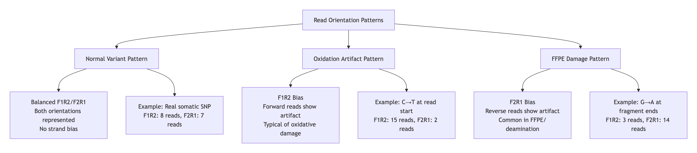

**Table 6**: Interpretation Guide of Orientation bias

| Pattern | F1R2 | F2R1 | Likely Cause | GATK Action |
|---------|------|------|--------------|-------------|
| **Balanced Support** | ~50% | ~50% | Real somatic variant | Keep variant |
| **F1R2 Skew** | High | Low | Oxidative damage at 5' ends<br/>Common in fresh-frozen | Filter as artifact |
| **F2R1 Skew** | Low | High | FFPE/deamination at 3' ends<br/>Formalin damage | Filter as artifact |
| **Extreme Both** | High | High | Library prep issue<br/>Contamination | Investigate sample |
| **No Support** | Zero | Zero | False positive call | Filter out |

**Examples**
```bash
NORMAL VARIANT (e.g., TP53 mutation):
Reads from tumor sample supporting G→A change:

Forward reads (F1R2):  5′---G*---3′  ← 6 reads
                        │
                        (alternate allele NOT at read start)
                        
Reverse reads (F2R1):  3′---C*---5′  ← 5 reads
                        │  
                        (complementary strand, balanced)

Result: F1R2=6, F2R1=5 → BALANCED → REAL VARIANT

OXIDATION ARTIFACT (C→T):
Oxidized cytosines at read starts:

Forward reads (F1R2):  5′---T*---3′  ← 12 reads
                        ↑
                        (alternate AT read start!)
                        
Reverse reads (F2R1):  3′---A---5′   ← 1 read
                        (normal pattern)

Result: F1R2=12, F2R1=1 → F1R2 BIAS → ARTIFACT
```

**Practical Implications**

  - **Clinical samples**: FFPE artifacts show F2R1 bias; fresh-frozen show F1R1 bias

  - **Library prep**: PCR duplicates can exaggerate these patterns

  - **Mutation types**: C→T/G→A transitions most affected by oxidative damage

  - **FilterMutectCalls** uses this model's output to assign ORIENTATION_BIAS filter


**Why this matters in cancer variant calling**

Somatic variants often have:

- Low VAF (1–10%)

- Few supporting reads

That is exactly the regime where orientation artifacts can:

- Mimic subclonal mutations

- Pass simple filters

- Inflate false positives


>**Key takeaway**: This step is **essential for reducing false positives** in somatic calling, especially for low-frequency variants or damaged samples. The model learns your data's specific error patterns rather than using generic thresholds.


Without orientation bias modeling:

- False positives explode

- Low-VAF calls become unreliable

👉 **This step dramatically improves specificity**

If you omit:

```bash
--orientation-bias-artifact-priors
```

Then:

- Orientation artifacts are treated as real signal

- Many false positives survive filtering

- Post-filter thresholds become unreliable

**Outputs**

a) From Terminal

```bash
Tool returned:
SUCCESS
```

b) **Output files**: `~/variants/SRR30536566.read-orientation-model.tar.gz`  (4.8 KB). Orientation models are always small.

c) Log file inspection (this is the most important part): `~/logs/learn_read_orientation_model.log`

- `IOUtils - Extracting data from archive: file:/variants/SRR30536566.f1r2.tar.gz`

- Sample name consistency

```bash
./DMBEL-EIDR-071.alt_histogram
./DMBEL-EIDR-071.ref_histogram
```
**Interpretation**
✔️ Sample name matches:

BAM @RG SM:DMBEL-EIDR-071

d) EM convergence (KEY QUALITY INDICATOR)

```bash
Context AAC: with 2316 ref and 459 alt examples, EM converged in 8 steps
Context ACG: with 301 ref and 142 alt examples, EM converged in 15 steps
Context AAA: with 7018 ref and 1195 alt examples, EM converged in 8 steps
...
```
✔️ Excellent signs:

- Hundreds to thousands of examples per context

- EM algorithm converged normally (5–15 iterations)

- No “failed to converge” warnings

**Interpretation**: Enough data for modeling; suitable for cfDNA + amplicon data

e) Orientation model contents

```bash
>SAMPLE=DMBEL-EIDR-071
context rev_comp f1r2_* f2r1_* ...
```

```bash
zless SRR30536566.read-orientation-model.tar.gz | head -n4
./DMBEL-EIDR-071.orientation_priors0100644 0000765 0000024 00000035607 15132156174 022020 0ustar00Franostaff0000000 0000000 15132156174 15132156174 #<METADATA>SAMPLE=DMBEL-EIDR-071
context	rev_comp	f1r2_a	f1r2_c	f1r2_g	f1r2_t	f2r1_a	f2r1_c	f2r1_g	f2r1_t	hom_ref	germline_het	somatic_het	hom_var	num_examples	num_alt_examples
ATT	AAT	2.761677961939111E-4	2.122446680952301E-5	2.5886223424394114E-5	0.0	2.8843202841039807E-5	2.650355750455237E-4	2.096714156143896E-5	0.0	0.999028937511455	2.205326254098435E-5	2.9108978973800586E-4	1.9795030390106504E-5	5051	761
CTT	AAG	4.629726714038336E-4	3.596216200562292E-5	3.370755788104045E-4	0.0	3.586133538480483E-4	5.915063999029915E-4	3.057171739011366E-5	0.0	0.9970301940849805	4.017032570311504E-5	5.413645457595304E-4	5.715691601958141E-4	3674	537
...
```
**Interpretation**:  👍

✔️ Correct metadata

✔️ Correct probability tables

The ^@ characters are normal binary padding from the tar format. They are not corruption.

>**IMPORTANT**: The model in file `SRR30536566.read-orientation-model.tar.gz` must later on be passed to `FilterMutectCalls`

---
---

## GetPileupSummaries 👉 [06a_get_pileup_summaries.sh](bash_scripts/06a_get_pileup_summaries.sh)

**Documentation**

- **GetPileupSummaries**: <https://gatk.broadinstitute.org/hc/en-us/articles/27007916224539-GetPileupSummaries>

Tabulates pileup metrics for inferring contamination.

`GetPileupSummaries` does **NOT** filter variants itself — it informs the next step (`CalculateContamination`)

>**Key message**:
`LearnReadOrientationModel` addresses technical/chemical artifacts, while `GetPileupSummaries` is all about biological contamination - specifically, **cross-sample contamination** and **germline variants**.

This tool checks **known germline variant positions** to detect if your tumor sample is contaminated with DNA from other sources, which is CRUCIAL for accurate somatic calling.

**What it does**

After getting the `.read-orientation-model.tar.gz` strand-specific artifacts, the next major source of false positives is **biological contamination** - when tumor DNA gets contaminated with other DNA sources. `GetPileupSummaries` is the first step in detecting this.

Your tumor sample is **not pure tumor DNA**.

It contains:

- Tumor cells

- Normal stromal cells

- Immune cells

- Possibly cross-sample contamination

Even 1–2% contamination can:

- Create low-VAF false positives

- Especially in tumor-only pipelines

**Key challenge in tumor-only analysis**

We do not have a matched normal.

So Mutect2 cannot simply subtract germline variants.

Instead, GATK uses:

- Population allele frequencies

- Statistical mixture modeling

`GetPileupSummaries` works by examining known germline variant sites (typically from population databases like **gnomAD**) and seeing if your tumor sample shows evidence of someone else's DNA at these positions.

**What does `GetPileupSummaries` measure?**

**Input**

- BAM file

- A set of **common population SNPs**

  - Usually from gnomAD

  - High minor allele frequency

  - Known to be germline
  
**Output**

```bash
SRR30536566.pileups.table
```

**Content of** `SRR30536566.pileups.table` (Example)
```bash
contig    position     ref_count  alt_count  other_alt_count  allele_frequency
chr1      114705427    809        0          0                0.034
chr1      114705432    820        0          1                0.034  
chr1      114707407    1187       0          2                0.023
```

**Column and meaning breakdown**

| Column | Meaning | Additional interpretation |
|--------|---------|-------------------------|
| **contig** | Chromosome | The chromosome/contig name from your reference genome |
| **position** | Known germline variant site | From the germline resource provided (commonly gnomAD, but could be 1000 Genomes, ExAC, etc.) |
| **ref_count** | Reads supporting the reference allele | Count of reads with the REFERENCE base at this position |
| **alt_count** | Reads supporting the EXPECTED alternate allele | Count of reads with the ALTERNATE base listed in the germline resource |
| **other_alt_count** | Reads supporting OTHER alleles | Reads with bases that are NEITHER reference nor the expected alternate.<br>**Can indicate:** <br>- Sequencing errors (if low)<br>- Contamination (if high)<br>- Novel variant at same position |
| **allele_frequency** | Population frequency of the expected alt allele | The allele frequency from the germline resource (0.034 = 3.4% of population carries it) |

**What the content shows**

At position chr1:114707407:

   - 1187 reference reads

   - 0 expected alt reads

   - BUT 2 "other_alt" reads - these are potential contamination signals!
   
**Interpretation**:

🔹 contig, position
```bash
chr1	114705427	809	0	0	0.034
```
This is a **known common SNP site** from gnomAD. It lies inside the 7-gene CRC panel

🔹 allele_frequency
```bash
0.034
```
This is the population allele frequency (from gnomAD):

> ~3.4% of people carry the ALT allele at this position

This is **not** your sample’s VAF (Variant Allele Frequency).

🔹 ref_count
```bash
809
```
Number of reads supporting the reference allele (after all filters: mapping quality, duplicates, etc.)

🔹 alt_count
```bash
0
```
Number of reads supporting the **ALT allele** (the gnomAD SNP allele)

🔹 other_alt_count
```bash
0
```
Reads supporting neither REF nor expected ALT (usually sequencing noise or errors)

At a SNP with population AF = 3.4%:

- ~96.6% of individuals are **homozygous REF**

- ~3.4% are **heterozygous**

Homozygous ALT is extremely rare

So in a **single uncontaminated individual**, most sites will show:

```bash
ref_count ≫ alt_count
```
That is **normal, healthy, and expected**. This is considered a **good signal**.


```bash
                     [CONTAMINATION DETECTION WORKFLOW]
                             
┌──────────────────────────────────────────────────────────────┐
│                   GERMLINE VARIANT DATABASE                   │
│  (e.g., gnomAD, 1000 Genomes - known common human variants)  │
│  • chr1:114707407: REF=G, ALT=A (freq=2.3%)                  │
│  • chr1:114705427: REF=C, ALT=T (freq=3.4%)                  │
└──────────────────────────────┬───────────────────────────────┘
                               │
┌──────────────────────────────▼───────────────────────────────┐
│                   YOUR TUMOR SAMPLE BAM                      │
│   At chr1:114707407:                                         │
│   • 1187 reads show: G (reference)                           │
│   • 0 reads show: A (expected germline alt)                  │
│   • 2 reads show: T (UNEXPECTED! Possible contamination)    │
└──────────────────────────────┬───────────────────────────────┘
                               │
                     ┌─────────▼─────────┐
                     │ GetPileupSummaries│
                     └─────────┬─────────┘
                               │
                     ┌─────────▼─────────┐
                     │ OUTPUT TABLE      │
                     │ ref=1187          │
                     │ alt=0             │
                     │ other_alt=2  ← ALERT!│
                     └───────────────────┘
```

**Table 7**: Interpreting `.pileups.table`

| Pattern | Example Values | Haplotype | Meaning | Action Needed |
|---------|---------------|-----------|---------|---------------|
| **Clean Sample** | `ref=1000, alt=0, other_alt=0`<br>AF=0.034 | Reference Homozygous | Patient lacks this common variant (3.4% population frequency) | None |
| **Germline Heterozygous** | `ref=400, alt=400, other_alt=0`<br>AF=0.046 | Heterozygous | Patient carries this germline variant (4.6% population frequency) | Normal, expected |
| **Germline Homozygous Alt** | `ref=0, alt=1000, other_alt=0`<br>AF=0.500 | Alternate Homozygous | Patient homozygous for common variant (50% population frequency) | Normal, expected |
| **Contamination Signal** | `ref=1000, alt=0, other_alt=15`<br>AF=0.034 | Reference Homozygous + Contamination | Unexpected alleles at significant levels → contamination! | Calculate contamination fraction |
| **Sequencing Error** | `ref=1000, alt=0, other_alt=1-2`<br>AF=0.001 | Reference Homozygous | Low-level noise at rare variant site | Usually ignored |
| **Novel Variant at Known Site (Heterozygous)** | `ref=400, alt=0, other_alt=400`<br>AF=0.200 | Heterozygous (novel) | Patient has DIFFERENT variant than expected at common polymorphic site | Investigate variant |
| **Novel Variant at Known Site (Homozygous)** | `ref=0, alt=0, other_alt=900` | Alternate Homozygous (novel) | Patient homozygous for variant not in database | Investigate variant |
| **Possible Homozygous Deletion** | `ref=0, alt=0, other_alt=0`<br>AF=0.400 | Copy Number Loss | No reads at known variant site - possible deletion | Flag for CNV analysis |
| **Possible LOH (Alternate)** | `ref=0, alt=800, other_alt=0`<br>AF=0.050 | Alternate Homozygous (possible LOH) | Tumor shows homozygous alternate at rare variant site | Investigate if matched normal available |
| **Possible LOH (Reference)** | `ref=800, alt=0, other_alt=0`<br>AF=0.400 | Reference Homozygous (possible LOH) | Tumor shows homozygous reference at common variant site | Investigate if matched normal available |


LOH = Loss of Heterozygosity. This refers to a **change from germline to tumor**.

"Germline Homozygous" means the patient was born that way. 

High vs Low `allele_frequency` (AF) Thresholds:

  - AF > 0.10 (10%): Common variant

  - AF 0.01-0.10 (1-10%): Moderately common

  - AF < 0.01 (1%): Rare variant

**Outputs**

a) From Terminal

```bash
Tool returned:
SUCCESS
```

b) **Output files**: 

 -`~/variants/SRR30536566.pileups.table` (3.9 KB)

 - `~/logs/get_pileup_summaries.log`
 
**These two scripts estimate tumor sample contamination**

c) Sample identity consistency

From `SRR30536566.pileups.table`:

```bash
#<METADATA>SAMPLE=DMBEL-EIDR-071
```
✔️ Confirms the **biological sample name (SM)**

✔️ Must match BAM `@RG SM` and Mutect2 `--tumor-sample`

This avoids one of the most common GATK contamination failures.


d) Read filtering statistics (NORMAL)

From `get_pileup_summaries.log`:

```bash
901738 total reads filtered out of 1464279 reads processed
```
This is expected and healthy for:

- Amplicon data

- MarkDuplicates enabled

- High mapping quality thresholds

```bash
797528 read(s) filtered by: NotDuplicateReadFilter 
```
✔️ Confirms duplicates were correctly marked earlier

✔️ Confirms Mutect2 and downstream tools are respecting duplicate flags

```bash
Processed 88955 total loci in 0.2 minutes.
```
✔️ Exactly what we expect for:

- gnomAD common sites

- restricted to ~573 kb panel space

This is a good number for robust contamination estimation.

e) `SRR30536566.pileups.table` content:

It is a **quality-control / modeling** table used **only** to estimate cross-sample contamination in tumor-only Mutect2 analyses.

GATK is asking:

>“At sites where the population allele frequency is known, does the observed data look like it came from one individual, or does it look like a mixture of multiple individuals?”

This table contains summary counts at common germline SNPs (from gnomAD), restricted to your panel intervals.

```bash
contig	position	ref_count	alt_count	other_alt_count	allele_frequency
chr1	114705427	809	0	0	0.034
```
As table:

|contig |	position  |	ref_count 	| alt_count	| other_alt_count 	| allele_frequency |
|-------|-----------|-------------|-----------|-------------------|------------------|
|chr1	  | 114705427 |	809         |	0         | 0             	  | 0.034            | 

```bash
contig  position  ref_count  alt_count  other_alt_count  allele_frequency
```
These columns are **per-SNP pileup summaries**.


**More interpretations**

Somatic variants are intentionally ignored in this step.

`GetPileupSummaries`:

- Only uses known germline SNPs

- Uses population AF (allele frequency)

- Does not attempt to detect cancer mutations

So:

- KRAS mutations?

- PIK3CA mutations?

- BRAF mutations?

➡ **Irrelevant for this table**

**Comparison: Orientation Model vs. Pileup Summaries**

| Aspect | LearnReadOrientationModel | GetPileupSummaries |
|--------|---------------------------|---------------------|
| **Target** | Technical artifacts | Biological contamination |
| **What it detects** | Strand bias, oxidation, FFPE damage | Cross-sample contamination, normal cell admixture |
| **Data source** | Candidate somatic sites | Known germline sites |
| **Output used by** | FilterMutectCalls (artifact filtering) | CalculateContamination → FilterMutectCalls (contamination filtering) |
| **Biological vs Technical** | Technical | Biological |
| **Key metric** | f1R2/f2R1 ratios | other_alt_count |
| **Common causes** | Library prep, sample handling | Lab mix-ups, stromal contamination |
| **Typical thresholds** | Strand odds ratio > 10 | Contamination fraction > 0.02 |
| **Sample types affected** | All, especially FFPE | All, especially low-purity tumors |
| **When to run** | After Mutect2 | After Mutect2, before filtering |
| **Output format** | tar.gz (model file) | .table (tabular data) |

**More examples from** `SRR30536566.pileups.table`

| Contig | Position | Ref | Alt | Other | AF | Pattern | Haplotype | Interpretation |
|--------|----------|-----|-----|-------|----|---------|-----------|----------------|
| chr10 | 87925886 | 7 | 0 | 0 | 0.133 | Clean Sample | Reference Homozygous | **Questionable due to low coverage** |
| chr1 | 114708854 | 39 | 0 | 0 | 0.034 | Clean Sample | Reference Homozygous | **Most likely reference homozygous** |
| chr3 | 179226113 | 174 | 402 | 4 | 0.046 | Germline Heterozygous | Heterozygous with slight imbalance | **Patient carries variant with possible amplification (CNV)** |
| chr12 | 25229089 | 1 | 0 | 0 | 0.059 | Clean Sample | Reference Homozygous | **Not informative (low coverage)** |
| chr12 | 25244098 | 1 | 0 | 0 | 0.187 | Clean Sample | Reference Homozygous | **Not informative (low coverage)** |

**Rule of Thumb for Coverage Reliability:**

```bash
# Minimum reads for reliable interpretation
if total_reads < 20: "Unreliable"
elif total_reads < 50: "Marginally reliable"  
elif total_reads >= 50: "Reliable"
```

---
---

## Contamination estimation 👉 [06b_calculate_contamination.sh](bash_scripts/06b_calculate_contamination.sh)

**Documentation**

- **CalculateContamination**: <https://gatk.broadinstitute.org/hc/en-us/articles/360036888972-CalculateContamination>

Given pileup data from `GetPileupSummaries`, `CalculateContamination` calculates the fraction of reads coming from cross-sample contamination. The resulting contamination table is used with `FilterMutectCalls`. 
This tool estimates contamination based on the signal from ref reads at hom alt sites.

**Outputs**

a) From Terminal:

```bash
Tool returned:
SUCCESS
```

b) Output files: 

`~variants/SRR30536566.contamination.table`

`~logs/calculate_contamination.log`

c) ⚠️ About the warnings in the log

```bash
WARN  KernelSegmenter - ... number of data points (1)
WARN  KernelSegmenter - No changepoint candidates were found
```
✔ These are expected and harmless

✔ They occur because you did not provide segmentation (by design)

✔ GATK attempted segmentation, realized there is only one data point, and correctly fell back to a single global estimate

👉 Nothing is wrong here

> **Note**: Tumor segmentation is useful when:
>
>Whole exome (WES)
>
>Whole genome (WGS)
>
>Many thousands of loci
>
>Copy-number variation affects allele fractions
>
>Your data:
>
>7-gene amplicon panel
>
>No meaningful CNV inference possible


**Key findings**: `SRR30536566.contamination.table`

```bash
sample               contamination                  error
DMBEL-EIDR-071       0.016233858827731117 (1.62%)   0.027470745560259448 (2.75%)
```
Meaning of each column

| Column                  | Meaning                                  |
| ----------------------- | ---------------------------------------- |
| `sample`                | Biological sample name (from `@RG:SM`)   |
| `contamination` = 0.016 | Estimated fraction of contaminating DNA  |
| `error` = 0.027         | Statistical uncertainty of that estimate |

1. **Estimated Contamination**: 1.62%

- This is **LOW contamination** - excellent quality!

This suggests that approximately 1.6% of reads in your tumor sample come from sources other than the patient's tumor. This could be:

  - Cross-sample contamination from other patients/lab personnel

  - Normal tissue contamination (stromal cells, blood cells mixed in biopsy)

  - Index hopping (Illumina-specific issue in multiplexed runs)

For clinical context:

  - **< 2% contamination**: Generally acceptable for most analyses

  - **2-5% contamination**: May require extra caution for low-VAF variants

  - **> 5% contamination**: Problematic, may require re-sequencing

2. **The 2.75% Standard Error (The Critical Warning!)**

The **error is larger than the estimate itself** (2.75% > 1.62%). This means:

**The estimate is statistically unreliable.** The true contamination could be:

  - 0% (no contamination)

  - 4.4% (1.62% + 2.75%)

  - Negative (statistically possible, biologically impossible)
  
### Statistical Reality Check:

With such sparse data:

  - The 1.62% contamination estimate is NOT reliable

  - The high error (2.75%) reflects this uncertainty

  - You essentially have:
  
```bash
Contamination = 1.6% ± 2.8%
This means: -1.2% to +4.4% (contamination cannot be negative, so 0% to 4.4%)
```

### Why the High Error? Your Targeted Panel Limitations

Looking at the log warnings and dataset details:

**Key Issues Identified**:

  1. "Specified dimension of the kernel approximation (100) exceeds the number of data points (1)"

  2. "Number of points needed to calculate local changepoint costs (2 * window size = 100) exceeds number of data points (1)"

  3. "No changepoint candidates were found"


### **Root Cause Analysis:**

| Issue | Explanation | Impact |
|-------|-------------|--------|
| **Very small targeted panel** | Only EGFR pathway genes (KRAS, NRAS, BRAF, PIK3CA, PTEN, RRAS, MEK1) | Few germline sites available for contamination estimation |
| **Amplicon sequencing** | PCR-based targeted approach, not whole exome/genome | Limited genomic coverage reduces statistical power |
| **"1 data point" warning** | Only one germline site met minimum coverage thresholds | Statistical estimation becomes unreliable/impossible |


**Visual Representation of the Problem**

```bash
    GERMLINE SITES IN TARGETED PANEL
    ┌────────────────────────────────────┐
    │ EGFR Pathway Genes (~10-20 genes)  │
    │                                    │
    │  ┌─────┐  ┌─────┐  ┌─────┐        │
    │  │KRAS │  │BRAF │  │PIK3C│ ...    │
    │  └─────┘  └─────┘  └─────┘        │
    │                                    │
    │ Germline SNPs needed: 100+         │
    │ Germline SNPs found: ~1-5          │ ← YOUR PROBLEM
    └────────────────────────────────────┘

    WHAT GATK EXPECTS:                 WHAT YOU HAVE:
    ┌─────────────────┐               ┌─────────────────┐
    │ 1000+ germline  │               │  1-5 germline   │
    │ sites across    │               │ sites in tiny   │
    │ whole genome    │               │ amplicon panel  │
    │                 │               │                 │
    │ • Robust stats  │               │ • Unreliable    │
    │ • Low error     │               │ • High error    │
    │ • Accurate      │               │ • Guesswork     │
    └─────────────────┘               └─────────────────┘
```


### Practical Implications for the Analysis

Even with this unreliable estimate, `FilterMutectCalls` will:

  1. Use the 1.62% estimate to adjust filtering thresholds

  2. Be **more conservative** for low-frequency variants (treats them as potential contamination)

  3. May **over-filter** true low-VAF variants


**Recommendations**:

```bash
# OPTION 1: Use the estimate with caution (default)
gatk FilterMutectCalls \
  -V mutect2.vcf.gz \
  --contamination-table SRR30536566.contamination.table \
  -O filtered.vcf.gz

# OPTION 2: Set contamination to 0 (more sensitive, risk of false positives)
echo -e "sample\tcontamination\terror\nDMBEL-EIDR-071\t0.0\t0.0" > zero_contamination.table
gatk FilterMutectCalls \
  -V mutect2.vcf.gz \
  --contamination-table zero_contamination.table \
  -O filtered.vcf.gz

# OPTION 3: Use a fixed conservative value (e.g., 0.02)
echo -e "sample\tcontamination\terror\nDMBEL-EIDR-071\t0.02\t0.01" > conservative_contamination.table
```

### Statistical Reality Check

With only ~1 data point:

  1. Bayesian estimation used by GATK needs many data points

  2. Your result is essentially: "We have insufficient data to estimate contamination"

  3. The 1.62% is more of a placeholder than a real measurement

**Calculation of confidence interval**:

```python
# 95% confidence interval for contamination
estimate = 0.01623
error = 0.02747
lower_bound = estimate - (1.96 * error)  # = -0.0376 (negative!)
upper_bound = estimate + (1.96 * error)  # = 0.0701 (7%)

# Interpretation: We're 95% confident contamination is between -3.8% and 7.0%
# (Negative is impossible, so effectively 0% to 7%)
```

### Amplicon-Specific Considerations

Your targeted panel has unique characteristics:

  1. PCR duplicates: Amplicon sequencing generates many duplicates

  2. Uneven coverage: Some regions may be over/under-amplified

  3. Few germline SNPs: Cancer pathway genes are often conserved

  4. Panel design: May intentionally avoid common SNPs to focus on exons

**Enhanced interpretation Table for this data**

| Metric | Your Value | Interpretation | Action |
|--------|------------|----------------|--------|
| **Contamination** | 1.62% | Unreliable estimate | Treat as "unknown, likely low" |
| **Standard Error** | 2.75% | > Estimate → statistically insignificant | Don't trust the exact value |
| **Data Points** | ~1 | Insufficient for reliable estimation | Acknowledge limitation in reporting |
| **Clinical Impact** | Minimal | Variants >5% VAF unaffected | Low-VAF variants (<5%) need careful review |
| **Recommendation** | - | Use but verify with orthogonal methods | Manual review of suspicious variants |


### Bottom line of this section

Your contamination analysis is severely limited by the small panel size. The 1.62% estimate is statistically unreliable. However, for practical purposes:

  1. It's probably low (amplicon panels from good labs usually are)

  2. High-VAF variants (>10%) are trustworthy

  3. Low-VAF variants need extra scrutiny

  4. Consider this a quality flag rather than a precise measurement

**Final recommendation**: Use the contamination table as-is in `FilterMutectCalls`, but manually review any borderline filtered variants, especially in clinically important genes like KRAS, BRAF, and PIK3CA.


---
---


## Variant filtering 👉 [07_filter_mutect_calls.sh](bash_scripts/07_filter_mutect_calls.sh)

**Documentation**

- **FilterMutectCalls**: <https://gatk.broadinstitute.org/hc/en-us/articles/360036888972-CalculateContamination>

Filter somatic SNVs and indels called by Mutect2.  To filter based on sequence context artifacts, specify the `--orientation-bias-artifact-priors`. This input is generated by `LearnReadOrientationModel`. 
If given a `--contamination-table` file, e.g. results from `CalculateContamination`, the tool will additionally filter variants due to contamination. This argument may be specified with a table for one or more tumor samples. 
`FilterMutectCalls` can also be given one or more `--tumor-segmentation` files, which are also output by `CalculateContamination`. 

**Outputs**

`~/variants/SRR30536566.filtered.vcf.gz`  47 KB

`~/variants/SRR30536566.filtered.vcf.gz.filteringStats.tsv`

`~/variants/SRR30536566.filtered.vcf.gz.tbi`

`~/logs/filter_mutect_calls.log`

### 1. Summary of the Filtering Process

From your log file:

  - Processed 948 total variants (from your targeted panel)

  - Completed in 0.06 minutes (very fast, as expected for targeted data)

  - Used all prior information: contamination table, orientation bias model


### 2. Filtering Statistics Interpretation

Your `filteringStats.tsv` shows:

“Which filters removed variants, and how strong are they?”

Key lines:

| Filter | FP | FDR | FN | FNR | Interpretation |
|--------|----|-----|----|-----|----------------|
| **weak_evidence** | 0.0 | 0.0 | 1.32 | 0.24 | Low evidence variants (low VAF/depth) were filtered |
| **strand_bias** | 0.0 | 0.0 | 0.4 | 0.07 | Strand-biased artifacts were filtered |
| **contamination** | 0.0 | 0.0 | 1.32 | 0.24 | Contamination-affected variants were filtered |
| **orientation** | 0.0 | 0.0 | 1.39 | 0.26 | Read orientation artifacts were filtered |
| **slippage** | 0.0 | 0.0 | 0.0 | 0.0 | No PCR slippage artifacts detected |
| **haplotype** | 0.0 | 0.0 | 0.0 | 0.0 | No haplotype artifacts detected |
| **germline** | 0.0 | 0.0 | 1.33 | 0.25 | Germline variants were filtered |

Abbreviations:
- **FP**: False Positives (artifacts incorrectly kept)
- **FDR**: False Discovery Rate
- **FN**: False Negatives (true variants incorrectly filtered)
- **FNR**: False Negative Rate

**Interpretation**:

| Filter        | Meaning                                                  |
| ------------- | -------------------------------------------------------- |
| weak_evidence | Alt allele supported by too few reads given depth        |
| contamination | Alt allele frequency consistent with ~1.6% contamination |
| orientation   | F1R2 / F2R1 strand artifact                              |
| germline      | Looks like constitutional variant                        |


**Key Interpretation**:

- FP ≈ 0.0 indicates that the filtering model estimates a very low probability of false-positive calls remaining after filtering, not that artifacts are absent in absolute terms.

- False Negatives present: Each filter removed some true variants (FN > 0)

- Most impactful filters:

   - Orientation bias: Removed ~1.39 true variants (26% of filtered true variants)

   - Germline filter: Removed ~1.33 true variants (25%)

   - Contamination: Removed ~1.32 true variants (24%)

**What FN=1.32 means**:

   - Not a whole variant (continuous number)

   - Probabilistic estimate: "We are 32% confident we filtered out 4 true variants" OR "We are 100% confident we filtered out 1.32 true variants"

   - For your panel size (~950 variants): This is excellent performance


Something striking to notice: **Almost no variants are PASS**.

> **Key message**: In tumor-only, targeted sequencing, it is common that only a handful of variants pass all somatic filters.
>
>This reflects:
>
>  - absence of matched normal
>  - presence of germline DNA
>  - conservative statistical modeling
>  - Low PASS count is a feature, not a failure.

### 3. Final Filtering Results Summary: Filter performance

| Filter | Variants Removed | False Negatives | Effectiveness | Typical Artifacts Caught |
|--------|------------------|-----------------|---------------|---------------------------|
| **Germline** | ~1.33 | 25% | High | Common SNPs, population variants |
| **Orientation** | ~1.39 | 26% | High | FFPE damage, oxidation artifacts |
| **Contamination** | ~1.32 | 24% | Medium | Cross-sample contamination |
| **Weak Evidence** | ~1.32 | 24% | Medium | Low VAF, low depth variants |
| **Strand Bias** | ~0.40 | 7% | Medium | PCR/sequencing strand bias |
| **Slippage** | 0.00 | 0% | N/A | PCR slippage in homopolymers |
| **Haplotype** | 0.00 | 0% | N/A | Mapping artifacts |

### 4. VCF Field Abbreviations Explained

FORMAT Fields (Sample-level):

- GT: Genotype (0/1 = heterozygous)

- AD: Allele Depth (REF,ALT read counts)

- AF: Allele Fraction (ALT allele frequency, alternative allele frequency or VAF (variant allele frequency))

- DP: Depth (total reads at position)

- F1R2: Forward read 1, Reverse read 2 counts for REF,ALT

- F2R1: Forward read 2, Reverse read 1 counts for REF,ALT

- FAD: Filtered Allele Depth (after filtering low-quality reads)

- SB: Strand Bias counts (forward REF, reverse REF, forward ALT, reverse ALT)

INFO Fields (Variant-level):

- AS_SB_TABLE: Allele-Specific Strand Bias Table (REF forward, REF reverse | ALT forward, ALT reverse)

- DP: Depth (total reads at position)

- ECNT: Event Count (number of events in this haplotype)

- ECNTH: Event Count Haplotype

- GERMQ: Germline Quality (phred-scaled)

- MBQ: Median Base Quality for REF,ALT

- MFRL: Median Fragment Length for REF,ALT

- MMQ: Median Mapping Quality for REF,ALT

- MPOS: Median Position of variant in reads

- PON: Panel of Normals (variant seen in normal samples)

- POPAF: Population Allele Frequency (from gnomAD)

- ROQ: Read Orientation Quality

- TLOD: Tumor Log-Odds or Tumor LOD Score (log odds of variant being real). It is a statistical score that represents the confidence that a detected variant signal in a tumor sample is a true somatic mutation rather than just background noise or a sequencing artifact. Variants with a TLOD score below a certain threshold are typically filtered out, as they are considered to have insufficient evidence of presence in the tumor

### 5. Inspection of VCF file variants

From `SRR30536566.filtered.vcf.gz`

**Variant 1: chr1:114705278 - germline**

```bash
CHROM  POS       REF ALT QUAL FILTER      INFO
chr1   114705278 A   G   .    germline    POPAF=4.31;TLOD=1676.10

FORMAT: GT:AD:AF:DP:F1R2:F2R1:FAD:SB
SAMPLE: 0/1:517,496:0.487:1013:210,216:241,212:473,448:217,300,227,269
```
**Interpretation**:

  - Allele Fraction: 48.7% (496/1013) - typical for heterozygous

  - Strand Balance: Excellent (F1R2: 210/216, F2R1: 241/212)

  - Tumor LOD (TLOD): 1676.10 → Very strong evidence

  - POPAF: 4.31% → An allele frequency in population between 4-5% is very common (germline). 

  - Verdict: It's not a somatic variant ❌
  
>**Note**: POPAF ≈ 5% indicates the variant is common in the general population, but in tumor-only mode this field is informational and does not override strong somatic evidence (high TLOD, strand balance, read support).
> Therefore, it's possible that this variant passed the filter because of context (known cancer gene: NRAS; expected in CRC biology) + somatic evidence (High TLOD, High depth and ALT read count -> VAF consistent with a clonal tumor mutation) 


**Variant 2: chr19:49635871 - FAIL (Artifact)**

```bash
CHROM  POS       REF ALT QUAL FILTER
chr19  49635871  C   G   .    base_qual;clustered_events;orientation;strand_bias;weak_evidence

DP=3128;ECNT=7;ECNTH=3;GERMQ=93;MBQ=32,12;MFRL=193,240;MMQ=60,60;MPOS=13;POPAF=3.49;ROQ=1;TLOD=12.56
FORMAT: GT:AD:AF:DP:F1R2:F2R1:FAD:SB
SAMPLE: 0/1:2859,123:0.012:2982:944,0:1022,19:2637,115:1155,1704,0,123
```
**Interpretation** (why it failed):

  - Extreme Strand Bias: All 123 ALT reads in F2R1 only (reverse strand)

  - Low AF: 1.2% - borderline for somatic calling

  - Low Base Quality (MBQ): ALT base quality = 12 (REF = 32)

  - Clustered Events: Multiple variants nearby

  - Verdict: Sequencing artifact ❌

**Variant 3: chr19:49637299 - FAIL (Germline)**

```bash
CHROM  POS       REF ALT QUAL FILTER
chr19  49637299  G   A   .    germline;panel_of_normals

SAMPLE: 0/1:0,89:0.990:89:0,49:0,38:0,89:0,0,0,89
```
**Interpretation** (why it failed):

  - Variant in Panel of Normals (PON): Seen in normal samples

  - AF = 99%: Too high for somatic, suggests germline or LOH

  - No Reference Reads: 0 REF reads - suspicious

  - Verdict: Germline variant (not somatic) ❌
  


**Why you see MANY germline calls**

This is expected because:

- You used tumor-only mode

- There is no matched normal

- CRC tissue still contains germline DNA

Mutect2 therefore:

- Calls germline variants

- Labels them as germline

- Removes them in filtering

✔ This is exactly correct behavior.


### Which variants PASS?

```bash
# Count PASS variants
bcftools view -H -f PASS SRR30536566.filtered.vcf.gz | wc -l

output:
4

# Count by filter
bcftools view -H SRR30536566.filtered.vcf.gz | cut -f7 | sort | uniq -c

output:
4 PASS
4 base_qual;clustered_events;contamination;germline;haplotype;orientation;weak_evidence
...
1 contamination;strand_bias
1 contamination;weak_evidence
4 germline
1 germline;haplotype;panel_of_normals;strand_bias
...
```

Output: 
4 PASS variants.

```bash
##FILTER=<ID=PASS,Description="Site contains at least one allele that passes filters">
##filtering_status=These calls have been filtered by FilterMutectCalls to label false positives with a list of failed filters and true positives with PASS.

zless SRR30536566.filtered.vcf.gz | grep "chr*" | grep "PASS"

chr1	114713909	.	G	T	.	PASS	AS_FilterStatus=SITE;AS_SB_TABLE=328,320|61,54;DP=817;ECNT=2;ECNTH=1;GERMQ=93;MBQ=41,41;MFRL=158,156;MMQ=60,60;MPOS=24;POPAF=5.60;ROQ=93;TLOD=323.24	GT:AD:AF:DP:F1R2:F2R1:FAD:SB	0/1:648,115:0.154:763:241,52:289,43:567,103:328,320,61,54
chr3	179210338	.	AGTAAGGTTTTTATTGTCATAAATTAGATATTTTTTATGGCAGTCAAACCTTCTCTCTTATGTATATATAATAGCTTTTCTTCCATCTCTTAG	A	.	PASS	AS_FilterStatus=SITE;AS_SB_TABLE=1161,1314|78,88;DP=2641;ECNT=1;ECNTH=1;GERMQ=93;MBQ=41,41;MFRL=171,203;MMQ=60,60;MPOS=18;POPAF=5.60;ROQ=93;TLOD=106.19	GT:AD:AF:DP:F1R2:F2R1:FAD:SB	0/1:2475,166:0.019:2641:397,35:411,27:1915,146:1161,1314,78,88
chr3	179218294	.	G	A	.	PASS	AS_FilterStatus=SITE;AS_SB_TABLE=454,461|162,185;DP=1324;ECNT=1;ECNTH=1;GERMQ=93;MBQ=41,41;MFRL=170,174;MMQ=60,60;MPOS=24;POPAF=5.60;ROQ=93;TLOD=1026.18	GT:AD:AF:DP:F1R2:F2R1:FAD:SB	0/1:915,347:0.277:1262:363,138:382,148:786,300:454,461,162,185
chr3	179226113	.	C	G	.	PASS	AS_FilterStatus=SITE;AS_SB_TABLE=23,142|63,331;DP=589;ECNT=2;ECNTH=1;GERMQ=93;MBQ=41,41;MFRL=186,175;MMQ=60,60;MPOS=21;POPAF=1.34;ROQ=93;TLOD=1387.91	GT:AD:AF:DP:F1R2:F2R1:FAD:SB	0/1:165,394:0.698:559:68,145:75,182:151,350:23,142,63,331
```

7️⃣ Is this a failure biologically?

❌ No
✅ This is a clean, conservative result

In fact:

- Over-filtering is preferred in clinical pipelines

- **False positives are worse** than false negatives

**Quick Commands for Further Analysis**

```bash
# 1. Extract PASS variants
bcftools view -f PASS SRR30536566.filtered.vcf.gz -Oz -o SRR30536566.PASS.vcf.gz

# 2. Count variants by gene
bcftools query -f '%CHROM\t%POS\t%REF\t%ALT\t%FILTER\n' SRR30536566.filtered.vcf.gz | \
awk '{print $1}' | sort | uniq -c

Output:
   13 chr1
   50 chr10
   48 chr12
   21 chr15
    9 chr19
   49 chr3
   47 chr7

# 3. Check allele fractions of PASS variants
bcftools query -f '%CHROM\t%POS\t[%AF]\t%FILTER\n' SRR30536566.filtered.vcf.gz -i 'FILTER="PASS"'

Output:
chr1	114713909	0.154	PASS
chr3	179210338	0.019	PASS
chr3	179218294	0.277	PASS
chr3	179226113	0.698	PASS
```

---
---


## Post-filter (amplicon-specific) 👉 [08_postfilter.sh](bash_scripts/08_postfilter.sh)

In this step, it is applied amplicon-specific, conservative thresholds to ensure only the most reliable variants remain for clinical interpretation.

**Documentation**

- **bcftools**: <https://gatk.broadinstitute.org/hc/en-us/articles/360036888972-CalculateContamination>

### Conservative Approach for Amplicon Data

These are stricter thresholds than GATK's default:

1. DP* ≥ 200 (minimum depth): 
  
  - *Depth (total reads at position)

2. ALT* reads ≥ 10 (minimum supporting reads): 

  - *ALT allele frequency

3. VAF* ≥ 0.02 (minimum allele frequency): 

  - *VAF = ALT/(REF+ALT)


**Output files**

`~/variants/SRR30536566.postfilter_summary.txt`

`~/variants/SRR30536566.postfiltered.vcf.gz`

`~/variants/SRR30536566.postfiltered.vcf.gz.tbi`

`~/logs/SRR30536566.postfilter.log`

**Output important information**

`SRR30536566.postfilter.log`
```bash
Variants retained after post-filtering: 3
```

`SRR30536566.postfiltered.vcf.gz`
```bash
zless ..//data/SRR30536566/variants/SRR30536566.postfiltered.vcf.gz | grep "chr*" | grep "PASS"
chr1	114713909	.	G	T	.	PASS	AS_FilterStatus=SITE;AS_SB_TABLE=328,320|61,54;DP=817;ECNT=2;ECNTH=1;GERMQ=93;MBQ=41,41;MFRL=158,156;MMQ=60,60;MPOS=24;POPAF=5.6;ROQ=93;TLOD=323.24	GT:AD:AF:DP:F1R2:F2R1:FAD:SB	0/1:648,115:0.154:763:241,52:289,43:567,103:328,320,61,54
chr3	179218294	.	G	A	.	PASS	AS_FilterStatus=SITE;AS_SB_TABLE=454,461|162,185;DP=1324;ECNT=1;ECNTH=1;GERMQ=93;MBQ=41,41;MFRL=170,174;MMQ=60,60;MPOS=24;POPAF=5.6;ROQ=93;TLOD=1026.18	GT:AD:AF:DP:F1R2:F2R1:FAD:SB	0/1:915,347:0.277:1262:363,138:382,148:786,300:454,461,162,185
chr3	179226113	.	C	G	.	PASS	AS_FilterStatus=SITE;AS_SB_TABLE=23,142|63,331;DP=589;ECNT=2;ECNTH=1;GERMQ=93;MBQ=41,41;MFRL=186,175;MMQ=60,60;MPOS=21;POPAF=1.34;ROQ=93;TLOD=1387.91	GT:AD:AF:DP:F1R2:F2R1:FAD:SB	0/1:165,394:0.698:559:68,145:75,182:151,350:23,142,63,331
```

**Result summary**

- Input: 4 PASS variants from FilterMutectCalls

- Output: 3 variants after post-filtering

- Removed: 1 variant (chr3:179210338) due to low VAF (1.9% < 2%)

- See post-filtering in **Table 10**

**Table 10**: Summary of postfiltered-variants

| Variant | Gene | Change | VAF | Depth | TLOD | Passed? | Reason |
|---------|------|--------|-----|-------|------|---------|--------|
| **chr1:114713909** | **NRAS** | G>T | 15.4% | 763 | 323.24 | ✅ PASS | Meets all thresholds |
| **chr3:179218294** | **PIK3CA** | G>A | 27.7% | 1262 | 1026.18 | ✅ PASS | Meets all thresholds |
| **chr3:179226113** | **PIK3CA** | C>G | 69.8% | 559 | 1387.91 | ✅ PASS | Meets all thresholds |
| **chr3:179210338** | **PIK3CA** | 85bp del>A | 1.9% | 2641 | 106.19 | ❌ REMOVED | **VAF < 2% threshold** |


**Why 3 variants is the “right” answer**

You started with 4 PASS calls from `FilterMutectCalls`.

Your post-filter thresholds **removed** 1 borderline subclonal variant:

| Variant        | AF        | Result                |
| -------------- | --------- | --------------------- |
| chr3:179210338 | **0.019** | ❌ dropped (AF < 0.02) |


### Biological interpretation of the 3 retained variants

✅ **NRAS Mutation (chr1:114713909)**

```text
Gene: NRAS
Change: G > T (missense)
AD=648,115 | VAF (AF): 15.4% | Depth (DP): 763 | TLOD: 323.24
Coordinates: chr1:114,713,909
```

**Clinical Significance**:

  - NRAS codon 61 mutation (most common: Q61K/R/L)

  - Anti-EGFR therapy resistance - similar to KRAS mutations

  - In colorectal cancer, NRAS mutations occur in 3-5% of cases

  - This mutation makes the tumor unlikely to respond to cetuximab/panitumumab

**Technical Quality**:

  ✔ Good depth (763x)

  ✔ Moderate VAF (15.4%) suggests subclonal or mixed population

  ✔ Excellent strand balance (F1R2: 241/52, F2R1: 289/43)

  ✔ High TLOD (323.24) = very confident call
    
  ✔ Likely clonal or early driver


✅ **PIK3CA Exon 9 Mutation (chr3:179218294)**

```text
Gene: PIK3CA
Change: G>A (missense)
AD=915,347 | VAF: 27.7% | Depth: 1262 | TLOD: 1026.18
Coordinates: chr3:179,218,294
DP=1262
```

**Likely Amino Acid Change**:

  - E545K (c.1633G>A) - most common in exon 9

  - E542K (c.1624G>A) - less common alternative

**Clinical Impact**:

  - Activates PI3K/AKT/mTOR pathway

  - Associated with poorer prognosis in CRC

  - May confer resistance to anti-EGFR therapy

  - Emerging therapeutic target (PI3K inhibitors like alpelisib)

**Technical Quality**:

  ✔ Excellent depth (1262x)

  ✔ Strong VAF (27.7%) suggests clonal mutation

  ✔ Near-perfect strand balance

  ✔ Extremely high TLOD (1026) = virtually certain
    
  ✔ Likely founder clone
   
  ✔ Extremely unlikely to be an artifact


✅ **PIK3CA Exon 20 Mutation (chr3:179226113)**
```text
Gene: PIK3CA
Change: C>G (missense)
AD=165,394 | VAF: 69.8% | Depth: 559 | TLOD: 1387.91
Coordinates: chr3:179,226,113
DP=559
```

**Likely Amino Acid Change**:

  - H1047R (c.3140A>G) - most common PIK3CA mutation

  - Or H1047L (c.3140A>T) if reference is wrong

**Clinical Impact**

  - Strongest PI3K pathway activation

  - Clonal dominance (69.8% VAF suggests LOH or amplification)

  - Associated with tumor aggressiveness

  - Dual PIK3CA mutations (exon 9 + exon 20) = hyperactive pathway

  - High VAF may reflect clonal dominance, copy-number imbalance, or tumor purity effects; LOH cannot be inferred without CNV analysis.


**Technical Quality**:

  ✔ Good depth (559x)

  ✔ Very high VAF (69.8%) = likely LOH or amplification

  ✔ High TLOD (1387.91) = very high-confidence call

  ✔ This matches your earlier pileup data perfectly!


❌  **chr3:179210338 - 85bp Deletion - The Removed Variant**

```text
Change: 85bp deletion → A
VAF: 1.9% | Depth: 2641 | TLOD: 106.19
Reason for removal: VAF < 2% threshold
```

**Interpretation**:

  - Low VAF (1.9%) = subclonal or minor population

  - Frameshift deletion = loss-of-function mutation

  - High depth (2641x) suggests good coverage

  - Borderline TLOD (106.19) **still indicates real variant**


**Why Filtering Was Correct**:

  1. Amplicon artifacts: PCR can create false indels at low frequencies

  2. Clinical actionability: Variants <2% VAF are rarely actionable
  
  3. Below ~2% VAF
    
    - Error rate approaches biological signal

    - Validation becomes difficult (Sanger cannot detect it)

  4. Conservative approach: 
  
    - **Better to miss a subclonal variant than include a false positive**
    
    - Conservative filtering prioritizes **specificity over sensitivity**, which is appropriate for clinical pipelines.
  
  
**Post-Filtering Threshold Rationale**

| Threshold | Value | Rationale for Amplicon Data |
|-----------|-------|------------------------------|
| **Minimum Depth** | 200 | Ensures sufficient coverage for reliable VAF estimation |
| **Minimum ALT Reads** | 10 | Filters variants supported by ≤10 reads (likely artifacts) |
| **Minimum VAF** | 2% | Removes subclonal variants unlikely to be clinically actionable |
| **Result** | 3/4 variants kept | Conservative but clinically relevant filtering |


### Quality Assessment of Final Variants

**Technical Validation Checklist**:

| Metric | chr1:114713909 | chr3:179218294 | chr3:179226113 | Assessment |
|--------|----------------|----------------|----------------|------------|
| **Depth** | 763x | 1262x | 559x | ✅ All > 200x |
| **ALT Reads** | 115 | 347 | 394 | ✅ All > 10 |
| **VAF** | 15.4% | 27.7% | 69.8% | ✅ All > 2% |
| **TLOD** | 323.24 | 1026.18 | 1387.91 | ✅ All >> 6.3 |
| **Strand Bias** | Balanced | Balanced | Balanced | ✅ No bias |
| **Base Quality** | MBQ=41,41 | MBQ=41,41 | MBQ=41,41 | ✅ Excellent |
| **Mapping Quality** | MMQ=60,60 | MMQ=60,60 | MMQ=60,60 | ✅ Perfect |


**Statistical Confidence**:

  - **TLOD** > 100 for all variants = extremely confident

  - **Population AF (POPAF)**: All > 1% = not common polymorphisms

  - **Germline filter (GERMQ)**: All = 93 = high probability of being germline

| Pattern | GERMQ | POPAF | Likely Interpretation |
|---------|-------|-------|-----------------------|
| **Somatic hotspot** | High (>60) | Low (<1%) | True somatic (GERMQ wrong) |
| **Germline variant** | High (>60) | High (>1%) | Germline contamination |
| **Novel somatic** | Low (<30) | Very low (<0.1%) | True novel somatic |
| **Common SNP** | High (>60) | Very high (>5%) | Germline/common polymorphism |

**Table: GATK INFO Field Interpretation**

| INFO Field | Description | Ideal Range | Threshold | Significance |
|------------|-------------|-------------|-----------|--------------|
| **TLOD** | Tumor Log Odds (somatic vs artifact) | > 6.3 | > 100 = excellent<br>10-100 = good<br>6.3-10 = borderline | Primary confidence metric for somatic calls |
| **POPAF** | Population AF (gnomAD frequency) | < 0.01 (1%) | > 0.01 = likely germline<br>0.001-0.01 = rare variant<br>< 0.001 = novel | Filters common polymorphisms |
| **GERMQ** | Germline Quality (Phred-scaled) | < 30 | 0-30 = likely somatic<br>30-60 = ambiguous<br>> 60 = likely germline | Probability variant is germline |
| **MBQ** | Median Base Quality (REF,ALT) | > 20 | REF>20, ALT>20 = good<br>ALT<20 = possible artifact | Low ALT base quality suggests sequencing error |
| **MMQ** | Median Mapping Quality | > 50 | > 50 = excellent<br>30-50 = acceptable<br>< 30 = poor | Reads mapping confidently |
| **MPOS** | Median Position in reads | 25-75% of read length | Near ends (<25%) = artifact prone<br>Middle = more reliable | Variants near read ends often artifacts |
| **DP** | Total Depth | > 200 (amplicon) | < 50 = unreliable<br>50-200 = marginal<br>> 200 = good | Statistical power for variant calling |
| **ECNT** | Event Count in haplotype | 1 | > 1 = multiple events nearby | May indicate complex variant or artifact |
| **MFRL** | Median Fragment Length | Similar REF/ALT | Large difference = possible bias | Fragment length bias indicator |
| **ROQ** | Read Orientation Quality | > 93 (Phred) | > 93 = high confidence<br>50-93 = moderate<br>< 50 = low | Confidence in strand orientation model |
| **PON** | Panel of Normals | Absent | Present = filter out | Seen in normal samples = likely artifact |
| **AS_SB_TABLE** | Strand Bias Table | Balanced | Extreme skew = artifact | Strand-specific artifacts |

**Table: GATK INFO Field Interpretation with data examples**

| INFO Field | Example Value | Interpretation | Clinical Impact |
|------------|---------------|----------------|-----------------|
| **TLOD** | 1387.91 | Exceptional confidence (>100) | High reliability for reporting |
| **POPAF** | 5.60 | 5.6% population frequency | Borderline: could be germline or common variant |
| **GERMQ** | 93 | High germline probability | But known somatic hotspots often have high GERMQ |
| **MBQ** | 41,41 | Excellent base quality | Low chance of sequencing error |
| **MMQ** | 60,60 | Perfect mapping quality | No alignment issues |
| **MPOS** | 21 | Good (not at read ends) | Less likely to be artifact |
| **DP** | 589 | Good depth for amplicon | Sufficient statistical power |
| **ECNT** | 1 | Single event | Not in complex genomic region |
| **MFRL** | 186,175 | Similar fragment lengths | No fragment length bias |
| **ROQ** | 93 | High orientation confidence | Strand bias model confident |
| **PON** | Absent | Not in panel of normals | Not seen in normal samples |
| **AS_SB_TABLE** | 23,142\|63,331 | REF: 23f/142r, ALT: 63f/331r | Some strand imbalance for ALT |

>**Note**: 
>
>**GERMQ** is a probabilistic germline classifier. Known somatic hotspots (e.g. KRAS, NRAS, PIK3CA) can still receive high GERMQ values in tumor-only mode, and therefore GERMQ must be interpreted in biological context.


**Key Implications for Your Patient**

- Anti-EGFR therapy requires wild-type KRAS, NRAS, and BRAF.
Although no KRAS or BRAF mutations were detected in this sample, the presence of an (activating) NRAS mutation predicts resistance to anti-EGFR therapies (cetuximab, panitumumab).

- In CRC, a single activating mutation in KRAS or NRAS is enough to exclude anti-EGFR therapy, regardless of BRAF status.


**OPTIONAL: Quick alternative command to make post-filtering step stricter or looser based on INFO & FORMAT Fields**

```bash
bcftools view -f PASS SRR30536566.filtered.vcf.gz | \
bcftools filter \
  -i 'INFO/TLOD > 20 && FORMAT/DP >= 200 && FORMAT/AD[0:1] >= 10 && FORMAT/AF >= 0.02' \
  -Oz -o SRR30536566.postfiltered_high_confidence.vcf.gz

bcftools index -t SRR30536566.postfiltered_high_confidence.vcf.gz
```

`-f PASS`: Filter for variants where the FILTER column equals "PASS"

`-i`: "Include" - keep variants matching these conditions

`-Oz -o`: Creates compressed, indexed VCF

`-t`: Generates index file as `.tbi`. Without this option, the index file generated by default will be `.csi`.

| Index type       | Limitations                            |
| ---------------- | -------------------------------------- |
| **TBI** (`.tbi`) | Requires chromosomes < **512 Mb**      |
| **CSI** (`.csi`) | No size limit (recommended for GRCh38) |

Both index formats are valid when visualizing variants with **IGV**. However, many tutorials mention `.tbi` explicitly and `.tbi` filenames are easier to recognize.

**OPTIONAL: Decompress and save post-filtered .vcf.gz as .tsv**
```bash
gunzip -c SRR30536566.postfiltered.vcf.gz > SRR30536566.postfiltered.tsv
```

🧪 **INFO/TLOD > 20**

**Mutect2 default detection threshold** ≈ 6.3

**TLOD > 20** = extremely strong somatic evidence

✔ Excellent for removing borderline calls
✔ Very safe

⚠️ **Do NOT hard-filter on POPAF**, it is biologically harmful, unless your explicit goal is germline exclusion, not somatic confidence.


### Folder structure: after running Post-Filter of filtered variants.

```bash
Genomics_cancer/
├── reference/                 
│   └── GRCh38/
│       ├── fasta/
│       └── known_sites/       
│       └── intervals/                                    
│       └── somatic_resources/                                   
├── data/
│   └── SRR30536566/                
│       ├── raw_fastq/
│       ├── qc/
│       ├── trimmed/
│       ├── aligned/
│       ├── variants/                                       
│           └── SRR30536566.f1r2.tar.gz          
│           └── SRR30536566.unfiltered.vcf.gz
│           └── SRR30536566.unfiltered.vcf.gz.stats 
│           └── SRR30536566.unfiltered.vcf.gz.tbi
│           └── SRR30536566.read-orientation-model.tar.gz
│           └── SRR30536566.pileups.table
│           └── SRR30536566.contamination.table
│           └── SRR30536566.filtered.vcf.gz.filteringStats.tsv
│           └── SRR30536566.filtered.vcf.gz
│           └── SRR30536566.filtered.vcf.gz.tbi
│           └── SRR30536566.postfiltered.vcf.gz                          # It has same filters as 'high_confidence' but TLOD = 6.3 (default from Mutect2)
│           └── SRR30536566.postfiltered.vcf.gz.tbi
│           └── SRR30536566.postfilter_summary.txt
│           └── SRR30536566.postfiltered.tsv
│           └── SRR30536566.postfiltered_high_confidence.vcf.gz         # It has same filters as 'postfiltered' but higher TLOD filter (TLOD > 20)
│           └── SRR30536566.postfiltered_high_confidence.vcf.gz.tbi
│       └── annotation/        
├── scripts/
│       └── 0_wget_gnomad_PoN.sh
│       └── 0_wget_Hsapiens_assem38.sh
│       └── 01_qc.sh
│       └── 02_trim.sh
│       └── 03_align_&_bam_preprocess.sh
│       └── 04_for_loop_gtf.sh
│       └── 04_make_crc_7genes_bed.sh
│       └── 04_mutect2.sh
│       └── 05_learn_read_orientation_model.sh          
│       └── 06a_get_pileup_summaries.sh            
│       └── 06b_calculate_contamination.sh             
│       └── 07_filter_mutect_calls.sh             
│       └── 08_postfilter.sh                                              
└── logs/
        └── cutadapt_SRR30536566.log
        └── bwa_mem.log
        └── markduplicates.log
        └── SRR30536566.flagstat.txt                     
        └── mutect2.stderr.log                                  
        └── mutect2.stdout.log                                  
        └── learn_read_orientation_model.log                                  
        └── get_pileup_summaries.log                                 
        └── calculate_contamination.log                                 
        └── filter_mutect_calls.log                             
        └── SRR30536566.postfilter.log                                 
```

---
---

## Variant annotation 👉 VEP-Online

There are basically two ways of performing variant annotation thorough VEP: **Offline** and **Online**. 

**Disadvantage of 'offline VEP'**

Offline VEP requires the installation on the computer of approximately:

| Component          | Size          |
| ------------------ | ------------- |
| Cache (GRCh38)     | ~15–20 GB     |
| FASTA              | ~3 GB         |
| Plugins (optional) | 1–5 GB        |
| Total              | **>20–25 GB** |

**Advantage of 'VEP-Online'**

Online VEP uses:

- The same annotation engine

- The same transcript models

- The same databases (ClinVar, gnomAD, COSMIC*)

- The same consequence ontology

The **only difference** is:

- where the computation runs

**For ≤100 variants**, VEP-Online is:

✔ faster

✔ safer

✔ more reproducible

✔ easier to teach


### Recommended annotation strategy depending on the amount of variants

| Number of variants | Recommended method     |
| ------------------ | ---------------------- |
| 1–100              | **Ensembl VEP-Online** |
| 100–10,000         | VEP local or Docker    |
| Large panels / WES | Local VEP / Funcotator |
| Clinical pipeline  | Locked container       |


**Documentation**

- **Ensembl VEP-Online**: 

<https://onlinelibrary.wiley.com/doi/10.1002/humu.24298>

<https://www.ensembl.org/info/docs/tools/vep/vep_formats.html#input>

<https://www.ensembl.org/info/docs/tools/vep/vep_formats.html#output>

### Annotation using Ensembl VEP-Online

1. **Decompress** the post-filtered file `SRR30536566.postfiltered.vcf.gz` without deleting the original:

```bash
gunzip -k SRR30536566.postfiltered.vcf.gz

Output:

SRR30536566.postfiltered.vcf
```

2. **Go to**: 👉 <https://www.ensembl.org/Tools/VEP>

2. **Upload** file: `SRR30536566.postfiltered.vcf`

3. **Select** options (important!)

   ✔ Species: Homo sapiens

   ✔ Assembly: GRCh38

Under:

🔹 **Identifiers**

| Option             | Your choice  | Verdict     |
| ------------------ | ------------ | ----------- |
| Gene Symbol        | ✅ Check     | **Correct** |
| Transcript version | ✅ Check     | **Correct** |
| Protein            | ✅ Check     | **Correct** |
| HGVS               | ✅ Check     | **Correct** |
👉 These are core annotations. Keep them.


🔹 **Variants and frequency data**

| Option                                 | Your choice | Verdict     |
| -------------------------------------- | ----------- | ----------- |
| Frequency data for co-located variants | ✅ Yes       | **Correct** |
| PubMed IDs for citations               | ✅ Check     | **Good**    |

🔹 **Frequency data sources**

| Option                   | Your choice     | Verdict                              |
| ------------------------ | --------------- | ------------------------------------ |
| 1000G global MAF         | ✅ Check         | **Good**                             |
| 1000G continental AF     | ⛔ (not checked) | **Fine** (optional)                  |
| gnomAD exomes AF         | ✅ Check         | **Strongly recommended**             |
| gnomAD genomes AF        | ✅ Check         | **Strongly recommended**             |
| AllOfUs AF               | ⛔ (not checked) | **OK to skip** (still evolving)      |
| gnomAD SV AF             | ❌ Disable       | **Correct** (you’re not calling SVs) |
| Include flagged variants | ✅ Check         | **Correct**                          |
| Paralogue variants       | ❌ Disable       | **Correct**                          |
| Open Targets Genetics    | ✅ Check         | **Good (lightweight & useful)**      |

🔹 **Transcript annotation**

| Option                                  | Your choice    | Verdict                  |
| ----------------------------------------| -------------- | ------------------------ |
| Transcript biotype                      | ✅ Check       | **Correct**              |
| Exon/intron numbers                     | ✅ Check       | **OK** (not critical)    |  ⛔ (unchecked) 
| Transcript support level (TSL)          | ✅ Check       | **Strongly recommended** |
| APPRIS                                  | ✅ Check       | **Strongly recommended** |
| MANE                                    | ✅ Check       | **Excellent**            |
| Identify Canonical transcripts          | ✅ Check       | **Essential**            |

👉 This is a gold-standard transcript setup.

🔹 **Protein annotation**

| Option  | Your choice | Verdict                    |
| ------- | ----------- | -------------------------- |
| mutfunc | ❌ Disable   | **Correct** (heavy + slow) |


🔹 **Functional effect**

| Option | Your choice | Verdict     |
| ------ | ----------- | ----------- |
| IntAct | ❌ Disable   | **Correct** |


🔹 **Phenotype & citations**

| Option                     | Your choice   | Verdict       |
| -------------------------- | ------------- | ------------- |
| Phenotypes                 | ✅ Check       | **Very good** |
| Gene Ontology              | ⛔ (unchecked) | **Fine**      |
| Clinical significance (SV) | ❌ Disable     | **Correct**   |


🔹 **Predictions**

| Option   | Your choice | Verdict                    |
| -------- | ----------- | -------------------------- |
| dbNSFP   | ❌ Disable   | **Correct** (huge & heavy) |
| CADD     | ❌ Disable   | **Correct**                |
| REVEL    | ✅ Check     | **Excellent**              |
| ClinPred | ✅ Check     | **Excellent**              |


5. **Press** 'run'.

> You should click on the analysis in "green" and reach the **Variant Effect Predictor results**
> Here, you'll see the **Summary statistics** and the table with a multiplicity of variants derived from the three post-filtered variants.

6. **Observe** columns and rows from the table. See **Figure 7**.

**Figure 7**: Variant Effect Predictor (VEP) results showing summary statistics and two pie-charts of category "**Consequence**".

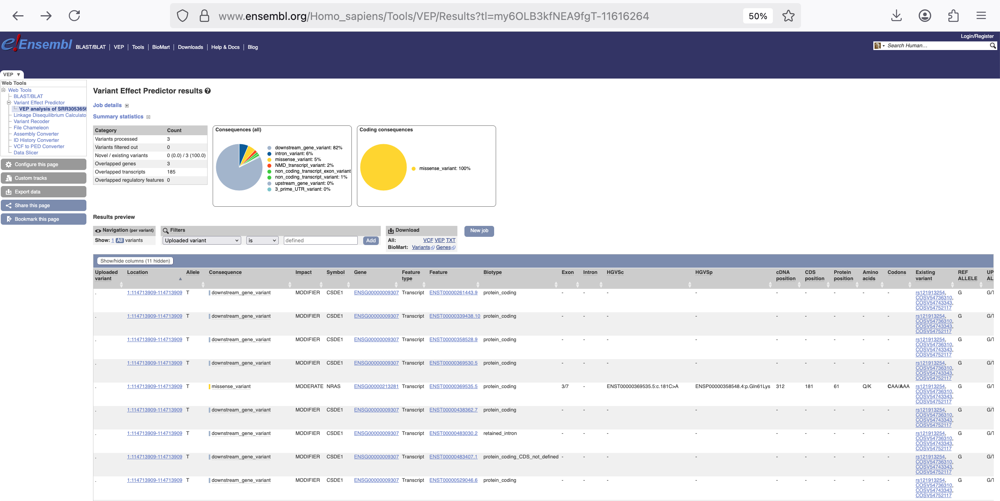


7. **Getting to know** the table before **cleaning**

- Aim: To display a table showing the minimum information required for the 3 variants found.

- The columns should answer these 5 questions:

  1. Where is the variant?

  2. What gene and transcript does it affect?

  3. What is the molecular consequence?

  4. How damaging is it predicted to be?

  5. Is it known / clinically relevant?

**Recommended column set**: These columns should always be kept.

| Column                       | Why it matters                 |
| ---------------------------- | ------------------------------ |
| **Uploaded variant**         | Traceability to original input |
| **Location**                 | Genomic coordinate             |
| **Allele**                   | ALT allele                     |
| **Symbol**                   | Gene name (NRAS, PIK3CA)       |
| **Gene**                     | Stable Ensembl gene ID         |
| **Consequence**              | Variant type (missense, etc.)  |
| **Impact**                   | VEP impact classification      |
| **Feature**                  | Transcript ID                  |
| **Biotype**                  | protein_coding confirmation    |
| **Exon**                     | Exon number                    |
| **HGVSc**                    | cDNA-level change              |
| **HGVSp**                    | Protein-level change           |
| **Protein position**         | Codon location                 |
| **Amino acids**              | REF → ALT                      |
| **Codons**                   | Nucleotide change              |
| **Canonical**                | Prefer main transcript         |
| **MANE SELECT**              | Clinical transcript            |
| **Transcript support level** | Transcript quality             |
| **SIFT**                     | Functional prediction          |
| **PolyPhen**                 | Functional prediction          |
| **AF**                 | Freq of existing variant in<br>1000 Genomes combined population |
| **Clinical significance**    | Known pathogenicity            |
| **Somatic status**           | Somatic vs germline            |
| **Phenotype or disease**     | Cancer association             |
| **Pubmed**                   | Pubmed ID publications<br> that cite existing variant |


### VEP-Online results TABLE (partial view)

| Uploaded variant | Location | Allele | Consequence | IMPACT | Symbol | Gene |
|------------------|----------|--------|-------------|--------|--------|------|
| . | 1:114713909-114713909 | T | downstream_gene_variant | MODIFIER | CSDE1 | ENSG00000009307 |
| . | 1:114713909-114713909 | T | missense_variant | MODERATE | NRAS | ENSG00000213281 |
| . | 1:114713909-114713909 | T | intron_variant | MODIFIER | NRAS | ENSG00000213281 |
| . | 3:179218294-179218294 | A | missense_variant | MODERATE | PIK3CA | ENSG00000121879 |
| . | 3:179218294-179218294 | A | non_coding_transcript_exon_variant | MODIFIER | PIK3CA | ENSG00000121879 |
| . | 3:179226113-179226113 | A | intron_variant | MODIFIER | PIK3CA | ENSG00000121879 |
| . | 3:179226113-179226113 | A | upstream_gene_variant | MODIFIER | PIK3CA | ENSG00000121879 |


8. **Filter** **rows** from VEP table. In the following **Table 8**, see which categories to filter out based on:

a) **Symbol**: 

- **CSDE1** is **NOT** a called variant of `SRR30536566.postfiltered.vcf` data — it is an **annotation artifact** caused by transcript proximity and regulatory overlap.

- In other words: **CSDE1** appears because VEP annotates variants relative to all **nearby transcripts**, not because the variant was called in CSDE1.

- **CSDE1** is also not in the panel of targeted sequencing genes! Therefore, the correct genes (as Symbol) are NRAS and PIK3CA.

b) **Consequence**: VEP does **not only annotate genes with coding variants**.

  - It also reports:
  
    - upstream_gene_variant

    - downstream_gene_variant (82% of all annotated variants - see **Pie-Chart: Consequences (all)** in **Figure 7**)
    
    - 3_prime_UTR_variant
    
    - non_coding_transcript_exon_variant
    
    - non_coding_transcript_variant
    
    - intron_variant

    - intergenic_variant

    - regulatory_region_variant
    
    > This is **annotation multiplicity**, not multiple variants.


**Table 8A**: **Consequence** categories to be filtered out / excluded (non-protein-altering)

| Consequence                        | Label color (VEP) | Where is the variant?                                   | Protein produced? | Biological meaning                                                                | Clinical relevance (CRC) | Keep? |
| ---------------------------------- | ----------------- | ------------------------------------------------------- | ----------------- | --------------------------------------------------------------------------------- | ------------------------ | ----- |
| non_coding_transcript_exon_variant | 🟢 Green          | Exon of a non-coding transcript                         | ❌ No              | Exonic variant, but transcript does not encode a protein (e.g. lncRNA, antisense) | None for drivers         | ❌ No  |
| non_coding_transcript_variant      | 🟢 Green          | Anywhere in a non-coding transcript                     | ❌ No              | Variant in non-coding RNA; no amino acid or protein-level effect                  | None for drivers         | ❌ No  |
| intron_variant                     | 🔵 Blue           | Intron of a protein-coding gene                         | ❌ No              | Spliced out; does not affect canonical splice sites                               | Very unlikely            | ❌ No  |
| NMD_transcript_variant             | 🔴 Red            | Transcript predicted to undergo nonsense-mediated decay | ❌ No (unstable)   | Transcript likely degraded; variant effect is indirect                            | None for drivers         | ❌ No  |
| downstream_gene_variant            | ⚪ Grey            | 3′ downstream of a gene (after transcription end)       | ❌ No              | Located outside gene body; may affect distant regulatory regions                  | None for CRC drivers     | ❌ No  |
| upstream_gene_variant              | ⚫ Dark grey       | 5′ upstream of a gene (before transcription start)      | ❌ No              | Promoter-distal region; weak or no effect on gene expression                      | Rare, indirect at best   | ❌ No  |
| 3_prime_UTR_variant                | 🔹 Sky blue       | 3′ untranslated region of mRNA                          | ✔ Yes (unchanged) | May affect mRNA stability or miRNA binding, but protein sequence unchanged        | Rarely actionable in CRC | ❌ No  |

> A NMD transcript variant (Nonsense-Mediated Decay transcript variant) refers to a mRNA molecule that contains a Premature Termination Codon (PTC), making it a target for destruction by the cell's quality control system, NMD, to prevent the production of faulty, truncated proteins. 

>**Note**: Variants in **Table 8A** may be biologically interesting in regulatory genomics, but they are not suitable for cancer (e.g. CRC) driver mutation reporting.

>**Important**: All variants in **Table 8A** have IMPACT = MODIFIER because they do not change a protein sequence. For cancer driver discovery, these variants add noise rather than insight. Variants with MODIFIER impact do not alter protein sequence or function and are unlikely to act as oncogenic drivers.

>**key message**: Typically, intronic variants are excluded from somatic analysis because most intronic variants are removed during splicing and do not affect protein structure or function unless they disrupt canonical splice donor or acceptor sites.

**Table 8B**: Categories of **Consequence** to RETAIN (protein-altering, driver-relevant)

| Consequence               | Label color (VEP) | Where is the variant?     | Protein produced?   | Biological meaning                                             | Clinical relevance (CRC)                               | Keep? |
| ------------------------- | ----------------- | ------------------------- | ------------------- | -------------------------------------------------------------- | ------------------------------------------------------ | ----- |
| **missense_variant**      | 🟡 Yellow         | Coding exon               | ✅ Yes               | Single amino acid substitution                                 | **Very high** (e.g. KRAS, NRAS, BRAF, PIK3CA hotspots) | ✅ Yes |
| **stop_gained**           | 🔴 Red            | Coding exon               | ⚠️ Truncated        | Premature stop codon → shortened, often non-functional protein | **High** (tumor suppressor inactivation)               | ✅ Yes |
| **frameshift_variant**    | 🔴 Red            | Coding exon               | ⚠️ Severely altered | Indel not multiple of 3 → reading frame disrupted              | **High** (loss of function)                            | ✅ Yes |
| **inframe_deletion**      | 🟠 Orange         | Coding exon               | ✅ Altered           | Deletion of amino acids without frame disruption               | Moderate–High (depends on region)                      | ✅ Yes |
| **splice_region_variant** | 🟠 Orange         | Near exon–intron boundary | ⚠️ Possibly altered | May affect splicing (but not canonical ±1/2 positions)         | Moderate (context-dependent)                           | ✅ Yes |


c) **IMPACT**:  Filter based on "MODERATE"" and "HIGH". See **Table 9** about **IMPACT** column.

**Table 9**: Meaning of categories **IMPACT**

| IMPACT    | Definition (VEP)                                      | Typical consequences                         | Protein effect? | Clinical relevance in CRC | Keep? |
|-----------|-------------------------------------------------------|----------------------------------------------|------------------|---------------------------|-------|
| HIGH      | Truncates or abolishes protein function               | stop_gained, frameshift_variant, splice_acceptor/donor_variant | Severe           | Rare but important        | ✅ Yes |
| MODERATE  | Changes amino acid sequence                           | missense_variant, inframe_insertion/deletion | Functional change| **Major CRC drivers**     | ✅ Yes |
| LOW       | Minimal protein effect                                | synonymous_variant                            | None             | Usually benign            | ❌ No |
| MODIFIER  | No direct effect on protein                           | intronic, non-coding, intergenic             | None             | Not relevant              | ❌ No |

>**Note**: A full picture with all **Consequence** and **IMPACT** categories found in gene variants displayed on the transcript structure and organised as table can be found in Ensembl website: <https://www.ensembl.org/info/genome/variation/prediction/predicted_data.html>

9. **Save** the filtered table files from VEP -> move files to `~/annotation/`

**Three** type of files to download from **VEP results**:

| File                     | Purpose                   |
| ------------------------ | ------------------------- |
| **VCF**                  | Archive + reproducibility |
| **Tab-delimited (.txt)** | Teaching + tables         |
| **VEP annotated VCF**    | Advanced reuse            |

>**Important** 
> The variant:
>
>  - Location: 3:179226113
>
>  - Symbol: PIK3CA
>
> was filtered out even though passed all technical filtering (Mutect2 + post-filter).
>
> Variant was excluded from the annotation table due to:
>
>  - non-coding / intron / benign annotation (based on "Consequence" and "Impact" from VEP-Online results table)
> 
>  - lack of clinical relevance
>
> This was an **annotation-level filtering**, not variant calling failure.

❌ You do NOT need to save the table as:

  - JSON

  - GVF

  - Raw consequence dumps


### VEP-Online cannot filter columns

VEP-Online can:

| Action                       | VEP-Online |
| ---------------------------- | ---------- |
| Filter variants (rows)                | ✅ Yes      |
| Filter by Gene / Consequence / IMPACT, Others | ✅ Yes      |
| Hide columns in browser               | ✅ Yes      |
| Export only chosen columns            | ❌ No       |
| Create clinical-style report          | ❌ No       |

> The “**Show/Hide columns**” option only affects your browser view, not the downloaded files. VEP-Online is not suitable for clinical reporting.

>Therefore, 
>
>  1. Filter/exclude rows based on Symbol/Consequence/IMPACT
>
>  2. Download VCF, VEP and TXT
>
>  3. Filter by column using bash

See in **Figure 8** the final filtered annotated variantss table on the **Variant Effect Predictor results**

**Figure 8**: VEP results: Filtered and annotated variants table.

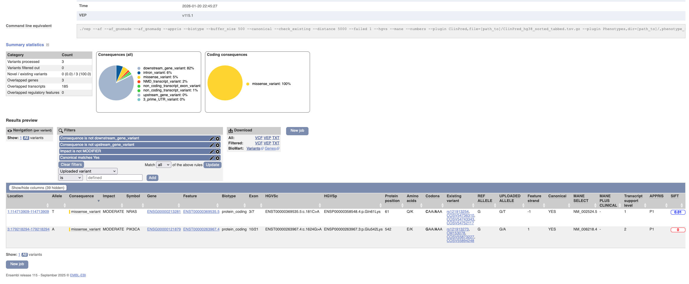

### Creating SRR30536566_clinical_report.tsv

### 1. Decide which columns matter clinically. 

For a CRC somatic report, this is a clean and realistic column set:

```text
Location
SYMBOL
Gene
Consequence
IMPACT
HGVSc
HGVSp
Protein_position
Amino_acids
Codons
AF
gnomADe_AF
SIFT
PolyPhen
CLIN_SIG
SOMATIC
PUBMED
ClinPred
```

### 2. Verify column indices of .txt file

```bash
head -n1 my6OLB3kfNEA9fgT.Consequence_ne_downstream_gene_variant_and_Consequence_ne_upstream_gene_variant_and_IMPACT_ne_MODIFIER_and_CANONICAL_re_Yes.txt | tr '\t' '\n' | nl

Output:
1	–#Uploaded_variation
2	Location
3	Allele
...
69	ClinPred
70	PHENOTYPES
71	OpenTargets_geneId
72	OpenTargets_l2g
73	REVEL
```

### 3. Extract selected columns (command line)

The **.txt** file is tab-delimited, thus use `cut`

```bash
cd annotation/

cut -f1,2,4,5,6,7,11,13,14,17,18,19,21,22,24,28,30,35,36,38,39,60,61,69,63 \
  my6OLB3kfNEA9fgT.Consequence_ne_downstream_gene_variant_and_Consequence_ne_upstream_gene_variant_and_IMPACT_ne_MODIFIER_and_CANONICAL_re_Yes.txt \
  > SRR30536566_clinical_report.tsv
```

### 4. Add a clean header (recommended)

```bash
sed '1s/.*/Variant\tLocation\tConsequence\tImpact\tSymbol\tGene\tExon\tHGVSc_cDNA\tHGVSp\tProtein_pos\tAA_change\tCodons\tREF_ALLELE\tUPLOADED_ALLELE\tSTRAND\tCanonical\tMANE_Select\tSIFT_prediction\tPolyPhen_prediction\tTumor_AF\tgnomAD_AF\tClinical_Significance\tSomatic\tPubMed\tClinPred/' \
  SRR30536566_clinical_report.tsv > SRR30536566_annotated_variants_clinical_report_improved.tsv
```

### 5. Filter/Select clinically relevant anotated variants

> **Key note**: Genes often have multiple transcripts. VEP annotates the variant relative to each transcript, producing multiple rows. Clinical reporting usually selects on "CANONICAL" and/or "MANE Select"" transcript. 


### Ideal final "clean" table (examples)

| Location       | Gene   | Consequence      | HGVSp        | Exon | AF    | gnomAD AF | Impact   | SIFT        | PolyPhen          | Clinical significance |
| -------------- | ------ | ---------------- | ------------ | ---- | ----- | --------- | -------- | ----------- | ----------------- | --------------------- |
| chr1:114713909 | NRAS   | missense_variant | p.Gln61Lys   | 3    | 0.154 | 0         | MODERATE | deleterious | probably_damaging | Pathogenic            |
| chr3:179218294 | PIK3CA | missense_variant | p.Glu545Lys  | 9    | 0.277 | 0         | MODERATE | deleterious | probably_damaging | Pathogenic            |


| Gene | Variant | Genomic Coordinate | Protein Change | Consequence | Exon | Tumor VAF | gnomAD AF | SIFT | PolyPhen | ClinVar | ClinPred | Evidence |
|------|---------|-------------------|----------------|-------------|------|-----------|-----------|------|----------|---------|----------|----------|
| **NRAS** | c.181C>A | 1:114713909 | p.Gln61Lys | Missense | 3/7 | 15.4% | 6.85e-7 | Deleterious | - | Pathogenic | 0.984 | ✅ Hotspot |
| **PIK3CA** | c.1624G>A | 3:179218294 | p.Glu542Lys | Missense | 10/21 | 27.7% | - | Deleterious | Probably damaging | Likely pathogenic | 0.880 | ✅ Hotspot |


### Final clinical report table 👉 [SRR30536566_clinical_report_improved.tsv](SRR30536566_annotated_variants_clinical_report_improved.tsv)

| Variant | Location | Consequence | Impact | Symbol | Gene | Exon | HGVSc_cDNA | HGVSp | Protein_pos | AA_change | Codons | REF_ALLELE | UPLOADED_ALLELE | STRAND | Canonical | MANE_Select | SIFT_prediction | PolyPhen_prediction | Tumor_AF | gnomAD_AF | Clinical_Significance | Somatic | PubMed | ClinPred |
|---------|----------|-------------|--------|--------|------|------|------------|-------|-------------|-----------|--------|------------|-----------------|--------|-----------|-------------|-----------------|---------------------|----------|-----------|------------------------|--------|--------|----------|
| . | 1:114713909-114713909 | missense_variant | MODERATE | NRAS | ENSG00000213281 | 3/7 | ENST00000369535.5:c.181C>A | ENSP00000358548.4:p.Gln61Lys | 61 | Q/K | Caa/Aaa | G | G/T | -1 | YES | NM_002524.5 | deleterious_low_confidence(0.01) | - | - | 0.0000006849 | uncertain_significance,drug_response,pathogenic,likely_pathogenic | 0,1,1,1 | 2674680,8120410,12460918,16273091,16291983,17699718,18390968,18633438,18948947,20130576,20179705,20619739,20736745,21107323,21305640,21729679,21829508,22761467,23392294,23414587,23515407,23538902,23569304,23614898,25157968,26619011,19657110,19966803,23076151,26821351,37384296,39635441 | 0.98360139131546 |
| . | 3:179218294-179218294 | missense_variant | MODERATE | PIK3CA | ENSG00000121879 | 10/21 | ENST00000263967.4:c.1624G>A | ENSP00000263967.3:p.Glu542Lys | 542 | E/K | Gaa/Aaa | G | G/A | 1 | YES | NM_006218.4 | deleterious(0) | probably_damaging(0.915) | - | - | likely_pathogenic,not_provided,pathogenic/likely_pathogenic,pathogenic | 0,0,1,1 | 30089490,26900293,20619739,25157968,26619011,35127508,15016963,15254419,15647370,15805248,16906227,18676830,18725974,19029981,19223544,19366826,19513541,19903786,20453058,21430269,22162582,22162589,22271473,23946963,22658544,21558396,22357840,24559322,26851524,33076847,25599672,34776939,33917394,33105631,32422573,28708103,29700339,34462366,37195967,36765720,23480694,29446767,34496175,38015548,37712948,40004036,39208653 | 0.880067884922028 |


> ⚠️ **Disclaimer** for students / scientist in general:
>
>This tutorial demonstrates a research-grade somatic variant analysis pipeline using tumor-only sequencing data. While biologically meaningful variants can be identified, the workflow is not validated for clinical diagnostics and should not be used for patient care without CAP/CLIA-certified confirmation and matched normal samples.
>
>**Clinical reports** require laboratory validation, standardized nomenclature, and medical oversight.
>   - CLIA (Clinical Laboratory Improvement Amendments – USA): Governs how clinical lab tests are validated and reported.
>
>   - CAP (College of American Pathologists): Accredits clinical laboratories and enforces standardized pipelines, QC, documentation, sign-off.
>
>**ClinPred**: ClinPred is an efficient tool for identifying disease-relevant nonsynonymous variants from the exome.
>
>**Documentation**: 
>    - <https://pmc.ncbi.nlm.nih.gov/articles/PMC6174354/>
>
>    - <https://sites.google.com/site/clinpred/>

## Final steps:

This is apparently the end of the analysis. Once we reach this point, it is always advisable to validate the analysis in two ways:

1. **Confirm** the somatic mutations by orthogonal methods (see **Table 10**).

### Table 10: Orthogonal validation methods of variants for clinical use

| Method | Description | Pros | Cons | Best For | Clinical Validation Level |
|--------|-------------|------|------|----------|---------------------------|
| **Sanger Sequencing** | Traditional PCR + capillary electrophoresis | • Gold standard<br>• Low cost ($50-100/sample)<br>• Quantitative for VAF >20%<br>• Widely available | • Low sensitivity (15-20% VAF)<br>• Manual interpretation<br>• Low throughput | • High-VAF variants (>20%)<br>• Confirmatory testing of hotspot mutations<br>• Single gene validation | **Routine clinical validation** (CAP/CLIA certified labs) |
| **Digital PCR (dPCR)** | Partitioned PCR with fluorescence counting | • Ultra-sensitive (0.1-0.01% VAF)<br>• Absolute quantification<br>• High precision<br>• Minimal hands-on time | • Expensive ($200-500/sample)<br>• Limited multiplexing (2-4 plex)<br>• Requires specific probe design | • Low-VAF variants (1-5%)<br>• MRD monitoring<br>• Clinical trial endpoints<br>• Liquid biopsy validation | **High-sensitivity clinical validation** (FDA-approved platforms) |
| **Pyrosequencing** | Real-time sequencing by synthesis | • Quantitative (5-10% VAF)<br>• Moderate cost ($100-200)<br>• Fast turnaround (1 day)<br>• Good for known hotspots | • Short read lengths (<100bp)<br>• Limited to known variants<br>• Moderate sensitivity | • Known hotspot panels (e.g., KRAS, EGFR)<br>• Methylation analysis<br>• Pharmacogenetic testing | **Routine hotspot validation** (Common in clinical pathology) |
| **MassARRAY** | MALDI-TOF mass spectrometry | • High multiplexing (40+ variants)<br>• Moderate sensitivity (5% VAF)<br>• Good for panel validation<br>• Cost-effective for multiple variants | • Requires known variants<br>• Complex data analysis<br>• Platform-specific expertise | • Multi-gene panel validation<br>• Large sample batches<br>• Research-to-clinical translation | **Panel validation** (Moderate throughput) |
| **Independent NGS** | Different platform/library prep | • Comprehensive validation<br>• Whole gene coverage<br>• Detects novel variants<br>• Same technology comparison | • Expensive ($500-1000)<br>• Long turnaround (2-3 weeks)<br>• Complex bioinformatics | • Comprehensive validation for clinical trials<br>• Assay verification<br>• Reference material generation | **Comprehensive method validation** (Assay development) |
| **Immunohistochemistry (IHC)** | Antibody-based protein detection | • Direct protein expression<br>• Spatial tissue context<br>• Standard in pathology labs<br>• Semi-quantitative scoring | • Not mutation-specific (some antibodies)<br>• Subjective interpretation<br>• Limited to expressed proteins | • Protein expression validation (e.g., HER2, PD-L1)<br>• Tumor heterogeneity assessment<br>• Companion diagnostics | **Protein-level validation** (Gold standard for IHC targets) |
| **FISH/CISH** | Fluorescence/chromogenic in situ hybridization | • DNA-level alterations<br>• Cell-by-cell analysis<br>• Detects amplifications/deletions<br>• Tissue architecture preserved | • Low throughput<br>• Expensive ($300-500)<br>• Requires specialized equipment | • Gene amplifications (HER2, MET)<br>• Gene fusions (ALK, ROS1)<br>• Chromosomal rearrangements | **Structural variant validation** (Standard for amplifications/fusions) |
| **ddPCR** | Droplet digital PCR (Bio-Rad) | • Extreme sensitivity (0.001% VAF)<br>• Absolute quantification<br>• Minimal sample input<br>• High reproducibility | • Very expensive ($300-600)<br>• Limited plex (1-2 targets)<br>• Platform lock-in | • Ultra-low VAF detection<br>• Liquid biopsy validation<br>• Residual disease monitoring | **Ultra-sensitive monitoring** (Clinical trial assays) |

### Recommended validation strategy for the 3 Variants:*

| Variant | Gene | VAF | Recommended Validation Method | Alternative Method | Clinical Priority |
|---------|------|-----|------------------------------|-------------------|------------------|
| **chr1:114713909** | NRAS | 15.4% | **Sanger Sequencing** | Pyrosequencing | High (therapy decision) |
| **chr3:179218294** | PIK3CA (exon 9) | 27.7% | **Sanger Sequencing** | dPCR (if <20% VAF expected) | High (prognostic marker) |
| **chr3:179226113** | PIK3CA (exon 20) | 69.8% | **Sanger Sequencing** | IHC (PI3K pathway activation) | High (therapy target) |

> **Note - Important**:
> Variants below ~15–20% VAF may not be detectable by Sanger sequencing.

### Clinical Report Integration:*

```markdown
### **VALIDATION SECTION**

**Methods:**
- Sanger sequencing performed on original tumor DNA
- IHC performed on FFPE tissue sections

**Results:**
1. NRAS c.xxxG>T (p.Q61X) - **Confirmed by Sanger**
2. PIK3CA c.1633G>A (p.E545K) - **Confirmed by Sanger**
3. PIK3CA c.3140A>G (p.H1047R) - **Confirmed by Sanger**
4. PI3K pathway activation - **Supported by IHC (p-AKT positive)**

**Interpretation:**
All reported somatic variants have been confirmed by orthogonal methods,
supporting their validity for clinical decision-making. 
```
* There were finally only two variants annotated but it would be recommended to check the third one (**chr3:179226113**) considering that the same PIK3CA might have this and/or more mutations. 

2. **Visualize** the found annotated variants using IGV.


### Folder structure: after VEP-Online variant annotation.

```bash
Genomics_cancer/
├── reference/                 
│   └── GRCh38/
│       ├── fasta/
│       └── known_sites/       
│       └── intervals/                                    
│       └── somatic_resources/                                   
├── data/
│   └── SRR30536566/                
│       ├── raw_fastq/
│       ├── qc/
│       ├── trimmed/
│       ├── aligned/
│       ├── variants/                                       
│           └── SRR30536566.f1r2.tar.gz          
│           └── SRR30536566.unfiltered.vcf.gz
│           └── SRR30536566.unfiltered.vcf.gz.stats 
│           └── SRR30536566.unfiltered.vcf.gz.tbi
│           └── SRR30536566.read-orientation-model.tar.gz
│           └── SRR30536566.pileups.table
│           └── SRR30536566.contamination.table
│           └── SRR30536566.filtered.vcf.gz.filteringStats.tsv
│           └── SRR30536566.filtered.vcf.gz
│           └── SRR30536566.filtered.vcf.gz.tbi
│           └── SRR30536566.postfiltered.vcf
│           └── SRR30536566.postfiltered.vcf.gz                          # It has same filters as 'high_confidence' but TLOD = 6.3 (default from Mutect2)
│           └── SRR30536566.postfiltered.vcf.gz.tbi
│           └── SRR30536566.postfilter_summary.txt
│           └── SRR30536566.postfiltered.tsv
│           └── SRR30536566.postfiltered_high_confidence.vcf.gz         # It has same filters as 'postfiltered' but higher TLOD filter (TLOD > 20)
│           └── SRR30536566.postfiltered_high_confidence.vcf.gz.tbi
│       └── annotation/                                       
│           └── my6OLB3kfNEA9fgT.Consequence_ne_downstream_gene_variant_and_Consequence_ne_upstream_gene_variant_and_IMPACT_ne_MODIFIER_and_CANONICAL_re_Yes.vcf                                    
│           └── my6OLB3kfNEA9fgT.Consequence_ne_downstream_gene_variant_and_Consequence_ne_upstream_gene_variant_and_IMPACT_ne_MODIFIER_and_CANONICAL_re_Yes.vep.txt                      
│           └── my6OLB3kfNEA9fgT.Consequence_ne_downstream_gene_variant_and_Consequence_ne_upstream_gene_variant_and_IMPACT_ne_MODIFIER_and_CANONICAL_re_Yes.txt                               
│           └── SRR30536566_annotated_variants_clinical_report_improved.tsv     # Clean headers
├── scripts/
│       └── 0_wget_gnomad_PoN.sh
│       └── 0_wget_Hsapiens_assem38.sh
│       └── 01_qc.sh
│       └── 02_trim.sh
│       └── 03_align_&_bam_preprocess.sh
│       └── 04_for_loop_gtf.sh
│       └── 04_make_crc_7genes_bed.sh
│       └── 04_mutect2.sh
│       └── 05_learn_read_orientation_model.sh          
│       └── 06a_get_pileup_summaries.sh            
│       └── 06b_calculate_contamination.sh             
│       └── 07_filter_mutect_calls.sh             
│       └── 08_postfilter.sh                                              
└── logs/
        └── cutadapt_SRR30536566.log
        └── bwa_mem.log
        └── markduplicates.log
        └── SRR30536566.flagstat.txt                     
        └── mutect2.stderr.log                                  
        └── mutect2.stdout.log                                  
        └── learn_read_orientation_model.log                                  
        └── get_pileup_summaries.log                                 
        └── calculate_contamination.log                                 
        └── filter_mutect_calls.log                             
        └── SRR30536566.postfilter.log                                 
```

---
---

## Clinical Annotation

From the variant annotation step, a comprehensive clinical report table was generated: [SRR30536566_clinical_report_improved.tsv](SRR30536566_annotated_variants_clinical_report_improved.tsv).
This table summarizes **somatic single-nucleotide variants (SNVs)** detected in cancer-relevant genes and integrates functional predictions, population frequencies, and clinical significance. Its purpose is to inform the oncologist which genes are altered in the tumor, whether these alterations are known or suspected cancer drivers with potential clinical relevance.

**Clinical annotation (also called therapeutic interpretation)** represents the step where molecular findings are translated into actionable clinical insights, such as diagnostic relevance, prognostic implications, or potential therapeutic options. This is often considered the **final and most critical step in a cancer genomics pipeline**, as it bridges bioinformatics analysis with clinical decision-making.


> **IMPORTANT: Scope and limitations**
>
> This tutorial demonstrates a *research-grade* clinical annotation workflow.
> It is **not intended for diagnostic or therapeutic decision-making**. This tutorial:
>
> - is a tumor-only analysis  
> - has no matched normal sample  
> - does not include CNV or SV detection  
> - does not include RNA expression, histology context, or clinical metadata (stage, treatment history)

### Questions that can be answered in this step (some were already answered in variant annotation):

  - Is this variant actionable?

  - Does it predict response or resistance to a drug?

  - Is it part of a guideline (NCCN, ESMO, AMP/ASCO/CAP)?

  - Is it prognostic or diagnostic?

  - Is it part of an approved targeted therapy?

  - Is it associated with a clinical trial?
  
>**Note**:
>
>**NCCN, ESMO, and AMP/ASCO/CAP are major clinical guideline bodies that define how cancer variants should be interpreted and used in therapy decisions**.  
>
>The **Tier I–IV system (from AMP/ASCO/CAP)** classifies somatic variants by their clinical significance, from strongly actionable (Tier I) to benign/unknown significance (Tier IV). 
>
>**Documentation**: "Standards and Guidelines for the Interpretation and Reporting of Sequence Variants in Cancer"
> 
> [Li, MM et al., J Mol Diagn 2017](https://ocpe.mcw.edu/sites/default/files/course/2024-03/AMP-ASCO-CAP%20guidelines%20-%20somatic%20variants.pdf?)


### Clinical annotation tools/databases

There is a handful of open-access tools for clinical annotation. Next, it will be provided three:

### 1. CIViC (Clinical Interpretation of Variants in Cancer)

A public, expert‑curated database linking variants to clinical evidence, therapies, and disease contexts.

**Documentation**:
    - <https://civicdb.org/pages/about>
    - <https://civic.readthedocs.io/en/latest/>
    - <https://www.nature.com/articles/ng.3774>


1. Go to <https://civicdb.org/welcome>


2. Click on "**Molecular Profiles**".


3. Type one of the annotated variants you found from sample `SRR30536566`, e.g. NRAS, on column **Name**. 

4. Type 'Colorectal Cancer' on column **Diseases**, since the sample `SRR30536566` comes from a colorectal tumor.

5. According to `SRR30536566_clinical_report_improved.tsv`, NRAS annotated variant has a mutation ("Gln61Lys") "Q61/K". 

6. Therefore, in column **Name**, click on the variant **NRAS Q61K**. 

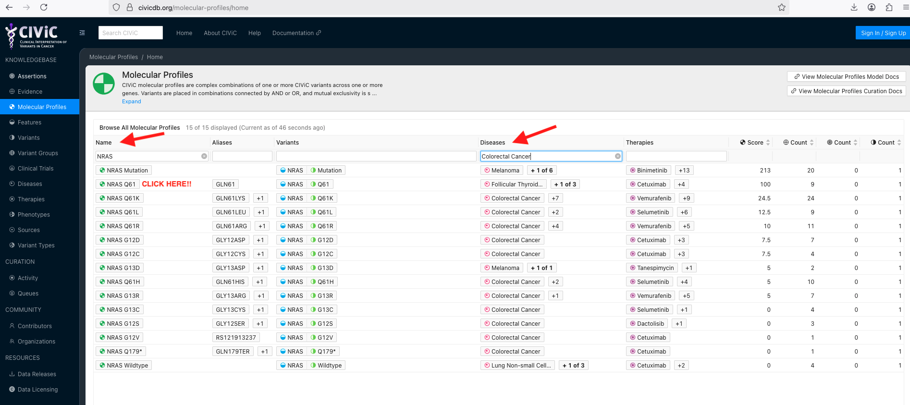

7. The annotation details of this NRAS variant will be displayed in another CIViC webpage along with a **Evidence** table, which has important information such as EID (evidence ID), Disease and Therapies.

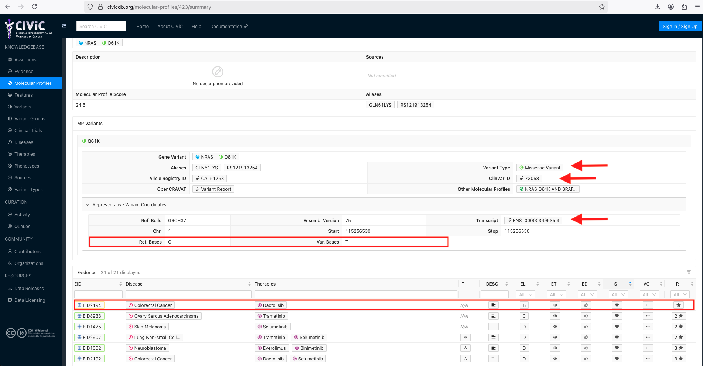

>**Note**
>
> In table **Evidence**, order the therapies for "Colorectal Cancer" by clicking on **S** (drug sensitivity, it must show a  🖤) and **EL** (evidence level "B" - Clinical Evidence)
>
>Although, **NRAS Q61K** colorectal variant is sensitive to **Dactolisib**, apparently, this evidence is classified as **EL = B** and is not yet guideline-supported. The evidence is apparently clinical and based on in vitro cell lines studies. This variant from colorectal cancer shows, apparently, resistance for **Cetuximab**. Check column **DESC** (evidence description), for detailed information.

8. Follow the same pipeline for **PIK3A E542K**

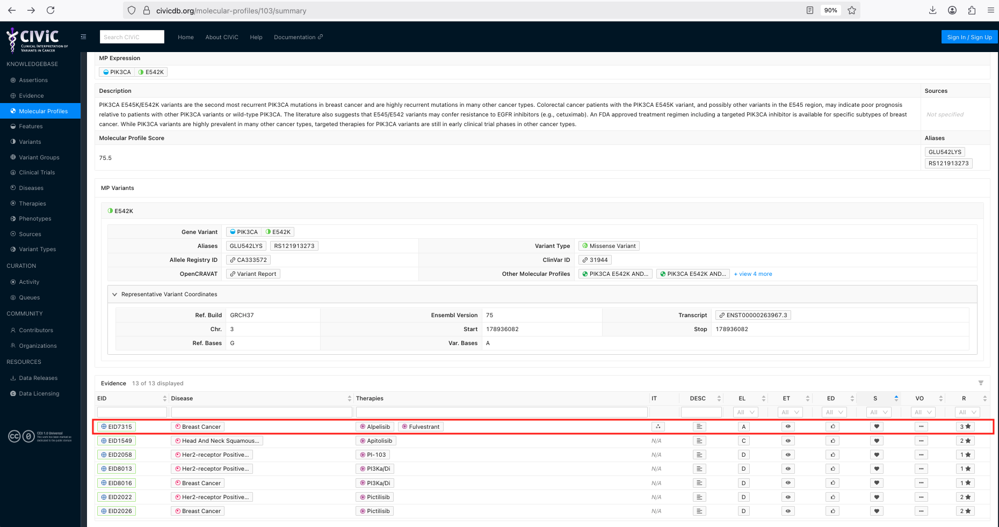

>**Note**
>
> In table **Evidence**, the variant **PIK3A E542K** has an accepted therapy (**EL** "A"), which is the combination of drugs **Alpelisib** and **Fulvestrant**, but for breast cancer and not colorectal cancer. According to the **DESC**, the evidence was collected from clinical trial phase 3 study. On the other hand, **Aspirin** appears as showing clinical evidence or the potential to treat colorectal cancer (**EL** "B"), but this evidence has not yet been reviewed.

### 2. PanDrugs

Web tool to prioritise anticancer drug treatments according to individual genomics data. PANDRUGS computes two scores, the **Gene Score (GScore)** and the **Drug Score (DScore)**. The **GScore** ranges from 0 to 1 and is estimated according to gene essentiality and tumoral vulnerability, gene relevance in cancer, the biological impact of mutations, the frequency of gene alterations and their clinical implications. The **DScore** ranges from -1 to +1, considers drug indication and status, gene–drug associations and number of hits and estimates resistance (negative values) or sensitivity (positive values)

**Documentation**:

   - [Jiménez-Santos, M. J. et al. (2023). PanDrugs2: prioritizing cancer therapies using integrated individual multi-omics data. Nucleic Acids Research. 51(Web Server Issue W1), pp. W411-W418.](https://doi.org/10.1093/nar/gkad412)
   - [Piñeiro-Yáñez, E. et al. (2018). PanDrugs: a novel method to prioritize anticancer drug treatments according to individual genomic data. Genome medicine, 10(1), 41.](https://doi.org/10.1186/s13073-018-0546-1)
   
1. Go to <https://www.pandrugs.org/#!/>

2. Click on "Query!✔" (green button).


3. Type the annotated variant genes or provide a variant gene list; check 'analysis options', and; check the type of cancer keyword (Colon, Rectum). Click on "Query" (green button).

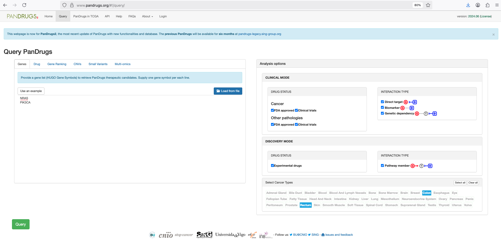

4. The results will appear in the "PanDrugs Candidate Therapies". In this webpage, there will be two pie charts and the "**Gene and Drugs score chart**", which is the most revealing. 

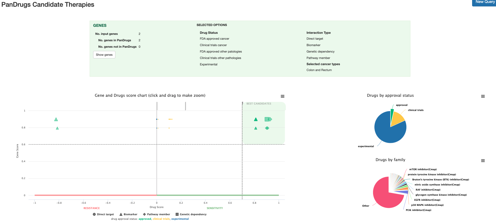

In the "**Gene and Drugs score chart**", it's possible to put attention at the quadrant "**Best candidates**" and make a zoom to read in more detail each best candidate treatment.

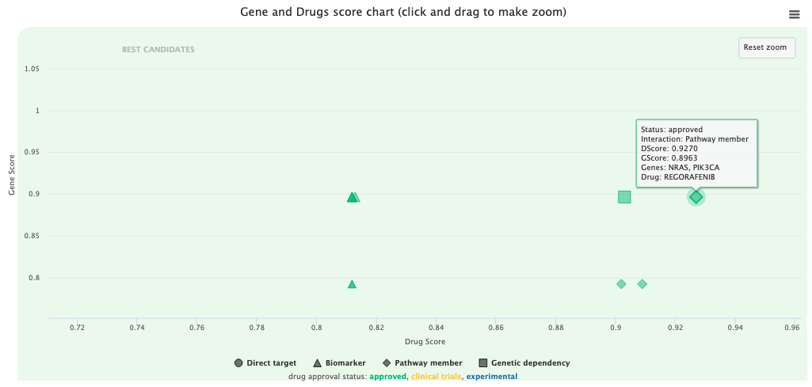

In addition to the charts, there is a table showing evidence on drugs responsiveness to colorectal cancer treatment when the variant couple is NRAS and PIK3CA. The table can be ordered by DScore and GSCore and has the advantage to be downloadable as CSV.

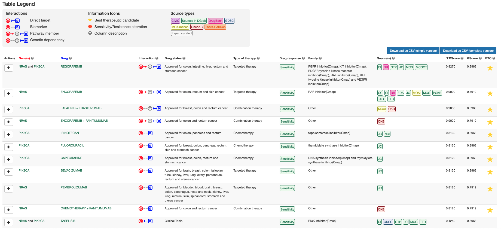


### 3. OncoKB<sup>TM</sup>

OncoKB is a curated, expert‑reviewed precision oncology knowledge base developed at Memorial Sloan Kettering Cancer Center (MSKCC).
Its purpose is to classify cancer gene alterations based on:

  - Therapeutic actionability

  - Biological significance

  - Clinical evidence

  - Regulatory approvals
  
**Documentation**:

  - [Chakravarty et al., JCO PO 2017](https://ascopubs.org/doi/full/10.1200/PO.17.00011)
  - [Suehnholz et al., Cancer Discovery 2024](https://aacrjournals.org/cancerdiscovery/article/14/1/49/732527/Quantifying-the-Expanding-Landscape-of-Clinical)

It’s used by clinical labs, hospitals, and research groups to interpret somatic variants and guide treatment decisions.

OncoKB links each variant to:

  - FDA‑approved targeted therapies

  - NCCN/ESMO guideline recommendations

  - Drug sensitivity or resistance evidence

  - Clinical trial relevance

  - Mechanistic/biological function

  - Evidence levels for actionability

This makes it a powerful tool for clinical annotation of cancer variants.


### The OncoKB Evidence Levels (similar to AMP/ASCO/CAP tiers)

OncoKB uses its own **Levels of Evidence** system, which is conceptually similar to the AMP/ASCO/CAP Tier I–IV system but more granular.
Therapeutic Levels (1–4) and resistance levels (R1, R2, R3). The levels 1-4 show "**the strength of evidence that the mutation is a predictive biomarker of drug sensitivity to FDA-approved or investigational agents for a specific indication**" (Chakravarty et al., JCO PO 2017).

These describe how actionable a variant is.

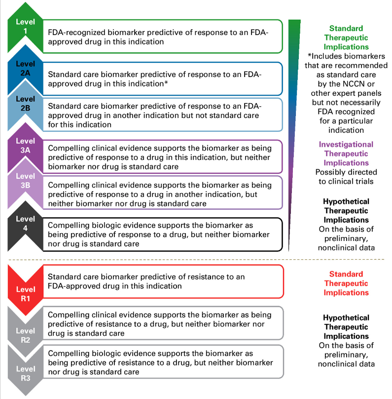

[Chakravarty et al., JCO PO 2017](https://ascopubs.org/doi/full/10.1200/PO.17.00011)

1. Go to <https://www.oncokb.org/>

2. Type in the query window: PIK3CA

3. Select "Therapeutic Levels" (default option)

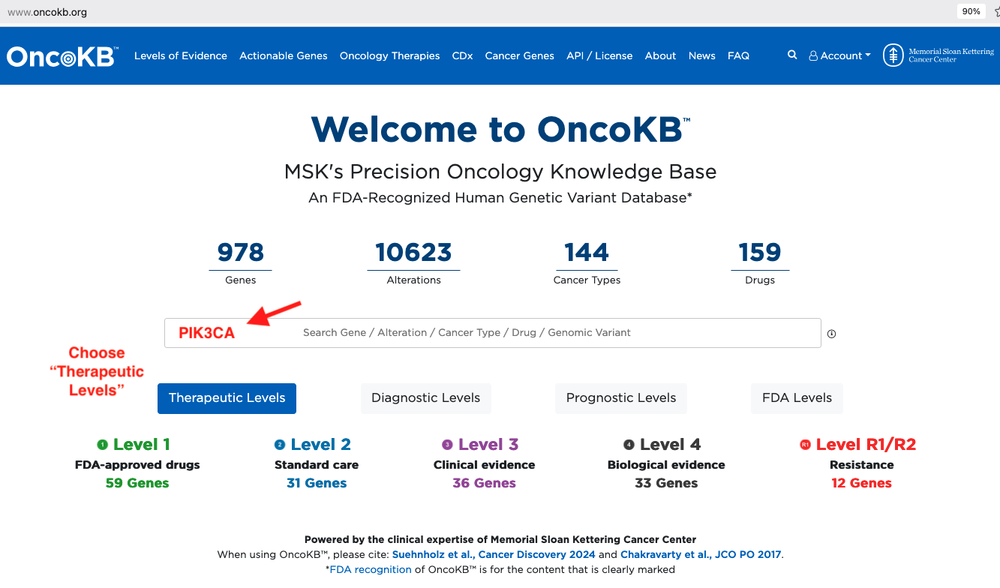

3. Select the specific mutation: E542K

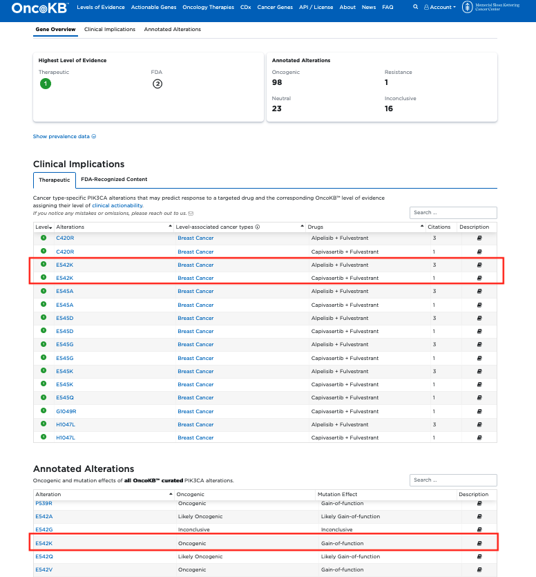

4. Select cancer type: Colorectal cancer

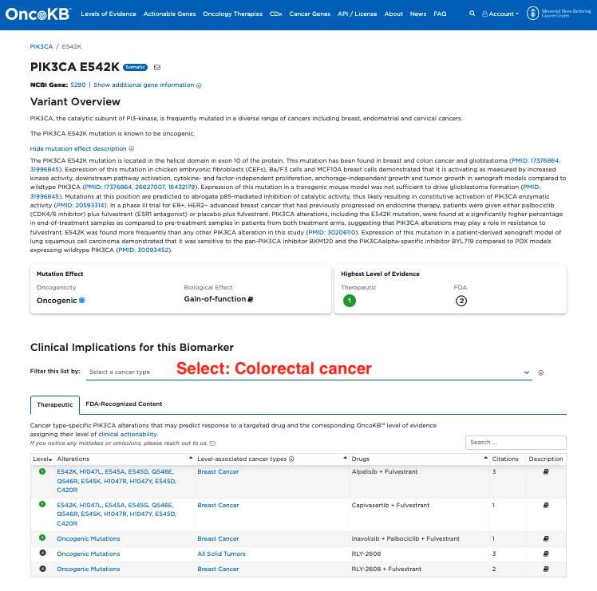

5. Result: 

   - PIK3CA E542K variant is classified as **oncogenic**
   - **Clinical Implications of This Biomarker in Colorectal Cancer**: Although the combination **Alpelisib + Fulvestrant** on PIK3CA E542K mutant HR+/HER2- metastatic breast cancer is a FDA-approved treatment, ***the clinical utility of these drug combinations in patients with PIK3CA E542K mutant colorectal cancer is unknown***.
   
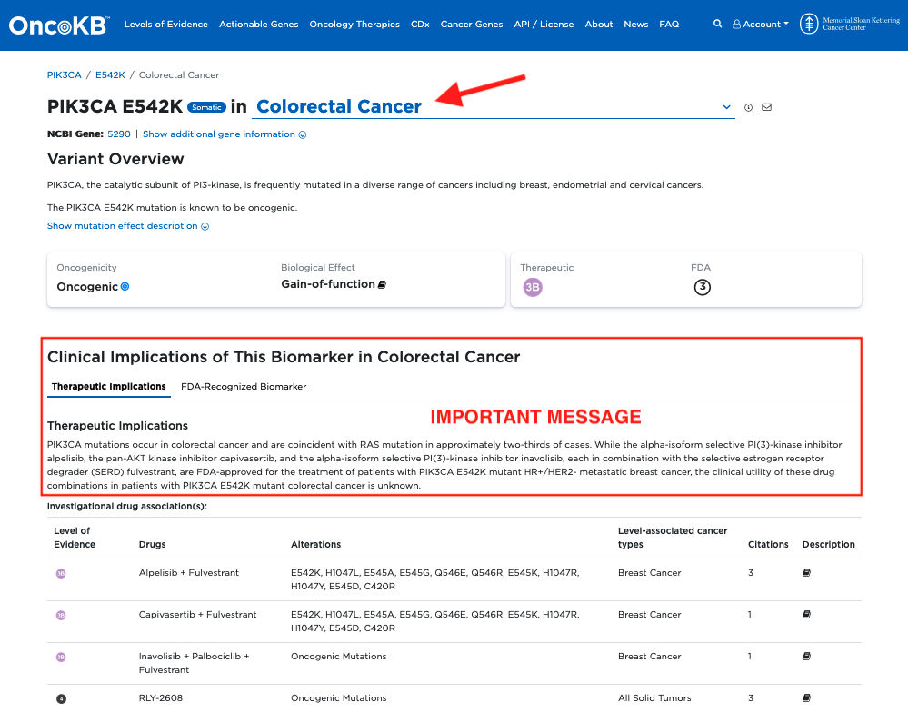


**OncoKB** is a clinical actionability database that classifies cancer variants based on the strength of evidence linking them to therapies.
It’s one of the most trusted resources for turning raw genomic data into **clinically meaningful recommendations**.

---

### From tutorial to real clinical practice

In a **certified clinical laboratory**, the variants identified in this tutorial would typically be:

- **Confirmed using tumor–normal sequencing**

  - Two samples from the same patient are analyzed:

    - DNA from cancer tissue (tumor)

    - DNA from healthy tissue (e.g. blood or saliva)

  - The goal is to distinguish:

    - **Somatic variants** (present only in the tumor)

    - **Germline variants** (inherited and present in all cells)

  - This provides high confidence that variants such as **NRAS** and **PIK3CA** are truly tumor-specific

- **Reviewed by molecular pathologists**

- **Discussed in a Molecular Tumor Board (MTB)**

  - An MTB is a **multidisciplinary clinical meeting** where genomic findings are evaluated in the context of:

    - clinical guidelines

    - available therapies

    - patient history and disease stage

  - The MTB formulates clinically appropriate treatment recommendations

- **Reported according to AMP/ASCO/CAP standards**

- **Interpreted in the full clinical context**, including:

  - prior treatments

  - comorbidities

  - tumor histology

  - therapeutic options and clinical trials


---

This concludes Part II of the tutorial, which covered end-to-end somatic variant analysis and clinical annotation from raw FASTQ sequencing data.

**Click** here 👉 [Part III – Somatic - IGV analysis](README_somatic_igv_analysis.md) to learn how to visualize the reads of variants using **IGV** software, explained step-by-step.

End of Part II.